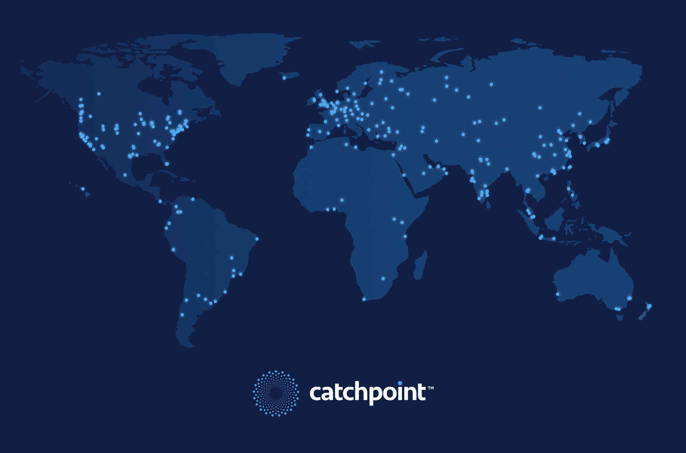

# Catchpoint 扩大网络监控服务范围

> 原文：<https://devops.com/catchpoint-expands-network-monitoring-service-reach/>

Catchpoint 已经将全球收集遥测数据的地点数量扩展到 825 个以上。

Catchpoint 首席产品官 Drit Suljoti 表示，随着应用程序变得越来越分散，开发操作系统和网络操作系统(NetOps)的世界正在融合。Suljoti 说，DevOps 团队需要更多地了解世界任何地方的网络延迟问题如何影响其最终用户的数字体验。

Catchpoint 监测服务现已扩展到全球 200 个城市，包括 mainland China 的 140 个节点。Suljoti 表示，除了监控关键的主干位置，Catchpoint 还在 133 个公共云位置放置了节点，现在正在为希望采用下一代数字体验管理(DEM)平台的公司提供免费无缝迁移，以取代最近退役的 Gomez 和 Dynatrace 的 Keynote 服务。

Suljoti 说，就像 DevOps 团队依赖各种工具来监控应用程序一样，他们也需要访问一种持续监控这些应用程序所依赖的网络的服务。Suljoti 指出，随着基于微服务的延迟敏感型应用数量的增加，这一要求变得更加重要。他补充说，由于组织依赖这些应用来驱动各种数字业务流程，网络如何影响最终用户的应用体验的可见性很容易下降。

大多数组织已经拥有监控其数据中心网络性能的工具。但是，对于大多数组织来说，创建用于识别全球广域网(WAN)中的网络性能问题的监控框架成本太高。当涉及到部署跨越多个广域网的应用程序时，大多数 DevOps 团队基本上是盲目的。

在许多组织中，仍然不清楚谁负责监控 WAN 服务。从历史上看，网络运营团队一直承担这一责任。然而，Suljoti 表示，随着 DevOps 流程的不断扩展和成熟，出现了一种更具协作性的方法，这种方法将网络监控工具纳入了组织在持续集成/持续部署(CI/CD)流程的背景下创建的测试框架中。

与此同时，现有广域网的压力只会增加。在没有 5G 服务的情况下，竞争接入带宽的应用数量增加。许多组织不知道网络服务提供商是否真的履行了他们作为服务水平协议(SLA)的一部分而同意的承诺。随着越来越多的应用程序性能问题被追溯到底层网络，对网络服务质量的失望只会越来越多。在要求网络服务提供商做出解释之前，开发运维团队需要获得明确显示服务水平承诺未得到满足的分析。

当然，这可能只会招致网络服务提供商的道歉。然而，最起码，DevOps 团队将能够做出更加明智的决策，决定如何路由应用流量。

— [迈克·维扎德](https://devops.com/author/mike-vizard/)