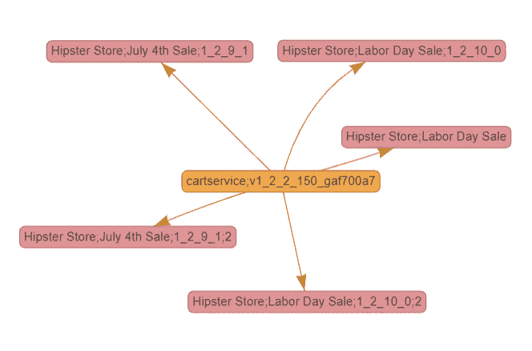

# CD Foundation 支持 Ortelius 管理微服务部署

> 原文：<https://devops.com/cd-foundation-embraces-ortelius-to-manage-microservices-deployments/>

持续交付(CD)基金会[增加了开源的 Ortelius 平台，用于管理微服务](https://www.prnewswire.com/news-releases/cd-foundation-welcomes-ortelius-open-source-microservices-management-platform-as-new-incubating-project-301188547.html)的部署，作为孵化级项目。

Ortelius 最初由 DeployHub 开发，旨在提供一种在应用程序级别自动配置的方法。它还提供了一个集中的服务目录，使跨集群消费和部署服务变得更加容易，并在服务更新时跟踪应用程序版本和依赖关系。

DeployHub 首席执行官特雷西·拉冈表示，现在吕斯正被捐赠给 CD 基金会，这是 Linux 基金会的一个分支，致力于创建事实上的连续交付标准。因此，Ortelius 将受益于该联盟其他成员的贡献，包括谷歌、CloudBees、CircleCI、JFrog、IBM、GitLab、网飞和 DeployHub。

CF 基金会的核心项目是开源的 Jenkins 持续集成/持续交付(CI/CD)平台；Kubernetes 上的开源 CI/CD 解决方案 Jenkins X；Spinnaker，一个开源 CD 平台；以及用于构建 CI/CD 组件的 Tekton 规范。

Ortelius 已经集成了 CD 编排工具和部署工具，如 Helm、Ansible 和 Spinnaker。拉冈说，现在的机会是使用 GitOps 方法解决云原生应用程序的整个应用程序开发生命周期。

虽然从理论上来说，Kubernetes 的兴起应该会使跨多个平台的 CD 流程自动化变得更加容易，但拉冈指出，在实践中，Kubernetes 的实例之间仍然存在实质性的差异，需要工具来自动化跨多个集群的微服务部署。她说，Ortelius 允许 IT 团队将微服务组作为一个实体进行逻辑管理，就像 IT 团队将单块应用程序作为一个实体进行管理一样。

拉冈还指出，并非所有微服务都具有同等价值，因此需要根据微服务的依赖性数量和微服务对业务的价值来采用不同的方法来管理它们。很明显，it 团队将很快管理数以千计的微服务，对集成多个 CD 平台的标准方法的需求变得更加迫切。她说，事实上，IT 团队正在走向一个新时代，混沌工程原则将需要应用于微服务的管理。

从长远来看，拉冈表示，吕斯还将使采用机器学习算法提供预测分析变得可行，这些分析可用于优化微服务环境。这种能力最终将为大规模管理微服务提供关键能力。它还可能有助于进一步采用最佳 CD 实践，这在 It 环境中是难以实现的，在这种环境中，每个平台都有独特的属性，无论涉及哪种类型的应用程序，自动化应用程序交付都具有挑战性。

与此同时，IT 组织被邀请为 Ortelius 项目做贡献，现在它是 CD 基金会的一部分。所做的贡献越多，Ortelius 平台就越快毕业，这对于许多已经投资微服务的组织来说是再快也不过分的。