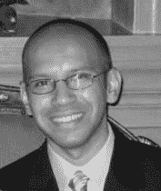

# 约翰·威利斯、KK 和穆斯塔法·卡帕迪亚参加的裁谈会峰会/詹金斯日

> 原文：<https://devops.com/cd-summitjenkins-days-with-john-willis-kk-mustafa-kapadia/>

 我们 DevOps Connect 的秋季阵容:CD Summit/Jenkins 日子快到了。我们将于 10 月 4 日和 6 日在亚特兰大举办七场秋季赛事。演讲者和主题都在网站上，但我想强调三位主题演讲者:我们亚特兰大的三位主角是 IBM 的**穆斯塔法·卡帕迪亚**，**川口幸介(KK)** ，Jenkins 的创始人兼 CloudBees 的首席技术官，最后是独一无二的**约翰·威利斯** ( [@botchagalupe](https://twitter.com/botchagalupe?ref_src=twsrc%5Egoogle%7Ctwcamp%5Eserp%7Ctwgr%5Eauthor) )。这些扬声器中的每一个本身都是很好的听众，但是在一个早上听到所有三个应该很棒！

但是等等，还有更多。除了穆斯塔法、KK 和约翰，我们还有一整天的  DevOps 学习在进行中。下午有三个独立的赛道，每个赛道有四到五场比赛。一个是关于 Jenkins 的，一个是关于 DevOps 的，还有一个是关于自动化和互操作性的。其他发言人包括来自 Security First Insurance 的 Ben Bomhoff 和来自 Accenture 的 Daryl Bower。查看网站获取更多信息。

 以上所有发言者都是在事件的第二天，10 月 6 日。第一天，10 月 5 日，将举办几场关于 Jenkins、Blue Mix 的大型研讨会，以及由 [DevOps Institute](http://www.devopsinstitute.com) 举办的 DevOps Foundation 研讨会。

您可以在 DevOps Connect 网站上查看完整的发言人、日程安排和主题。当天会议不包括研讨会的费用仅为 99 美元，包括午餐、茶点和访问。如果你也想参加第一天的研讨会，只需另付 99 美元。如果你在亚特兰大地区，这是 DevOps 的一个伟大的日子！

如果你不在亚特兰大，一定要去 http://www.devopsconnect.com 看一看秋季的完整时间表。我们要去的其他城市包括:

*   阿姆斯特丹
*   柏林
*   丹佛
*   奥斯汀
*   西雅图
*   洛杉矶

如果你在这些城市中的任何一个，请来和我们一起度过一两天。另外，请务必关注我们正在计划的其他会议，包括 RSA 和 InfoSec World 2017 上的 DevSecOps 活动。

— [Alan Shimel](https://devops.com/author/ashimmy/)