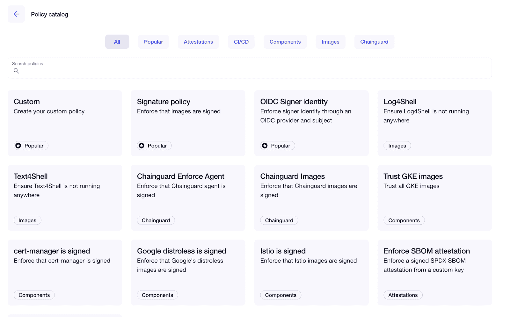

# Chainguard 增加了代码签名平台的私有版本

> 原文：<https://devops.com/chainguard-adds-private-edition-of-code-signing-platform/>

Chainguard 今天增加了 Chainguard Enforce 签名服务的私人预览，由开源项目 [Sigstore](https://devops.com/?s=Sigstore) 实现，允许开发人员使用他们自己创建的身份和一次性密钥为软件工件生成数字签名。

Chainguard 的产品负责人 Kim Lewandowski 表示，Chainguard Enforce 签名提供了一种替代依赖公共服务来生成这些数字签名的方法。它还允许组织携带自己的密钥和证书，以便根据合规性和隐私要求监控和审核密钥的使用情况。

此外，Chainguard 添加了一个策略库，管理员可以直接从 Chainguard Enforce web 控制台将其部署到自己的环境中。

Chainguard 强制签名功能基于 Sigstore，这是一个开源项目，它提供了一个协议，通过消除管理密钥的需要来简化加密证书的生成。Sigstore 的核心是创建一组短期密钥，其信任根基于可审计的公共日志。因为它创建了一个不可变的日志，参与软件开发过程的每个人，包括审计员，现在可以透明地跟踪任何软件工件的监管链。

密钥管理、密钥泄露/撤销以及公钥和工件摘要的分发都很难管理。开发人员还需要确定哪些密钥是可信的，此外还需要学习在使用不同平台时如何对它们进行签名。

Lewandowski 指出，Chainguard 的替代方案是使组织能够托管他们自己的不可变日志，而不是依赖公共服务来消除管理密钥的需要。

历史上，代码签名平台一直存在问题，因为它们容易被篡改。例如，网络罪犯可以通过交换摘要来获取受损凭证。摘要和公钥也经常分布在易受黑客攻击的易受攻击的网站上，或者无意中存储在公共 Git 存储库中。

代码签名和软件材料清单(SBOMs)是提高软件供应链安全性的两大技术进步之一。当然，当 SBOMs 描述的软件组件由创建它们的开发人员签名时，它们会被认为更可靠。

不太清楚的是，代码的签署是否会提高其整体质量。大多数开发人员以他们的代码为荣，但是在生产环境中部署的软件的整体质量总是可以提高的。如果开发人员知道他们将被要求签名，他们可能会决定更专注地审查他们参与构建的代码。

同时，在将代码部署到生产环境之前，组织要求开发人员签署代码只是时间问题。除了增强对所用代码质量的信心之外，这些签名还使得在出现需要解决的问题时跟踪创建代码的开发团队变得更加简单。毕竟，组织在尝试更新软件时遇到的最具挑战性的问题与其说是创建补丁，不如说是根据他们对所用软件组件的了解来确定谁应该创建补丁。