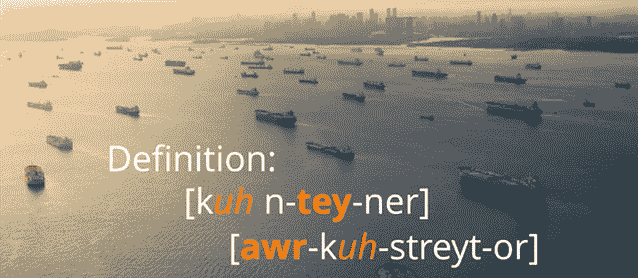
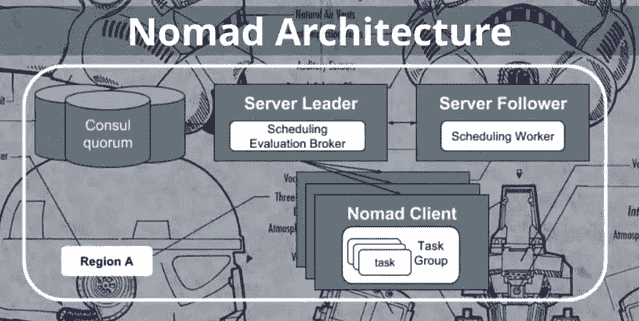
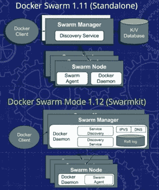
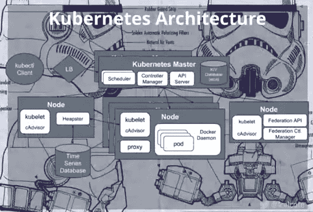

# 描述和对比容器编排器

> 原文：<https://devops.com/characterizing-and-contrasting-container-orchestrators/>

海军上将卡尔科特，也被他的朋友们称为[李·卡尔科特](https://www.linkedin.com/in/leecalcote) ( [@lcalcote](https://twitter.com/lcalcote?lang=en) )或[生姜怪才](http://blog.gingergeek.com/)，在 [2016 全天 DevOps 会议](https://www.alldaydevops.com/)上做了题为“[描述和对比集装箱管弦乐](https://youtu.be/P-wQaXlgaQg)的演讲。

好吧，他不是真正的海军上将——也没有人这么称呼他——但他用“海军上将”这个头衔来描述集装箱指挥者的工作，将其与指挥集装箱船队的海军上将联系起来。你也可以说他们就像一个管弦乐队的指挥，指挥个人作为一个团体朝着一个共同的目标一起工作，而每个音乐家仍然能够演奏他们自己的乐器。

Lee 是网络安全管理软件产品技术战略的负责人，在他的演讲中，他讨论了四个开源容器协调器: [Nomad](https://www.nomadproject.io/) ， [Swarm](https://github.com/docker/swarm/) ， [Kubernetes](https://kubernetes.io/) 和 [Mesos-Marathon](https://mesosphere.github.io/marathon/) 。

他强调了显而易见的事实:没有一个完美的解决方案。每个组织都是不同的，所以对于每个解决方案，他都考虑了:

*   起源和目的
*   支持和动力
*   主机和服务发现
*   行程安排
*   模块化和可扩展性
*   更新和维护
*   健康监控
*   网络和负载平衡
*   机密管理
*   高可用性和可扩展性

Lee 指出，虽然有许多核心功能，但任何协调器都必须具有集群管理和调度功能。

然后，他更深入地研究了四种解决方案。以下是摘要(完整的演讲充满了信息，并在网上[这里](https://youtu.be/P-wQaXlgaQg)):

## **流浪者**

*   专为长期和短期批处理工作负载而设计
*   具有声明性作业规范的集群管理器
*   通过高效的任务打包，确保满足约束条件并优化资源利用率
*   支持所有主要操作系统和工作负载
*   用 Go 和 Unix 哲学编写
*   主机发现:八卦协议——使用 Serf 服务器向客户端通告全套的 Nomad 服务器；创建联合集群很简单
*   服务发现:与 Consul 集成
*   时间安排:两个不同的阶段——可行性检查和排序；乐观并发；创建作业时的三种调度程序类型
*   使用任务驱动程序来执行任务并提供资源隔离，但它不支持可插入的任务驱动程序
*   专为管理多个集群/集群联盟而构建

****

## **Docker Swarm 1.12**

*   简单且易于设置
*   建筑不像 Kubernetes 和 Mesos 那样复杂
*   用 Go 编写–轻量级、模块化和可扩展
*   强大的社区支持
*   主机发现(Host discovery):由管理器在形成集群时用来发现节点(主机)；拉动模式-员工向经理汇报
*   服务发现:嵌入式 DNS 和循环负载平衡
*   调度程序是可插拔的，是策略和过滤器/约束的组合
*   移除“电池”的能力
*   支持滚动更新
*   管理器可以部署在高度可用的配置中，但不支持多个故障隔离区域或联合

****

## **Kubernetes**

*   构建分布式系统的自以为是的框架
*   用 Go 编写，轻量级，模块化，可扩展
*   以谷歌、红帽等为首
*   年幼–大约 2 岁
*   强大的文档和社区
*   调度由 kube-scheduler 处理
*   可插拔架构和可扩展平台
*   为服务发现或网络驱动程序和容器运行时选择数据库
*   支持回滚部署、自动化部署和滚动更新应用程序
*   固有负载平衡
*   使用 Pods，这是一种基本的调度单位。每个 pod 都有自己的 IP 地址，不需要 NAT，并且可以通过本地主机进行 pod 内部通信

****

## **Mesos-Marathon**

*   Mesos 是一个分布式系统内核
*   Mesos 是历史最长的(自 2009 年以来)
*   Mesos 是用 C++写的
*   马拉松是一个运行在 Mesos 之上的框架
*   Twitter、AirBnB、易贝、苹果、思科和 Yodle 都使用 Mesos
*   马拉松被威瑞森和三星使用
*   Mesos-DNS 为每个 Mesos 任务生成一个 SRV 记录
*   Marathon 确保所有动态分配的端口都是唯一的

最后，Lee 提供了以下概述，比较了不同的容器编排解决方案。

李在他的讲话中包含了大量的信息。如果你使用容器，他的演讲值得你花时间，可以在网上找到。如果你错过了其他任何 30 分钟长的全天 DevOps 演示，它们很容易找到并免费提供[在这里](https://www.sonatype.com/all-day-devops-on-demand?__hstc=160429922.6e550c6bb5ab39a60b15e9b7c028fd0a.1493638577119.1505042444747.1505311463042.19&__hssc=160429922.3.1505311463042&__hsfp=969726444)。最后，请务必在此为您和您团队的其他成员注册 2017 年全天 DevOps 大会[。今年的活动将提供 96 场由从业者主导的会议(不允许供应商推介)。10 月 24 日，这一切都是免费在线的。](https://www.alldaydevops.com/)

— [德里克·威克斯](https://devops.com/author/derek-e-weeks/)