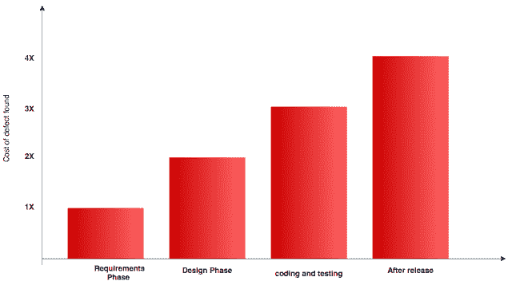

# 制衡以构建更强大的代码

> 原文：<https://devops.com/checks-balances-to-build-stronger-code/>

每个软件开发都需要编码；没有它，什么也发展不起来。软件的质量取决于开发者编写代码的方式。它是系统的重要组成部分，系统的行为依赖于它。编码中的一个小错误可能会使软件变得脆弱和不稳定。

质量工程努力寻找缺陷以避免软件的潜在问题。QA 工程师花费大量的时间和精力来发现软件的任何问题，并将其报告给开发人员。

修复不同级别缺陷的成本。

 
后期修复缺陷的成本呈指数增长；因此，您需要 QA 工程师和开发人员花费更多的时间来修复并再次运行整个发布周期。如果我们能节省一些时间和精力，我们就能更有效地利用资源。

我们能确保代码写得更好，更安全，没有潜在的错误，并且使用了正确的库吗？

如果我们可以实现它，我们至少可以确保开发人员正在检查以确保代码中的摩擦更少？

这里有一些可以在创建过程中或者在将代码传递给 QA 之前实现的检查，以确保代码少出错。

## 代码审查

在代码审查中，编码人员将它发送给其他人进行审查。这确实是一个很好的方法，通过第二双眼睛来发现任何被编码者忽略的小故障、逻辑或可能的错误。

这是开发过程的一部分，以确保在没有第二意见的情况下不会发布任何内容。有许多方法和工具可以用来执行代码审查。这些可以实现并与源代码控制工具集成。更多关于代码审查和细节可以在[这里](https://devops.com/2015/08/19/code-review-write-code-right/)找到。

## 单元测试

单元测试通过支持数据编写小代码并模拟测试场景来测试一段代码。它通常由开发人员在开发期间编写，然后在源代码编译期间运行，或者根据各种语言独立运行。

这种测试提供了额外的早期预警，以便在将问题移交给质量检查之前发现问题。单元测试覆盖可以提供单元测试用例覆盖了多少的细节。有很多方法可以计算出覆盖率。

## 静态代码分析

静态代码分析是一种非常基础的分析方法，不需要运行软件或者执行任何测试。这可以通过使用客户端工具在编译时或开发时完成。

分析工具寻找任何可能的或者隐藏的错误，比如永无止境的循环，或者编程缺陷。这些工具基于相似的模式进行分析，但每种工具的方式略有不同。

## 编码指南

每个开发人员可能以他/她自己的风格编写代码，具有不同程度的差异。当将项目移交给不同的团队或编码人员时，这可能会产生很大的问题。理解别人写的东西可能要花大量的时间。

为了减少这种潜在的麻烦，组织可以实现一个编码指南，或者为开发人员编写代码的风格，以确保每个人都遵循一个其他团队成员可以容易理解的系统化方法。不同的编码语言有不同的工具。

## 图书馆检查

GitHub 中的开源项目和其他免费可用的工具使得开发者更容易在他们的项目中使用它们作为库。同时，如果库没有被正确地测试，他们会引入软件的其他问题，包括安全漏洞、未测试的组件或者许可问题。

有许多工具可以帮助开发人员验证他们的库。

## 概括起来

组织可能需要许多其他验证和检查。以上是可以在开发阶段实施的非常基本的检查，以排除与安全或法律问题相关的任何差异。检查可以在开发人员编写代码的客户端实现，也可以在持续集成阶段实现。

市场上或开源社区中有许多工具可以用来验证和保护代码，以避免未实现的错误。对任何组织来说，保持软件无 bug 并减少处理这些问题的不必要资源是最有利的。

*其他参考资料—*http://www.scmtechblog.net/2016/08/code-quality-check.html