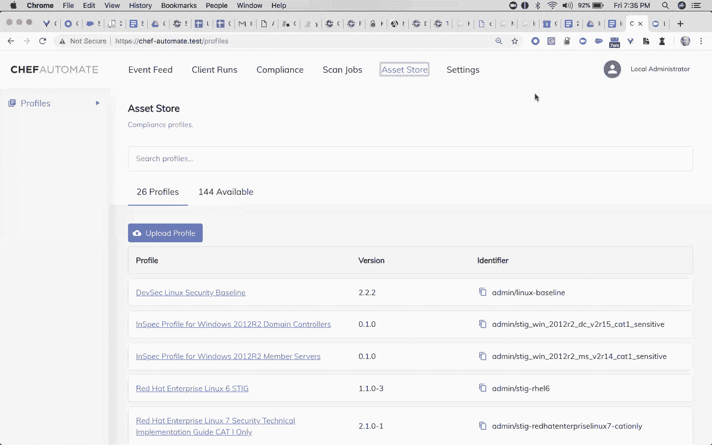

# 厨师实现多项合规要求

> 原文：<https://devops.com/chef-achieves-multiple-compliance-mandates/>

Chef 今天宣布，它将使采用其 it 自动化框架的组织更容易[遵守法规](https://www.businesswire.com/news/home/20190313005191/en/Chef-Advances-Security-Capabilities-Government-Enterprise-Customers)，如联邦信息处理标准(FIPS)、安全技术实施指南(STIG)和互联网安全中心(CIS)认证。

Chef 的高级软件开发工程师和联邦解决方案工程内容负责人 John Snow 表示，it 平台或应用程序的提供商有责任确保他们的产品符合广泛要求的指令。例如，FIPS 法规不仅适用于联邦机构，还适用于与这些机构有交互的任何组织。

具体来说，Chef 表示，它已经实现了 FIPS 合规性，同时在 Chef InSpec 中为 RHEL 7 和 Windows Server 2016 提供了 STIG 配置文件的实施，并在 Chef Automate 中实现了亚马逊网络服务(AWS)基础基准 1 级和 2 级的(CIS)认证。Chef 声称，它是第一家跨 AWS、微软 Azure 和谷歌云平台获得 CIS 认证的供应商。

Snow 表示，Chef 能够实现这一目标，部分是因为它投入了时间和精力来开发一个解析器，使公司能够将合规性作为其开发过程的可编程扩展。这一翻译过程是必需的，因为大多数法规遵从性要求是由审计人员而不是 IT 运营团队为审计人员编写的。Snow 说，Chef 还将利用这一能力来确保其平台与它支持的合规性要求的任何未来更新保持同步。

几年来，Chef 一直将合规视为准则。任何给定的法规遵从性要求通常都由一组控制措施组成，这些控制措施需要首先实施到位，然后进行测试和验证。Chef 认为，实现合规性应该成为同类最佳开发运维流程的自然延伸，而不是试图依靠无法扩展的手动流程来实现这一目标。

目前还不清楚法规遵从性在多大程度上可以整合到 DevOps 中。但是 DevSecOps 的最新进展表明，实现法规遵从性控制的责任与安全控制一起“左移”只是时间问题。合规团队可能会定义需要实施哪些控制措施。但是作为任何质量保证过程的一部分，实现这些控制的责任正在转移到开发运维团队。然而，只有当以编程方式实现这些控件的方法可用时，开发人员才会承担这一责任。

这一转变的长期经济影响可能会被证明是深远的。各种规模的组织在实施法规遵从性控制以及让第三方对其进行审核方面都会产生巨大的成本。随着合规流程变得更加自动化，不仅大规模实施控制变得更加容易，而且通过审核所需的文档也会自动生成。鉴于大多数审计员的服务是按小时收费的，限制与准备和通过审计相关的时间和精力可以节省大量成本。挑战和机遇是教育 DevOps 团队不仅要知道可以为公司节省多少钱，还要知道有多少钱可以再投资于推动 DevOps 的采用。

— [迈克·维扎德](https://devops.com/author/mike-vizard/)