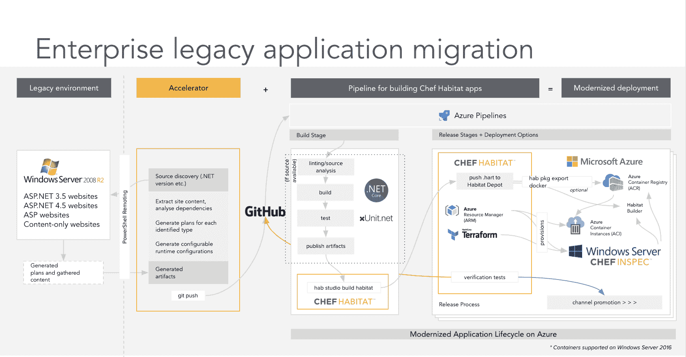

# Chef 将 DevOps 引入 Windows 平台迁移

> 原文：<https://devops.com/chef-brings-devops-to-windows-platform-migrations/>

Chef 和微软今天宣布，他们正在合作应用 DevOps 流程，以加速 Windows Server 2008 和 SQL Server 2008 向更新版本的迁移。

在 [Microsoft Inspire](https://partner.microsoft.com/en-us/inspire) 大会上宣布，目标是让组织能够利用 Chef Enterprise Automation Stack(EAS)，其中包括一个用于 Windows 的 EAS 迁移加速器，可以扫描现有的。NET 应用程序来发现配置和依赖关系的详细信息，然后将这些信息封装为代码，使应用程序能够在最新版本的 Microsoft 虚拟机上运行或作为容器运行。

微软的合作伙伴发展经理伊万·道尔顿说，大约有 50 万人。NET 应用程序运行在计划于一月份停止支持的平台上。道尔顿说，在理想的世界中，大多数应用程序都将被现代化，部署在微软 Azure 云上。

Chef 的业务发展副总裁 Vikram Ghosh 表示，Chef EAS 不仅仅是将传统应用程序提升和转移到一个新的平台上，它将使采用 DevOps 流程来实现这些应用程序更新和维护的现代化成为可能。例如，Chef EAS 可以使用 GitHub 等源代码控制库扫描、提取和打包遗留应用程序及其依赖项，并使用 Azure DevOps 等管道将其转换为云平台。Ghosh 补充说，客户可以在 Azure 中部署这些应用程序包，并运行连续的安全和合规扫描。

许多组织在尝试迁移应用程序时面临的最大挑战是创建应用程序的开发人员早已离开公司。因此，大多数组织只有文档，通常很少。然后，他们必须确定是否值得更新应用程序，或者是否应该简单地替换它。如果认为遗留应用程序中包含的业务逻辑对于继续运行仍然至关重要，他们需要找到一种尽可能自动化该过程的方法。

当然，从长远来看，大多数组织将通过将遗留的单片应用程序分割成一系列更易于管理的微服务来进一步实现它们的现代化。但是许多组织已经没有时间了。NET 应用程序。一旦微软终止对他们运行的平台的支持，解决网络安全问题的补丁将不再作为标准许可协议的一部分提供。实际上，这意味着从现在到明年 1 月有足够的时间来重新设计应用程序。Ghosh 说，Chef EAS 实际上给了组织一条生命线，以确定他们在替换遗留应用程序方面接下来要做什么。

当然，总会有一些 IT 社区的子集继续运行。过时的微软平台上的. NET 应用程序。这些组织中的任何一个也不太可能很快采用 DevOps 流程来维护这些平台。

— [迈克·维扎德](https://devops.com/author/mike-vizard/)