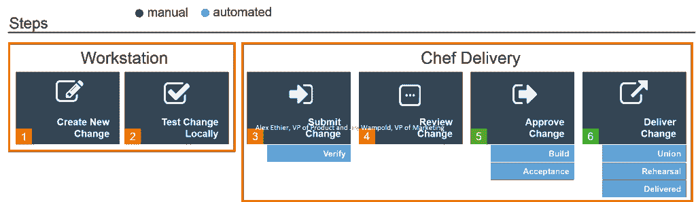

# 主厨定义了主厨交付的开发运维工作流

> 原文：<https://devops.com/chef-defines-the-devops-workflow-with-chef-delivery/>

在 ChefCon today 上，Chef 发布了一项重要公告，推出了 Chef Delivery“新的 DevOps 工作流产品，首次实现了基础设施、运行时环境(包括容器)和应用程序的连续交付。”Chef 研究了成千上万客户的使用成功模式，从中提炼出他们认为在 DevOps 环境中取得成功的公式。

 我有机会与 Chef 的产品副总裁 Alex Ethier 和营销副总裁 Jay Wampold 谈论送货事宜。他们都很兴奋，因为他们认为这不仅是厨师的真正改变，也是整个 DevOps 市场的改变。Chef 已经是 DevOps 社区的领导者，在全球 2000 强中拥有快速增长的客户群，并在 AWS 客户中占据主导地位。交付将把 Chef 平台扩展到整个 DevOps 工作流程中。

Chef 认为这是将 Chef 平台扩展到整个 DevOps 工作流的时候了。几乎每个分析公司和调查数据都表明，DevOps 正在各种规模的 IT 团队中广泛采用。虽然 DevOps 是关于文化变化的，但是一旦组织认识到 DevOps 文化的优势，利用这种文化的工具肯定会扩大它们的足迹。

我问 Alex 和 Jay 交付是否会让 Chef 与其他 DevOps 工具供应商竞争。例如，CD 和 CI 领域的 Jenkins 和 CloudBees 在交付的十字线上看起来是方形的。虽然表面上看起来是这样，但交付实际上是一个平台，旨在利用 API 和开源与第三方的大型生态系统合作，包括 Jenkins、CloudBees 和 DevOps 生态系统中的其他参与者。我仍然不能 100%确定合作将在哪里结束，竞争将在哪里开始，但我想我们必须等待，看看事情会如何发展。

根据厨师的顾客体验研究，他们认为 DevOps 的流程是这样的:

DevOps lifecycle step by step

一些步骤是手动的，并且将继续是手动的。厨师想在自动化区域打球。是的，这是厨师雄心勃勃的举措。如果他们成功了，他们将利用他们在 DevOps 配置管理领域的主导地位，成为整个 DevOps 生命周期的主导者。

推动这一生命周期的事实是，随着向云的迁移，当今的企业正在从静态系统转向快速变化的服务。这给 IT 部门带来了新的压力，要求他们以“高速 IT”的方式开展工作。所有这一切的关键当然是自动化。在它的指导下，所有的交付都寻求 CI、CD 和持续测试的自动化。

Chef 的首席技术官 Adam Jacob 这样评价 Chef Delivery，“我们使用的工具强化了行为；行为强化了工具。因此，如果你想改变你的行为，改变你的工具。"

Chef 新闻稿中 Chef Delivery 的其他亮点包括:

*   **强大的管道:** Chef Delivery 为软件开发提供了共享的管道和成熟的工作流程，可以从开发人员或运营工程师的工作站安全地获取代码，完成构建、测试和生产。
*   **协作平台:**交付管道的每一步都包含自动化测试，以便为开发人员、运营工程师、合规和安全官以及 IT 架构师提供关于提议变更的快速反馈。通用的工作流允许每个 IT 专业的人员一起工作，并完全了解整个管道中的变更流程。可以在每个步骤中轻松应用策略，以确保最大程度的变更控制和治理。
*   **复杂的分析:** Chef Delivery 为您的发展管道的所有阶段提供指标。借助全面的审计功能，您可以跟踪管道性能和活动，管理权限，并从易于使用的仪表板访问全面的变更历史。
*   **可扩展架构:** Chef Delivery 完全是为了性能和可扩展性而设计的。其架构与 Chef 服务器完全集成，旨在满足最大、最复杂的企业 IT 环境的需求。
*   **全面的生态系统集成:** Chef Delivery 与广泛的操作系统和运行时环境相集成，包括亚马逊 Web 服务和微软 Azure 等公共云平台，以及 Docker containers 等运行时环境。
*   **可用性:**厨师服务目前通过邀请计划提供
*   **定价:** Chef Delivery 将于 2015 年以订阅方式销售。

对于已经飞得很高的厨师来说，这确实是一个真正的游戏改变者。在今天的 ChefCon 大会上，我打算询问在此参展的许多合作伙伴和供应商，他们如何看待交付，以及我们可以期望从他们那里看到什么样的集成。

有一点是肯定的，DevOps 工具市场正在迅速发展和成熟。工具供应商必须快速行动，让高绩效的 IT 团队以开发运维的速度前进。