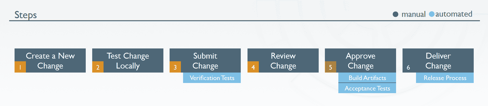

# 厨师推出了一些美味的新菜肴

> 原文：<https://devops.com/chef-rolls-out-some-tasty-new-dishes/>

主厨宣布了他们今天阵容中的一些重要成员。我们将逐一介绍，但总的来说，以下是厨师今天带来的新闻:

首先，[之前宣布的](https://devops.com/2015/04/01/chef-defines-the-devops-workflow-with-chef-delivery/) Chef Delivery 现已面向所有人公开发售。Chef Delivery 定义并管理整个 DevOps 工作流程。下图很好地说明了这一点:

根据 Chef，Delivery，“提供了一个规定的流程，在一个规定的管道中自动更改基础架构、应用程序和容器。”

除了之前宣布的交付的普遍可用性，Chef 还宣布他们正在以一种大的方式进入服务。他们正在构建一个新的 DevOps 转型实践，以帮助企业采用 DevOps 并转变其模式。Justin Arbuckle 是 Chef 的首席企业架构师，负责这项新业务。我认为他们会在帮助大型企业转型和采用 DevOps 实践方面与 IBM、HP、PWC 等专业服务组织竞争。这对 Chef 来说是一个自然的举动，因为它随着 DevOps 市场的整体发展而不断成熟。

最后，Chef 将推出代码形式的法规遵从性，这是 Justin Arbuckle 之前向我讲述 velocity 法规遵从性的一部分。为了将这种能力推向市场，Chef 收购了一家规模较小的德国安全提供商 VulcanoSec。VulcanoSec 在开发左移安全产品方面做得很好，该产品允许持续合规。我确信我们将看到 Chef 团队扩展这一点，因为他们寻求将越来越多的安全性引入 DevOps 流程，并且他们看到了改进整个开发/部署环境以使其更加安全的机会。他们还必须集成和使用现有的企业安全解决方案。

总之，这是厨师在伦敦举行的 [欧洲厨师社区峰会](https://www.chef.io/summit/london/)上发布的一系列声明。Chef 从一开始就是 DevOps 运动的领导者，他们继续表明他们将继续领导和创新，将 DevOps 和一切作为代码带给各地的企业。