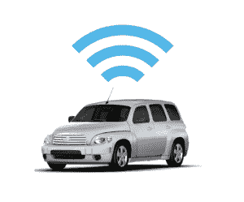
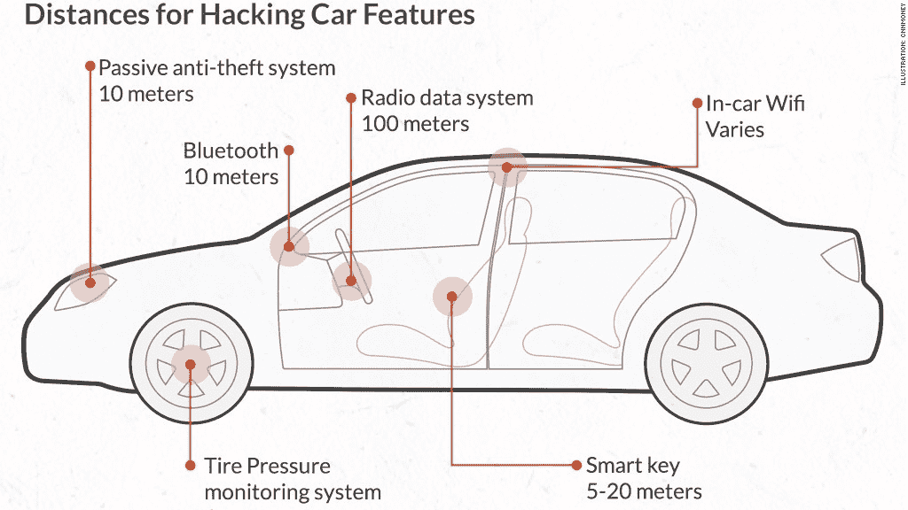

# Chevy 和 DevOps:什么是无线网络？

> 原文：<https://devops.com/chevy-devops-wi-fi/>

**在 DevOps:快速反馈，快速修复**

我相信你也看过。雪佛兰汽车现在配有无线网络。多酷啊。我希望如此(*我的孩子们也希望如此*)。我只能想象可能性。

但是，这并不是我的全部需求。雪佛兰和其他汽车制造商也希望如此。而不是出于你可能首先想到的原因。很快，让我向你介绍今天的回忆:

*   [菲亚特召回导致熄火的软件汽车(2015 年 4 月)](http://www.thecarconnection.com/news/1097773_2013-2015-fiat-500e-recalled-for-software-flaw)
*   [召回 20 万辆吉普车进行软件更新(2015 年 2 月)](https://money.cnn.com/2015/02/02/autos/jeep-grand-cherokee-recall/)
*   [奥迪因软件故障召回 20 万辆汽车(2014 年 10 月)](http://www.autonews.com/article/20141023/COPY01/310239941/audi-recalls-102000-a4-cars-in-u.s.-over-airbag-glitch)

故障与汽车失去动力、错误地展开安全气囊和其他缺陷有关。这只是过去一年发生的软件召回事件的一小部分。

但更令人不安的是，宝马公司这种形式的软件“召回”显示出一个安全缺陷，可能允许网络罪犯打开 210 万辆汽车的车门。因为这 210 万辆车中的每一辆都有同样的软件缺陷，所以犯罪分子实际上可以获得每一辆车的万能钥匙。

**在 DevOps:统治你的供应链**

事实是，你的新车里的软件比你想象的要多——大约有 1 亿行代码。正如我们所知，所有的软件都有缺陷。但是谁愿意去经销商那里获取软件更新呢？如果我的车可以连接到互联网并自我更新，我就不用去经销商那里进行维修了。

虽然过去汽车模型的软件更新需要 5 年时间才能进入生产线，但现在一切都变了。几十年来，像丰田这样的大型汽车制造商一直在为他们的整个供应链应用卓越的管理流程。随着 wi-fi 在车辆中的引入，他们正在扩展其高度优化的实践，以包括其软件供应链。他们知道他们软件的每个部分和版本在哪里，以及谁拥有它。如果检测到缺陷(无论是质量、安全、安保或其他属性)，他们现在将能够自动更新该车辆。他们不仅能消除缺陷，像 Telsa 这样的汽车制造商甚至让他们的汽车跑得更快。

虽然我们许多汽车行业以外的人认为这些大型工业家是行动缓慢的组织，但在汽车中引入 wi-fi 使他们现在能够应用敏捷宣言中的核心原则:“我们的最高优先级是通过早期和持续交付有价值的软件来满足客户”。

**在 DevOps: Version Everything**

对于那些从事软件行业的人来说，这种演进是许多开发工作和持续交付工作的核心。尽你所能实现自动化。尽可能的版本化。快速交付、提高可见性和快速变化。从许多方面来说，雪佛兰卡车中 4G LTE Wi-Fi 的加入意味着 DevOps 进入了我们的汽车和软件供应链。

如果你想象一下这种 wi-fi 功能和软件供应链管理的更广阔的前景，汽车制造商现在正在引领物联网(IoT)质量改善的期望。在快速提高和更新质量、功能、性能等方面，互联网卡车、恒温器或健身手环之间没有太大区别。(我将在以后的帖子中更多地讨论这个话题。)

**在 DevOps:优化您的软件供应链**

汽车制造商从软件行业学到了什么？也许更重要的是——当谈到软件供应链管理和持续交付时——我们能从中学到什么？

* * *

*关于软件和汽车安全的最后一点提示:**我是骑兵**(@ iamthecalary)是[鼓励汽车行业致力于网络安全](https://www.change.org/petitions/automotive-industry-we-request-that-you-unite-with-us-in-a-joint-commitment-to-safety-between-the-automotive-and-cyber-security-industries)。该运动最近发布了一份[五星汽车网络安全框架](https://www.iamthecavalry.org/auto/5star) ( [PDF 下载](https://www.iamthecavalry.org/wp-content/uploads/2014/08/Five-Star-Automotive-Cyber-Safety-February-2015.pdf))，并呼吁汽车行业采纳。来自美国和欧洲的媒体赞扬了这一努力，并呼吁汽车制造商和安全研究人员共同努力，以确保一个安全的未来。*