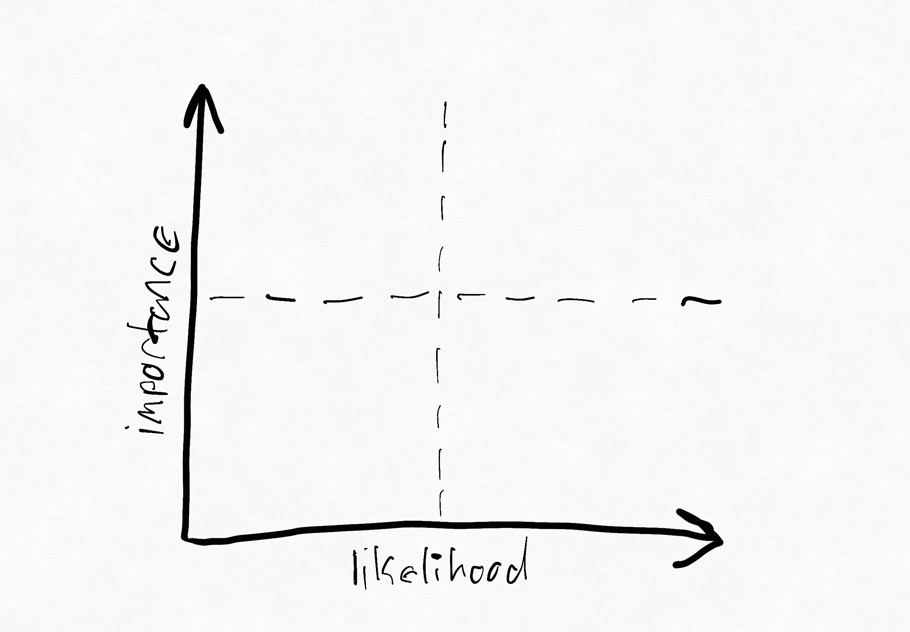

# SLO 鸡汤

> 原文：<https://devops.com/chicken-soup-for-the-slo/>

自古以来，人类一直在努力沟通。从神话到现代，我们最难忘的故事往往涉及个人或团体寻求理解，以避免冲突。无论是圣经中的巴别塔寓言，还是最近的*星际迷航:下一代*一集《达摩克》，对人们如何交流的深深着迷似乎共同抓住了我们的想象力。

因此，分布式软件系统开发中不同团队和角色之间的交流是一个令人着迷的话题也就不足为奇了。在工作场所有一个几乎原始的斗争——“特性”和“稳定性”之间的二分法——几十年来团队一直试图克服它。事实上，软件工程的许多学科已经隐含地进化为对工程师与业务的其他部分进行交流的需求的响应。

那么，我们如何改进这种交流，并与我们的开发伙伴、同事、项目经理和经理建立共鸣呢？我们需要一种与他们沟通的方式，来表达“事情进展如何”，我们的服务或系统有多可靠。但是，让我们退后一步，因为这只是我们看到的一个小窗口——我们需要[将这些愿望和目标传达给更多的观众](https://youtu.be/cWXUOIs33oo)；我们的老板，他们的老板，我们的客户，整个世界。组织的兴衰取决于他们有效沟通的能力。

在自然科学中，我们观察到系统趋向于熵；如果没有约束，能量就会消散。随着规模和复杂性的增加，人类系统也会丧失生产力。敏捷方法和 DevOps 思维的流行与此相关。它们最终是为了帮助我们更好地交流需求和优先事项。现场可靠性工程(SRE)是这一学科发展的最新成果，它对“我如何在动态环境中操作超大规模系统”这一问题提出了严格的要求

SRE 行动手册中更受欢迎的元素之一是[服务水平目标](https://devops.com/?s=SLO)的概念，或称 SLO。引用 Alex Hidalgo 的优秀的*实现服务级别目标*，SLO 是“服务所针对的适当的可靠性级别”，是对服务正常运行中可能发生的“坏”事件数量的计算。正如 Alex 指出的，SLOs 和 SRE 的想法在我们的集体意识中几乎已经不可分割——从组织上来说，没有一个就没有另一个是很奇怪的。

让我们更深入地了解一下 SLO 到底是什么。还是那句话，我会从 Alex 的书里摘录和转述(很好；如果你对这个话题感兴趣，你应该读一读。SLO 只是一个目标，一套定义好的标准，代表着你试图达到的目标。在非常普遍的意义上，SLO 表达了你在一段时间内愿意容忍的“好”到“坏”事件的阈值。然而，这个简单的比率开启了许多关于性能和可靠性的有趣而重要的思考方式。它让您和您的团队能够以非常定量的*和*定性的方式推理和交流可靠性。

现在，你可能会问自己 SLO 的定性成分是什么——毕竟，根据定义，这些测量不就是定量的吗？正是在这种二分法中，我相信 SLOs 的真正力量和效用在于；它们不仅仅是衡量你在做什么的工具，也是向 T2 传达你在做什么的工具。误差预算源于这种思路-它们代表 SLO 的当前状态与其边界之间的空间。

更简单地说，这是一种在目标成为问题之前，衡量你能在多大程度上偏离目标的方法。如果我的 SLO 目标是 99%的可靠性，那么我一年大约有三天半的时间不可靠——或者说，一天大约 14 分半钟。这种测量方法当然有助于推动和决定工程决策，因为它允许我们快速判断如何对看似对立的“特性工作”和“可靠性工作”进行优先排序如果我们即将耗尽这个月的误差预算，那就做更多的可靠性工作。如果我们有懈怠，做更多的特色工作。很简单，对吧？

## 如何交朋友和影响预算

可靠性、SLO、错误预算——这些都是量化软件性能和可用性的有用方法。不过，还有另一种方式来考虑它们，那就是从风险的角度。如果你获得了 MBA 学位，你可能对“风险热图”很熟悉。

这个象限上的 x 轴代表问题发生的可能性；y 轴代表该元素的重要性。这通常可以扩展到业务的任何元素—从您的销售人员到您的客户成功团队，再到您的数据中心或云资源的可用性。

在许多方面，这个简单的象限负责影响你工作的许多决定。虽然一个企业做很多事情，但是经营一个企业的业务可以被认为是一个持续不断的风险管理和减少的过程。

我发现，在软件开发和维护这种更具创造性的领域里，由 MBA 驱动的六适马和过程管理的沉闷世界并不十分有效。这很大程度上与风险有关——你猜对了。在制造业中，失败或缺陷的成本可能非常高。组件缺陷会使数百万或数十亿美元的供应链边缘化；预测和计划的失败可能会破坏及时库存，一艘被困的船或一场突如其来的冬季风暴可能会对国家或全球经济造成数月或数年的破坏。我们应该庆幸的是，软件系统失败的实际成本是如此之低；虽然 us-east-1 停机一小时会对*不利*，但它可能不会在六个月内破坏全球 GDP。

将“较低层次”的问题(如软件系统可靠性或员工流动)转化为“较高层次”的风险问题，在公司的运营和管理方面起到了屏障的作用。当我们思考 SLO 的真正优势和革命潜力时，我们必须考虑这一幕。请记住，SLO 代表“好”和“坏”之间的比率，并给我们一个阈值。这些 SLO 可以非常容易地覆盖到我们的风险地图上；更关键的服务和流程的 SLO 上升到顶部，较新的服务移动到右侧。

本质上，我们可以给我们的 SLO 一个关于整体业务风险的定性分数，并使用它来塑造整体业务方向。这是至关重要的，因为在缺乏更好的定性测量的情况下，企业通常会抓住定量的可靠性测量——引用 Hidalgo 的话来说就是“被解雇的页面或被开出的票”。他继续说道，“由于误报或开票人的突发奇想，这些很可能是不准确的。”我们经常依赖的测量类型，如按严重程度分类或“平均到达时间 *x* ”无法准确分类可靠性或它如何影响用户体验。

让我们用例子来说明——关于 SLO 的大部分对话都在讨论如何从用户的角度来设计它们；更快乐的最终用户、更快乐的工程师、更快乐的经理等等。对应于用户旅程的 SLOs 例如，“向购物车添加商品的成功率为 99%。”—从最终用户的角度来看易于理解。我们可以通过对 SLO 本身进行重要性和可能性评分来讨论风险。如果我们的网站是一个电子商务平台，那么购物车的重要性就非常高。由于我们的门槛非常低(1%)，因此这种风险的可能性也非常高——我们没有太多的回旋余地！

针对定向广告服务的 SLO 可能是这样的:“90%的情况下，在 30 毫秒内提供上下文适当的显示广告。”在这种情况下，就我们的业务风险而言，我们的广告业务可能不太重要，因此我们应该降低 SLO 的重要性。此外，我们的阈值非常大，因此我们应该减少违规的可能性(因为我们有更多的回旋余地)。随着时间的推移，这些位置和分数可以(也应该)改变——也许我们业务的广告部分变得更有价值，所以我们在风险地图上重新排列它的优先顺序。

通过使用这种语言并以不同的方式量化我们的数据，我们可以拉开运营和管理部门之间的帷幕，并利用它来影响我们直接领域之外的事情。

## “妈妈，为什么房子里有一个 SLO？”

有一句关于战争和战斗的格言说，“将军们总是准备打最后一战。”这些年来，我在自己工作过的每家公司都看到了这一点——在规划和准备战略性业务挑战时，我们往往是被动的，而不是主动的。部分原因是我们都不是能够预测未来的先知，但大部分原因只是与上述推动业务规划和决策制定的风险管理周期有关。当向更广泛的受众介绍 SLO 时，你需要做好准备，应对高管和经理几乎肯定会对这种新的思维方式产生的抵触情绪。

但是，当你仔细想想，SLO 试图代表的东西和 OKR、KPI 或任何其他以目标为导向的系统试图代表的东西并没有太大的区别。在每种情况下，我们都会创建一些启发式规则，将事件分为“好”和“坏”两种情况，然后根据它们之间的比率创建一个“现在有问题了”的阈值。本质上，这就是你如何用百分比来衡量任何东西。

你可以将销售、营销、客户成功或人员运营团队的目标转化为 SLO。例如，“30%的 POC 应转化为已达成交易的机会”基本上已经是一个 SLO，并且可能是您的销售团队的现有目标。将这些视为 SLO 有两大优势:一致的报告和错误预算。

持续报告 SLO 意味着您可以在整个组织中以相同的格式和语言表达团队和公司的目标。这将团队聚集在一个共同的目标上，并允许一个关于可靠性如何使每个人受益的共享语言。能够汇总事情进展情况的报告不仅可以鼓励更多的目标共享，还可以帮助你在不同类型的工作之间建立联系，从而实现共同繁荣。更重要的是，SLO 报告给出了关于团队——不管他们的职能是什么——应该如何解决失败的极其明确的信号。

如果围绕可靠性的一致语言是建立同理心的因素，那么错误预算就是释放创造力和解决业务问题的方法。在太多的情况下，由于惯性、自上而下的命令和控制风格的过程或者仅仅是害怕搞砸，组织不愿意给个人贡献者，甚至团队，实验和测量这些实验的结果的灵活性。

让我给你举个例子——假设你的营销团队有一个演示，每个月都会产生一定比例的销售线索。如果没有为这个演示的性能定义一个 SLO，就很难改变这个演示的工作方式。为什么？因为事物有一种稳定在当前状态的趋势——我们都被时时刻刻的危机或新的工作所困扰，以至于评估现有事物的表现具有挑战性。

证明一个变化的合理性所需要的工作最终超过了为实现这个变化所做的实际工作，因此变化在藤上枯萎了，过程停滞了。现在，假设这个演示流有一个与之相关联的 SLO，类似于“我们演示的 10%的点击应该会导致有效的电子邮件捕获”突然间，我们可以以一致的方式报告这一点，更重要的是，我们有了大量的实验空间。我们不仅可以在流程的当前状态(我们比我们的目标运行得更好还是更差)的背景下证明正在进行的改进流程的工作是正确的。)也是在我们的*其他*目标的背景下(总的来说，我们是否生产了足够的 mql 来支持销售漏斗？)并适当地进行优先排序。

最终，我们无法改变这样一个事实，即人们倾向于处理最后发生的事情，但这不是重点。我们能够改变的是我们如何思考表达现在正在发生的事情，并围绕解决这些问题建立一致的语言和措辞。从广义上讲，SLO 是作为一种沟通复杂分布式软件系统可靠性目标的方式而设计的。除了复杂的分布式人类系统之外，什么是人的业务？

随着围绕 SLO 的思想、工具和流程的不断成熟(例如最近宣布的 [OpenSLO](https://github.com/OpenSLO/OpenSLO) 规范)，我很兴奋地看到未来为我们准备了什么。归根结底，我们应该努力减少等级制度，增加自主性，并在我们作为人类所依赖的社会技术系统中建立集体所有权；SLO 只是这个不断发展的难题的另一部分。