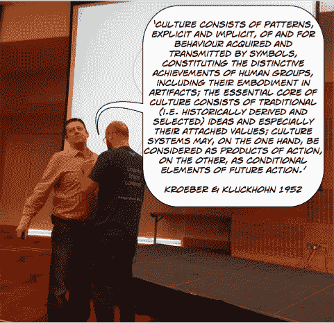

# 克罗诺斯、凯罗斯和杰纳斯:是时候寻求平衡了

> 原文：<https://devops.com/chronos-kairos-janus-time-seek-balance/>

> 我们把理想主义和天真混为一谈，把悲观主义和“现实一点”混为一谈。但是否认完美的存在就是否认我们自己生活的证据。

## 2015 年是赢了还是输了？

很难判断谁是赢家，谁是输家。我就读的数学系有一个习惯，就是把班上的 a 叫出来，或者干脆什么都不说。一位教授认为我们很幸运，因为他的母校在交还论文时喊出了 f。有趣的是，从不同角度呈现的信息会对其引发的情绪范围产生如此巨大的影响。

事后分析是一种关注导致失败的时间线的活动。Etsy 在鼓励[业内清白的事后调查](https://codeascraft.com/2012/05/22/blameless-postmortems/)方面做得非常出色。当我们处理复杂的系统时，问题是事情什么时候会失败，而不是失败是否会发生。

回顾是在开发冲刺结束时举行的类似会议，团队成员试图确定他们可以采取的行动，以便在未来获得更成功的冲刺。回顾 2015 年，我认为有必要平衡我们的成功与失败。当我们专注于优化时，我们太急于庆祝我们的成功。当我们专注于稳定性时，我们往往只看到失败，而忽略我们遇到的成功。当我们很好地平衡时，很难区分我们的事后分析和回顾，但我们肯定两者都有。

不管你对它有什么感觉，2015 年正从我们的指缝间快速溜走。Chronos & Kairos 分别代表我们通常机械地认为的时间和采取行动的机会时间。我碰巧是亚努斯的粉丝，亚努斯是所有开始和结束的神，据说他同时存在于所有的空间和时间。虽然我没有这种经验或远见，但我能够回顾过去的一年，预测下一年，并努力调整。

我记得有些学生很难通过考试，但他们对计算机科学很感兴趣。我记得其他学生如果得了 B 会很失望，如果考试不及格会彻底崩溃。很可能你是这两种学生，因为我们的表现就像我们随着时间的推移所面临的课程一样充满活力。当我们庆祝的时候，这真的是一个学生没有被挑战的标志。一个 F 是一个信号，表明他们需要慢下来或者后退一点，而 C 学生代表那些受到课程挑战并且正在成功取得进步的学生。

## 文化平衡

11 月初，我在圣克拉拉云博览会期间的 devOps 峰会上做了一个名为“精密、准确和调试双模模型”的演讲。我关注的是我们衡量事物的粒度，以及我们倾向于将事物分为对错、好与坏、新旧以及其他极端，而不是简单地承认它们是不同的。虽然布尔分类在某些情况下可能是准确的，但通常情况下需要通过定义两个极端之间的范围来提供精确度。这些中间状态通常会增加我们实施成功变革的几率，因为它们提供了循序渐进的步骤，而不是期望一蹴而就。

当不可否认的失败发生时，我们通过跟随小成功的时间线来找到学习的地方。在某些时候，我们的期望会与我们面临的现实不一致，这是我们需要仔细观察的地方。

当我在圣克拉拉的时候，我赶上了硅谷的发展日。我进行的对话旨在收集更多关于文化黑客的反馈，以及文化如何影响组织生产的工件。主题是“沟通 devOps 文化”，这使得我很容易获得关于我一直在做的一些模型的反馈，因为这是活动中的一个普遍话题。

事实上，对于文化变革最终是真诚进步所需要的，这种担忧在我今年所在的科技行业的各个部门都得到了回应。Devops Days 硅谷将其作为一个主题，但文化变革似乎是 2015 年大多数活动的走廊主题。戴夫·斯诺登的 [cynefin](https://youtu.be/N7oz366X0-8) 框架也出现在我今年参加的大多数活动中。我是在[杰贝·布鲁姆在纽约的演讲中被介绍给这位模特的。J. Paul Reed 和我都在 devOps 峰会上提到过，但是 Jason Hand 在他的演讲中对此做了更详细的介绍。](https://youtu.be/ZbOodRzgZGI)

精益敏捷苏格兰有很多关于文化和 cynefin 的讨论。它甚至在地毯里。这种方法对我很有效，因为我这次旅行是为了对比我随一个国际团队去过的美国各城市的科技社区的文化差异。在演讲之外，文化是走廊谈话中的一个常见话题。精益敏捷苏格兰有来自世界各地的人参加。我们往往会发现一些小差异，比如称它为走廊而不是过道，这很有趣。

康威定律将一个组织生产的人工制品与其沟通结构联系起来，而沟通结构最终是该组织文化本身的人工制品。我开始将文化视为一个组织如何沟通的背景。杰贝·布鲁姆和 T2·克里斯·马茨都在爱丁堡做了关于文化的演讲，但是视频还没有发布。这里有一张 Jabe 在 Chris 的主题演讲中提供文化定义的图片。

我对克里斯的主题演讲非常满意。它排练得很好，也很有趣，但它也为我一直在努力开发的基于向量的模型提供了一个缺失的部分，以更加一致地对组织进行基准测试。我碰壁了，因为我不知道如何量化像文化这样的东西而不把我的个人偏见注入到度量中，但是克里斯分享的关于霍夫斯塔德的文化维度的内容很容易落入我的模型并满足了要求。

我在匹兹堡、爱丁堡和硅谷之间收到了很多关于我的模型的反馈，这些反馈都非常令人鼓舞。我已经看到最初的怀疑变成了乐观，并且有很多人愿意帮助我进一步努力和研究，这是我打算在 2016 年关注的重点。我确实期待着明年对组织进行基准测试，努力在行业的安全游戏状态之间找到更多的路径。

回顾一下我之前描述的教授发回评分测试的交流，可以清楚地看到我们如何学习受到交流时强调的情绪的影响。我们关注的是失败还是成功？我们所处的文化更看重稳定还是优化？你的团队有事后分析，回顾，或者两者都有？

凯瑟琳·柯克提倡[“为什么团队快乐是最糟糕的目标”](https://vimeo.com/143894732)。洞察力被情感所包围，而冷静是我们获取它的工具。由于情感转瞬即逝，我们不应该追求它们。相反，通过将我们自己固定在平静中，我们为不同情绪的波动做好了准备，这些波动将会到来，并允许它们不加判断地过去。

《T2 欢乐公司》的作者理查德·谢里丹(Richard Sheridan)和《T4 门罗创新公司》的首席执行官理查德·谢里丹(Richard Sheridan)发表了一个不同的观点，他在主题演讲中谈到了如何“[建立一个人们喜欢的工作场所——只需增添欢乐](https://vimeo.com/144370269)。他描述了一个以学习为中心的开放、高度信任的社区。这意味着一个在失败发生时能坦然接受失败的环境，并能抓住从中学习的机会。追求一种情感可能是愚蠢的，但当文化如此依赖于稳定性，以至于失败最终在系统的人类组成部分中表现出来时，朝着不同的方向彻底纠正是很自然的。

## 人非圣贤孰能无过

[Jonathan Disher](https://twitter.com/funjon) 的演讲，[“devo PS 一个人的军队”](https://youtu.be/vfQLVD-0gHo)在 devopsdays 硅谷，技术和文化信息完美融合。我们通过自动化来努力获得一些平衡的空间，但是这个空间很快就会被其他工作代替。

寻求某种帮助，比如让更多的团队成员来抵消工作量，会让领导层质疑个人的承诺水平。即使我们在团队中没有足够的深度，对报复的恐惧可能会阻止我们花费我们需要的个人时间，但最终总会有事情发生。这就是我们这个行业烧坏率高的原因。

绘制地图的目的是明确挑战我们的假设。这有助于我们一检查方位就意识到我们偏离了轨道。[沃德利映射](http://www.cio.co.uk/insight/strategy/introduction-wardley-value-chain-mapping-3604565/)是由[西蒙·沃德利](https://twitter.com/swardley)开发的价值链映射方法，非常恰当。他的制图非常实用，并提供了与[爱德华·塔夫特](https://twitter.com/EdwardTufte)的技术的有趣对比，他是今年我很高兴见到的另一位数据可视化和制图专家。

不幸的是，在企业文化中，给予这种洞察力所需的关注程度所需的时间通常被认为是一种奢侈。由于自动化和适应性可视化框架，标准正在慢慢提高。[威尔·埃文斯](https://twitter.com/semanticwill)的[来自精益敏捷苏格兰](https://vimeo.com/143053323)的演讲提供了沃德利映射和设计的坚实融合，他解释了像这样的新实践如何进入我们的工作场所。

## 学习文化

随着 2015 年进入最后时刻，我感到成功地找到了共识，即我们失败的原因是文化原因。我相信我们不能改进我们不测量的东西，因此我 2016 年的计划是进一步研究、建模和可视化组织及其平衡状态。

在我获得做出合理尝试的背景之前，我不得不形成一个关于我们如何解决问题的假设，但是映射旨在帮助我们挑战我们的假设。我假设解决方案在于我们作为个人的行动，如果我们希望看到周围的改善，我们必须想改善自己。

通常我们努力追求的最终状态是无法实现的。约翰·威利斯向我介绍了迈克·罗泽尔的[丰田形](http://www-personal.umich.edu/~mrother/Homepage.html)中“正北”的概念，并建议我自己阅读以了解更多。我们现在正在我们创办的 devOps 读书俱乐部里读丰田形，现在我们已经读完了杰夫·苏斯纳的[设计交付](http://shop.oreilly.com/product/0636920033080.do)。

读书俱乐部旨在帮助我们在阅读一本书时讨论想法。我很惊讶地发现一个读书俱乐部的运作是多么的不同步。每个人都以相同的速度阅读同一本书是一种更典型的读书俱乐部方式，但鉴于我们生活在不同的时区，并且日程安排繁忙，我们正在适应一种更适合的模式。如果你读过《设计交付》、《丰田形》,或者打算读这两本书中的任何一本书，并且希望有人与你讨论，请随时在 twitter 上联系我。

罗泽尔书中的改进形将科学方法映射为计划、执行、检查和行动。我们不应该关注过程，而应该关注让人们能够提高自己。我们在学习中进步，在交流中学习。如果你的文化不能促进交流，那能促进学习吗？如果你对自己不坦诚，那会对你的环境产生什么影响？

我可以更详细地说明我明年的打算，以后可能会这样做，但是我的计划对你没有用，因为我们是不同的人。我鼓励你通过挑战过去一年限制你经营的假设来获得对你自己处境的认识。你有成功也有失败，两者都值得关注。平静地回顾你的结果将有助于平衡你的行动，并有望引领你进入成功的 2016 年。新年快乐。