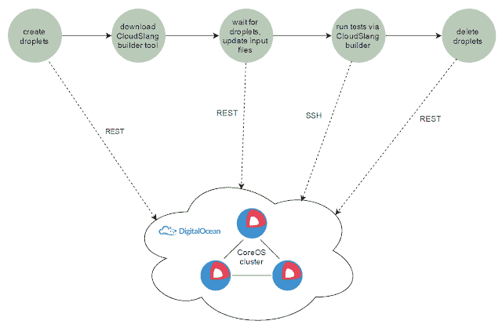
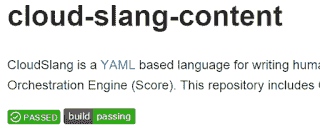

# 具有 CircleCI 和 DigitalOcean 的复杂集群环境 CI

> 原文：<https://devops.com/ci-complex-cluster-environment-circleci-digitalocean/>

在 [CloudSlang](http://cloudslang.io) ，我们对所有开源的东西都充满热情。与其他开源项目集成是我们工作的关键部分。我们专注于集成许多云原生技术，如 CoreOS、Docker 和 Consul。

因此，作为 CI 的一部分，自动测试这些集成对我们来说非常重要。但是使用流行的 CI 解决方案(如 Travis 或 CircleCI)建立复杂的集群环境(如 CoreOS/Swarm cluster)进行测试可能会很棘手。

在本帖中，我们将概述如何结合使用 DigitalOcean、CircleCI 和 CloudSlang 来测试我们的内容集成。同样的公式可以用来建立您自己的复杂测试环境。

最近，CloudSlang 引入了一个测试框架，为 CloudSlang 内容编写测试，并使用构建工具运行它们。构建工具的特性包括将测试分组到测试套件中，并验证流程结果、预期输出或异常。

CloudSlang 在 GitHub 上有一个快速增长的内容库。当存储库中的流程发生更改时，它会影响依赖于更改后的流程的内容的其他部分。因此，找到合适的 CI 解决方案对我们来说至关重要。

在调查了可用的 CI 提供者和我们的配置需求之后，我们决定将我们的测试套件分成两类，并在 CircleCI 和 Travis 之间进行分配。这两种解决方案都基于 CloudSlang 构建工具来验证我们的内容:CircleCI 运行与集群相关的测试套件(例如 CoreOS、Docker Swarm)和基本内容(不需要 SSH 访问)，而 Travis 处理需要通过 SSH 访问环境的大部分 Docker 内容和流。

### 构建过程的逻辑步骤

[](https://1.bp.blogspot.com/-qHUfZwZ9f7c/VdsVxYDTUHI/AAAAAAAAAoM/CvvNHqyPZqk/s1600/build_process.png)

这个过程从处理本地内容存储库开始。内容存储库包含两个主要文件夹:内容(用于常规的 CloudSlang 文件)和测试(测试相关的 CloudSlang 文件)。变化可能是添加新的内容和测试，或者只是更新现有的文件。

变更完成后，它们被提交到一个工作分支。当所有的提交都准备好时，它们被推送到 GitHub，并与一个 pull 请求相关联。

推送到 pull 请求的任何更改都会触发 CircleCI 构建，该构建基于一个 [circle.yml](https://github.com/CloudSlang/cloud-slang-content/blob/acdf0721468ac0879e53e075e507378a31da125f/circle.yml) 文件进行配置。CircleCI 使用 Docker 容器构建您的代码。目前我们使用两个容器的并行性，每个容器都运行构建工具。结合 CircleCI 的并行修饰符和环境变量(例如节点索引)，您可以指定一个命令是应该在每台机器上执行(下载构建工具)还是只在一台特定的机器上执行(创建只由一台机器使用的资源)。

**circle.yml**

```
test:  pre:    - ? > ### machine 0        if [ "${CIRCLE_NODE_INDEX}" = "0" ];        then docker run -d -p 49165:8080 jenkins        && docker run -d -p 8500:8500 -p 8600:8600/udp fhalim/consul;        fi      : parallel: true    - if eval "${RULE_DROPLET_MACHINE_NOT_FORK}"; then chmod +x ci-env/create_droplets.sh && ci-env/create_droplets.sh; fi:        parallel: true ### machine 1    - ? > ### every machine        wget https://github.com/CloudSlang/cloud-slang/releases/download/cloudslang-0.8.0/cslang-builder.zip        && unzip cslang-builder.zip -d cslang-builder        && chmod +x cslang-builder/bin/cslang-builder        && mkdir cslang-builder/lib/Lib        && pip install -r python-lib/requirements.txt -t cslang-builder/lib/Lib      : parallel: true    - ? > ### machine 1        if eval "${RULE_DROPLET_MACHINE_NOT_FORK}";        then chmod +x ci-env/wait_for_droplets_and_update_test_inputs.sh        && ci-env/wait_for_droplets_and_update_test_inputs.sh;        fi      : parallel: true
```

在第一台机器(机器 0)上，默认测试套件被激活。它验证基本内容，包括处理文件或字符串操作等内容。这个测试套件不需要额外的环境配置。

在第二台机器(机器 1)上运行的测试需要额外的配置。在这种情况下，我们使用 CoreOS 机器集群作为测试流使用的基础设施。我们使用 DigitalOcean 来创建和管理 CoreOS 机器(水滴)。每个构建都有自己的一组 droplets，按照以下约定命名:ci-{ build _ number }-coreos-{ machine _ number }因此构建是完全独立运行的。

[](https://3.bp.blogspot.com/-rJxHKvdWquk/Vdr8dMuREGI/AAAAAAAAAHM/gZlsZNktFRY/s1600/namig_format.png)

一旦所有的并行执行完成，CircleCI 就会收集并评估构建结果。CircleCI 还发布了一个名为 execution.log 的工件，它由构建工具创建，包含关于执行的相关日志记录信息——这在调试流执行时非常有用。

### 对水滴进行测试

下图显示了第二个容器的执行阶段:

[](https://4.bp.blogspot.com/-YD9RioD3u7s/Vdbej8DWrxI/AAAAAAAAAF8/cul4EH3Wp58/s1600/droplets.png)

这些步骤使用 bash 脚本来执行相关命令。脚本和配置文件可以在 [ci-env](https://github.com/CloudSlang/cloud-slang-content/tree/acdf0721468ac0879e53e075e507378a31da125f/ci-env) 目录下找到。使用 DigitalOcean 的 REST API 创建和管理水滴。第一步(create_droplets.sh)为 CoreOS 集群生成一个发现 URL，并用新创建的 URL 更新云配置文件。cloud-config 文件包含集群的常规 CoreOS 配置数据(私有网络配置，启动 etcd 和 fleet 等服务)和 write_files 部分，我们在其中为群用例准备了一个单元文件(docker-tcp.socket )(该 socket 将用于启用 Docker Remote API)。一旦云配置文件准备就绪，我们就可以通过向 DigitalOcean 发送 POST 请求来创建水滴:

```
 CURL_OUTPUT=$(curl -i -s -X POST https://api.digitalocean.com/v2/droplets \                -H 'Content-Type: application/json' \                -H "Authorization: Bearer ${DO_API_TOKEN}" \                -d "{                  \"name\":\"${COREOS_MACHINE}\",                  \"ssh_keys\":[${DO_DROPLET_SSH_PUBLIC_KEY_ID}],"'                  "region":"ams3",                  "size":"512mb",                  "image":"coreos-stable",                  "backups":false,                  "ipv6":false,                  "private_networking":true,                  "user_data": "'"$(cat ci-env/cloud-config.yaml | sed 's/"/\\"/g')"'"                }')
```

该请求是使用项目属性页中定义的全局环境变量(DO_API_TOKEN，DO_DROPLET_SSH_PUBLIC_KEY_ID)、脚本中定义的环境变量(COREOS_MACHINE:机器的名称，取决于内部版本号)和云配置文件动态生成的。该脚本还验证请求是否被 DigitalOcean(状态代码:202)接受，并将液滴 id 存储在一个数组中:

```
DISCOVERY_URL: https://discovery.etcd.io/5f30dd91642ae055ff24efd6b2359f3dci-1439-coreos-1 (ID: 6748964) droplet creation request accepted - status code: 202ci-1439-coreos-2 (ID: 6748965) droplet creation request accepted - status code: 202ci-1439-coreos-3 (ID: 6748966) droplet creation request accepted - status code: 202
```

第二步(在两台构建机器上并行执行)下载并准备构建工具。相关命令从 circle.yml 文件中读取。

第三步(wait _ for _ droplets _ and _ update _ test _ inputs . sh)等待 droplets 开始运行，添加必要的启动后配置(例如，为 Docker Swarm 激活 TCP 套接字)并用实际信息(droplet IP 地址、私钥文件位置)更新输入。该脚本通过向 DigitalOcean 发送 GET 请求来定期检查水滴状态:

```
Droplet(6748964) information retrieved successfullyDroplet(6748964) status: newDroplet(6748964) information retrieved successfullyDroplet(6748964) status: newDroplet(6748964) information retrieved successfullyDroplet(6748964) status: newDroplet(6748964) information retrieved successfullyDroplet(6748964) status: activeDroplet(6748964) IPv4 address: 188.166.45.76
```

在这里，我们将常规的 bash 脚本(grep、awk)与 Python 结合起来(用于复杂的数据处理):

```
 IP_ADDRESS=$(\          echo "$RESPONSE_BODY_JSON" | python -c \'if True:          import json,sys;          obj = json.load(sys.stdin);          ipv4_container_list = obj["droplet"]["networks"]["v4"];          public_ipv4_container_list = filter(lambda x : x["type"] == "public", ipv4_container_list);          print public_ipv4_container_list[0]["ip_address"] if len(public_ipv4_container_list) > 0 else "";'\          )
```

两台 CoreOS 机器将被用作群代理(剩下的一台将有群管理器)，所以我们需要为这些机器启用 Docker 套接字。定义套接字的单元文件是在 droplet 启动时基于 cloud-config 文件创建的。在这个阶段，我们需要使用以下命令来启用套接字:

```
 LAST_LINE=$(ssh -i ${SSH_KEY_PATH} \  -o UserKnownHostsFile=/dev/null \  -o StrictHostKeyChecking=no \  [[email protected]](/cdn-cgi/l/email-protection)${DROPLET_IP} \  'sudo systemctl enable docker-tcp.socket \  && sudo systemctl stop docker \  && sudo systemctl start docker-tcp.socket \  && sudo systemctl start docker \  && echo -e "\nSUCCESS"' | tail -n 1)
```

现在液滴可以被访问了。当 CoreOS 集群配置正确时，Swarm 集群将使用流来设置，因为 Swarm 是基于 Docker 容器的(需要在机器上运行管理器和代理容器)。启动构建工具之前的最后一步是用实际数据更新测试输入文件(例如微滴的 IP 地址):

```
find test -type f -exec sed -i "s/<coreos_host_1>/${DROPLET_IP_ARRAY[0]}/g" {} +
```

此时，运行测试的一切都准备好了。构建工具通过激活相关的测试套件来执行。这些套件中的流使用 SSH 调用与液滴进行交互。构建工具显示关于执行的相关统计数据——覆盖率、通过了多少测试用例以及测试失败时的问题原因。

```
02:41:58 [INFO] 97% of the content has tests02:41:58 [INFO] Out of 158 executables, 154 executables have tests02:41:58 [INFO] 02:41:58 [INFO] ------------------------------------------------------------02:41:58 [INFO] BUILD SUCCESS02:41:58 [INFO] ------------------------------------------------------------02:41:58 [INFO] Found 153 slang files under directory: "/home/ubuntu/cloud-slang-content" and all are valid.02:41:58 [INFO] 11 test cases passed02:41:58 [INFO] 145 test cases skipped
```

一旦测试完成——在最后一步——我们需要通过向 DigitalOcean (cleanup_env.sh)发送删除请求来删除用于该构建的水滴。

### 管理敏感数据

由于我们的构建系统的工作机制是基于异构组件的，因此我们需要一种安全的方式来存储敏感数据(例如用于身份验证的 DigitalOcean API 令牌)。CircleCI 提供了定义全局环境变量的可能性，我们可以在其中存储这类数据。这些环境变量不包括在来自外部拉请求(由不属于 CloudSlang 组织的用户创建的拉请求)的构建中，否则它们很容易被获取。有人可以通过修改 pull 请求中的 circle.yml 文件来打印它们。

### 结论

在这篇文章中，我们向您展示了 CloudSlang 如何通过结合诸如 Build Tool(执行测试的工人)、GitHub 托管代码库、CircleCI(定义构建系统框架的 CI 解决方案)和 DigitalOcean(托管测试机器的 IaaS 提供商)等技术来开发自己的持续集成机制。

如果你想了解更多关于构建系统的信息或者只是看看这个项目，请访问我们在 CloudSlang 的[网站](http://www.cloudslang.io/#/)或者 [GitHub](https://github.com/CloudSlang) 页面。

记住——保持酒吧绿色……

[](https://4.bp.blogspot.com/-LeqFck0P4FI/VdbnCLXdJCI/AAAAAAAAAGs/nL25IG8grmA/s1600/gh_passing3.png)