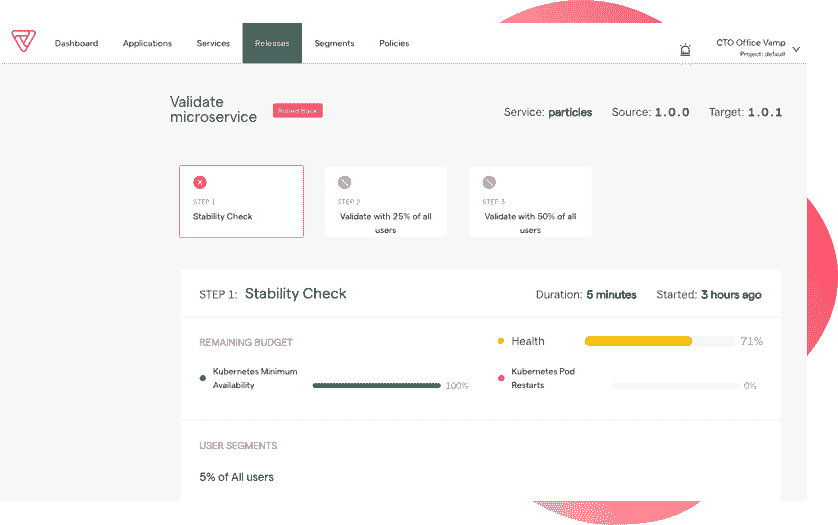

# CircleCI 收购 Vamp 将 AI 应用于 CD

> 原文：<https://devops.com/circleci-acquires-vamp-to-apply-ai-to-cd/>

CircleCI 今天宣布，它已经收购了 Vamp，这是一家自动化应用程序发布的编排平台提供商。CircleCI 同时透露，它已经获得了额外的 1 亿美元融资，以实现 17 亿美元的估值。

CircleCI 首席执行官吉姆·罗斯(Jim Rose)表示，在应用部署率持续稳定增长的情况下，Vamp 将在提升 CircleCI 持续集成/持续交付( [CI/CD](https://devops.com/?s=CI%2FCD) )平台的能力方面发挥重要作用。事实上，CircleCI 声称其平台现在每天处理 250 万份工作。

[Vamp](https://vamp.io/) 平台使构建和编排多阶段发布周期变得更加容易，例如，涉及应用程序的 canary 发布。然后，它采用机器学习算法，根据 It 团队定义的服务级别目标来验证发布的影响、性能和质量。如果确定有任何问题，平台将自动回滚一个版本。

虽然许多组织已经成功地实施了 CI 最佳实践，但持续部署应用程序版本的能力已被证明是一个更难以实现的目标。部署应用程序的每个平台都有独特的属性。Rose 指出，增加机器学习算法可以提供对部署的持续验证，应该有助于推动应用程序开发和部署方式的巨大变化，以改善 CD 的整体状态。

这些机器学习算法以及其他形式的人工智能(AI)不会取代对 DevOps 团队的需求，因为在一定程度上由于微服务的兴起，IT 环境正变得越来越复杂。事实上，随着容器、Kubernetes 和无服务器计算框架的到来，不使用人工智能来管理 it 环境几乎是不可能的。

Rose 补充说，随着生产前和生产环境之间的界限不断模糊，it 团队更紧密地协调 CI 和 CD 工作流至关重要。目标应该是更紧密地集成这些过程，而不是在 GitOps 工作流的上下文中将 CD 与 CI 隔离开来。越来越明显的是，构成应用程序的元素更加经验性，例如，配置文件现在与应用程序代码一起存储在 Git 存储库中。这种更紧密的集成最终使得在部署应用程序之前对其进行测试和验证变得更加容易。可以被分析以优化应用程序开发和部署的元数据也可以作为连续反馈循环的一部分更容易地被捕获。

这种方法比以往任何时候都更加重要，因为“大爆炸”式部署应用程序更新的时代已经过去。Rose 指出，现在取而代之的是源源不断的更新，这些更新提供了新的功能，需要不断地进行审查。

DevOps 的每一个连续时代都将比前一个时代更加自动化。面临的挑战是，在竞争对手在速度和灵活性上获得无法超越的优势之前，认识到这些新时代何时到来。