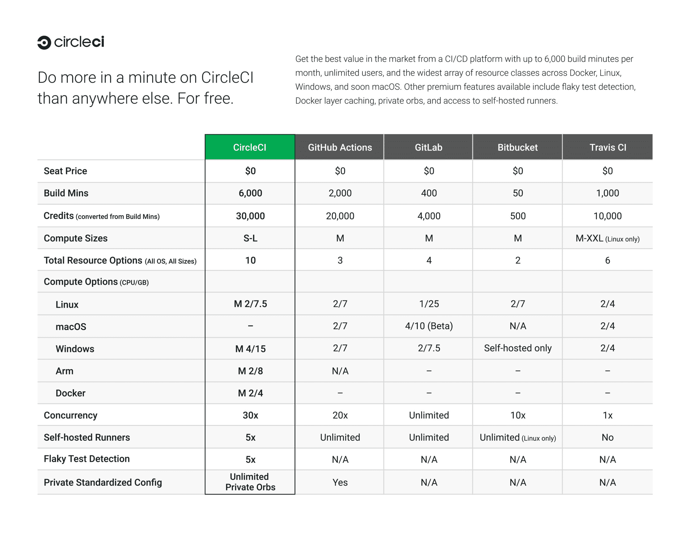

# CircleCI 为 CI/CD 服务增加了免费无限制访问层

> 原文：<https://devops.com/circleci-adds-free-unlimited-access-tier-to-ci-cd-service/>

CircleCI 在其持续集成/持续交付(CI/CD)平台中添加了一个免费的无限制访问层。

CircleCI 首席执行官吉姆·罗斯(Jim Rose)表示，与其他“免费增值”产品相比，CircleCI 的免费层为开发人员和开发团队提供了对该平台所有优质功能的无障碍访问。这些功能包括每月高达 6，000 分钟的构建时间、无限制的用户、使用缓存、并发、测试分割、安全工具和健康指标微调管道的能力。

CircleCI 声称现在有超过 200，000 个团队使用它的 CI/CD 平台。Rose 指出，免费增值层旨在使开发团队在开始应用程序开发项目时更容易利用 CI/CD 平台。他补充说，随着该项目的发展和成熟，许多团队最终将需要 CircleCI 提供的商业支持和其他服务。

CircleCI 云服务的免费层是在许多组织试图加快构建和部署应用程序的速度时出现的。特别是，在新冠肺炎疫情之后，数字化业务转型计划已经成为一个更高的优先事项。CI/CD 服务的免费层可能会鼓励更多的试验，因为它降低了与设置应用程序开发环境相关的开销水平。

随着开发的应用数量持续稳步增长，CI/CD 平台提供商之间的竞争也变得更加激烈，因为采用 DevOps 最佳实践来加速应用开发的组织数量也在增加。与此同时，在新冠肺炎疫情之后，越来越多的 DevOps 团队依赖云服务来托管 CI/CD 平台。

目前还不清楚 DevOps 团队是否会选择依赖专有平台还是开源平台。虽然开源平台可以防止组织受到供应商的限制，但随着从一种云服务转换到另一种云服务的成本下降，云服务的易用性可能会减少这些担忧。

无论如何，CI/CD 平台的使用将在 2022 年大幅增加。尽管努力鼓励标准化，但是同一个组织内的不同 DevOps 团队采用不同的 CI/CD 平台的情况并不少见。以生产力的名义，DevOps 团队倾向于在许多组织中行使相当大的自主权。

当然，最大的挑战不一定是构建应用程序，而是部署它们。尽管有 CI/CD 平台，但大多数组织部署应用程序所依赖的流程在很大程度上仍然是手动的。然而，在云时代，由于 API 云服务提供商的出现，自动化应用交付应该变得更加容易。事实上，2022 年可能是 DevOps 团队[最终掌握 CD](https://devops.com/continuous-delivery-challenge-looms-large-in-2022/) 的一年。当然，CI/CD 平台的提供商在确保集成 CI/CD 平台的全部承诺最终成为日常 DevOps 现实方面有既得利益。