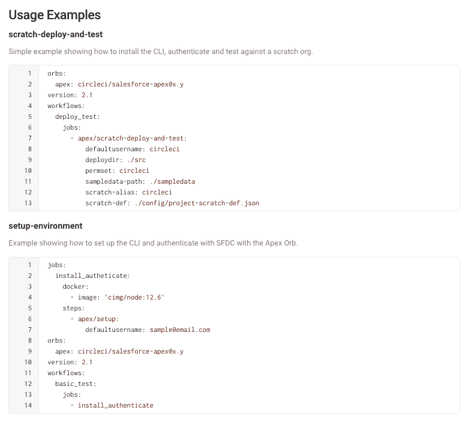

# CircleCI 添加到 Salesforce CI/CD Orbs 系列

> 原文：<https://devops.com/circleci-adds-salesforce-to-cicd-orbs-collection/>

CircleCI 今天宣布，它已经扩展了对 DevOps 团队[的 CI/CD 支持，这些团队构建的应用程序扩展了 Salesforce](https://circleci.com/blog/salesforce-apex-orb/) 的软件即服务(SaaS)平台。

公司首席执行官吉姆·罗斯(Jim Rose)表示，随着新冠肺炎疫情带来的经济衰退，人们对构建补充 Salesforce 平台的应用程序的兴趣急剧上升。他指出，IT 团队不是从零开始构建整个应用程序，而是通过利用 Salesforce 作为云服务提供的核心应用程序套件来推进数字业务转型计划。

Rose 说，其中许多应用程序是由采用最佳 DevOps 实践的专业开发人员构建的。

为了减少这些 DevOps 团队的摩擦，CircleCI 现在增加了对 Salesforce Apex orb 的支持。orb 是 CircleCI 为其持续集成/持续交付(CI/CD)平台提供的一组预配置连接器。该公司已经制造了超过 1600 个圆形球体。Salesforce Apex 是 Salesforce 向开发人员提供的专有面向对象语言。

Salesforce Apex orb 自动将更改部署到生产应用程序，运行使用 Salesforce Platform 用户界面显示的单元测试，并跟踪提交时的版本控制。

CircleCI 还更新了其现有的 Salesforce 命令行界面(CLI) orb，以加强集成。

Rose 表示，随着应用程序开发的步伐不断加快，越来越多的 IT 团队正在将最佳开发运维实践应用到他们构建和部署应用程序的方式中，作为使整个组织更能适应变化的努力的一部分。其他人只是希望对当前在传统 CI/CD 平台上运行的现有 DevOps 工作流进行现代化改造。

无论是哪种情况，Rose 都表示，大多数最终客户更希望 CI/CD 平台的提供商专注于提高 DevOps 团队的效率，而不是进入相邻的细分市场，以增加他们的总潜在市场规模。他指出，在许多情况下，后一种策略试图推动整个 DevOps 市场的整合，以吸引潜在投资者，而不是专注于客户利益。

现在说 DevOps 平台大战将如何收场还为时过早。随着并购速度的加快，整个市场的规模不断扩大。Rose 说，不管结果如何，越来越多的 IT 组织都面临着更快地提供更强大的软件的压力，并指出 Salesforce 应用程序开发人员社区只是这种扩张的一部分。

当然，每个组织都需要制定自己的 DevOps 计划。同一个组织的不同团队在多个 DevOps 平台上实现标准化并不罕见。总有一天，降低成本的需求可能会迫使这些组织合理化开发运维平台。然而，只要高质量软件的交付率继续提高，正如许多组织可能得出的结论一样，最好不要去管那些看起来没有损坏的东西。