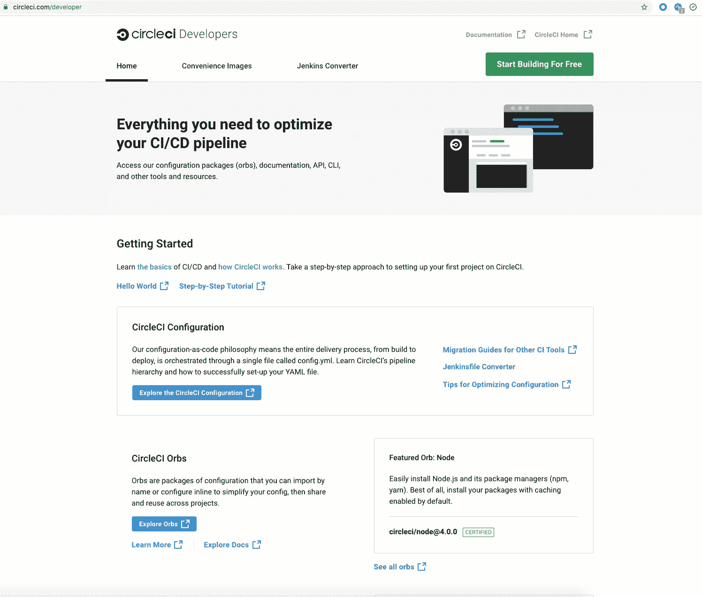

# CircleCI 希望推动 DevOps 最佳实践的采用

> 原文：<https://devops.com/circleci-looks-to-advance-devops-best-practices-adoption/>

CircleCI 今天推出了一个开发人员中心，作为进一步推动采用 DevOps 最佳实践的努力的一部分。

公司首席执行官吉姆·罗斯(Jim Rose)表示，CircleCI developer hub 提供了一组用于优化持续集成/持续交付(CI/CD)管道的资源。Rose 指出，在许多情况下，在新冠肺炎疫情肆虐之前，组织仅部分实施了最佳开发运维实践。他说，CircleCI 开发者中心将使那些 DevOps 团队更容易扩展那些流程的范围，同时为那些对 DevOps 工作流了解有限的 it 团队提供教育。

CircleCI 开发人员中心提供对 CI/CD 配置优化和预建包、迁移指南和文档的访问。还有可重复使用的 CircleCI 配置代码片段，可在任何平台上使用的定制开源 Docker 映像，以及命令行界面(CLI)和应用程序编程接口(API)。

开发中心的后期将包括一个 orb 开发工具包，帮助用户使用 CircleCI CLI 命令快速创建新的 orb。orb 是一个软件开发工具包(SDK ),它简化了 CircleCI CI/CD 平台与第三方工具和平台的集成。CircleCI 还计划为 CircleCI 文档提供更加简化的搜索引擎体验。

CircleCI 开发者中心部分是利用该公司今年早些时候筹集的 1 亿美元额外资金建立的。总体而言，CircleCI 声称每天处理 10 万个项目中的近 200 万个工作。

总的来说，Rose 表示，随着组织试图协调使用容器和无服务器计算框架构建的单片和基于微服务的应用程序的构建和部署，DevOps 正变得越来越具有挑战性。他指出，在许多情况下，部署单一应用程序仍然更合适，因此 IT 组织需要能够创建能够跨越多种框架和平台的开发运维工作流。

Rose 补充说，让事情变得更加复杂的是，微服务的测试现在需要集成到生产环境中。Rose 说，在 It 组织看到它可能对已经部署在生产环境中的其他微服务产生什么影响之前，完全测试一个微服务是不可能的。

目前还不清楚新冠肺炎对 DevOps 团队的生产力有什么影响。对于开发人员来说，在家工作比在办公室工作更容易生成更多的代码。然而，当应用程序开发团队的成员高度分散时，在项目的正确时间生成高质量的代码需要更多的编排。不少组织已经或即将调整开发运维工作流，以符合所谓的新常态。

当然，在构建和扩展 DevOps 工作流时，有很多地方可以找到技巧和建议。面临的挑战是创建不仅灵活、有弹性，而且易于实施和维护的工作流。