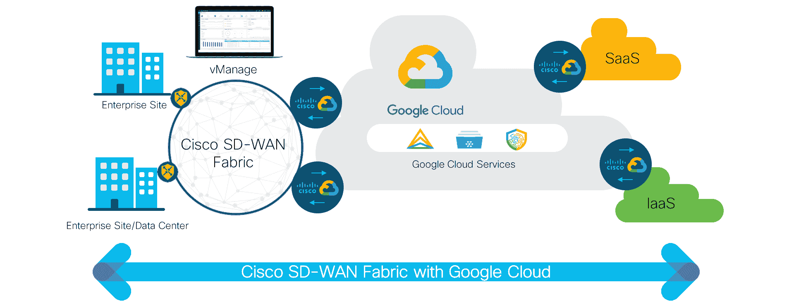

# 思科与谷歌结盟，整合开发运维与网络运维

> 原文：<https://devops.com/cisco-aligns-with-google-to-meld-devops-and-netops/>

思科系统公司和谷歌公司的合作伙伴关系的[扩展推动了各自软件定义的广域网(SD-wan)产品和云平台之间的更紧密集成，有望加速 NetOps 和 DevOps 的融合。](https://blogs.cisco.com/networking/cisco-and-google-partner-on-cisco-sd-wan-cloud-hub-with-google-cloud)

思科意向网络集团副总裁兼首席技术官 John Apostolopoulos 说，在新冠肺炎疫情之后，很明显更多的组织将采用 SD-wan 作为虚拟专用网的替代方案。然而，许多 SD-WAN 部署将在公共云上，而不是在传统的内部数据中心，他补充说。

Apostolopoulos 指出，随着这种转变的发生，DevOps 团队将越来越多地通过驻留在云中的应用编程接口(API)调用 SD-WAN 服务，为用户提供对云应用的访问。

思科和谷歌有一个技术联盟，涵盖从 Kubernetes 到云管理软件的所有领域。这种合作关系现在正在扩展，包括即将在 Google Anthos 上部署的思科 SD-WAN 软件，这是一个基于 Kubernetes 的云平台，可以在任何云或内部 IT 环境上部署，预计在 2021 年上半年。

思科 SD-WAN 服务在多个云平台上的可用性自然会对网络运营团队产生重大影响。SD-wan 的未来不再需要管理单个的路由器和交换机，而是更倾向于成为一组以编程方式调用的软件服务。随着这种转变的发生，还不清楚 NetOps 团队会在多大程度上并入 DevOps 团队。Apostolopoulos 说，IT 团队总是需要网络专家在某种程度上优化网络服务。然而，开发运维团队不得不等待数天或数周，等待网络运营团队代表他们手动调配网络服务的日子即将结束。

Apostolopoulos 说，在新冠肺炎疫情之后，灵活性已经成为一种非常珍贵的 IT 资产。因此，越来越多的应用程序将很快被部署到云中。思科确信，与其管理多个云网络服务，不如让更多的组织更愿意将思科的企业网络服务扩展到多个云中。他指出，这种方法将使 IT 组织能够通过建立在一组一致的 API 之上的管理控制台，更容易地集中管理网络服务。

Apostolopoulos 补充说，同样重要的是，思科将提供保护这些网络服务所需的集成工具。

实际上，思科确信企业 IT 组织将整合网络和安全服务，作为降低 IT 总成本努力的一部分。思科可能不总是最便宜的单个路由器或交换机提供商。然而，集成来自多个供应商的网络和安全产品的总成本会迅速增加。当然，各组织拥有实现这一目标所需的政治意愿和经济资本的程度仍有待观察。然而，同样清楚的是，维持当前的网络和安全现状不会持续太久。