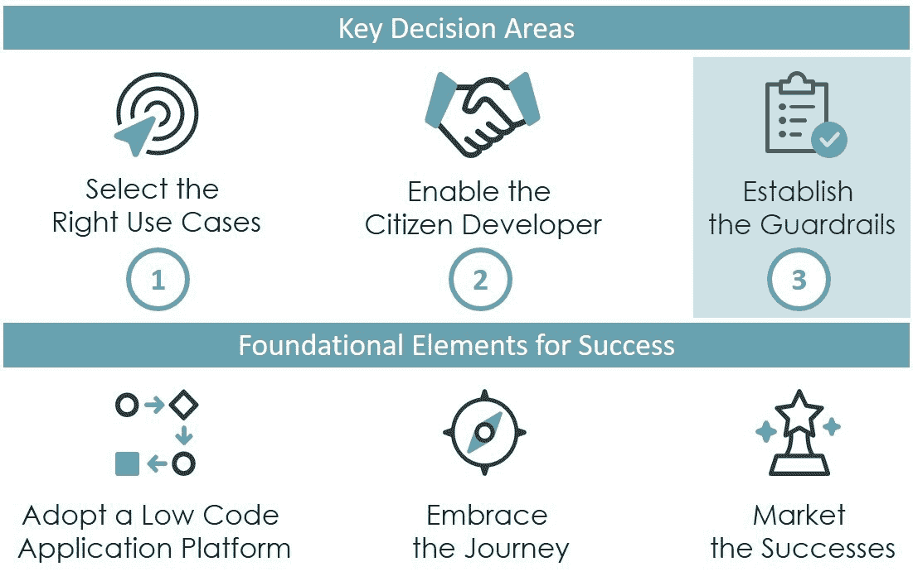
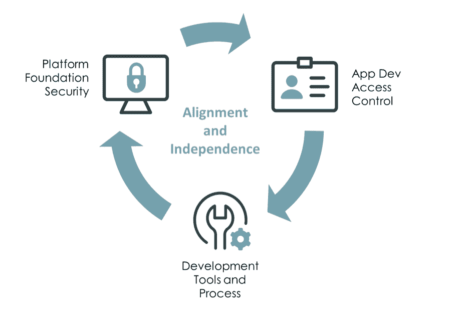

# 公民发展计划:建立护栏

> 原文：<https://devops.com/citizen-development-program-establishing-guardrails/>

公民发展就像一、二、三一样简单。

1.  [选择正确的用例](https://devops.com/citizen-development-program-selecting-the-right-use-cases/)
2.  [启用公民开发者](https://devops.com/citizen-development-program-enabling-citizen-developers/)
3.  并建立护栏，我将在这里介绍。

当然，事情远不止如此。成功需要专注、计划和耐心。在本系列的第一部分和第二部分中，我们已经讨论了用例及公民开发者(CDs)所需的规程。这第三篇也是最后一篇文章涵盖了如何建立适当的技术和过程护栏，以确保更广泛的企业、平台和开发人员得到保护。

## 建立护栏

护栏的存在有两个主要目的:对齐和独立。清晰简洁的护栏确保跨组织目标、公司政策和不同团队的一致性。这些护栏为 CDs 提供了一定程度的独立性——一个安全的操作空间，在这里它们不会受到微观管理，也不会承受不必要的流程负担。有效的护栏定义并实施一系列可接受的行为，同时降低风险并加快应用交付。

虽然低代码应用平台([lcap](https://en.wikipedia.org/wiki/Low-code_development_platform))每个都有其独特的功能和技术实现，但相关功能可以分为三大类:平台基础安全性、应用开发访问控制和开发工具&流程。

在您特定的 LCAP 和开发方法的上下文中，您需要考虑并回答以下问题:

### 平台基础安全性

*   您将如何为您的 CD 提供一个“安全”的环境来构建和测试它们的应用程序？您的平台支持独立和安全的开发、测试和生产环境吗？你会把你的公民开发者放在他们自己的离散开发环境中吗？
*   您的开发人员会处理需要加密和/或本地化的数据吗？如果是，您的平台是否支持数据加密并符合相关的数据保留法律？
*   您的 LCAP 是否支持防病毒扫描和/或 HTML 清理，如果不支持，您将如何防止光盘无意中使您的组织面临风险？
*   您的 CD 活动需要哪些日志记录和审计？谁审查日志？信息保留多长时间？
*   您的平台是否支持增强的安全机制，如双因素身份验证(2FA)或虚拟专用网络(VPN)？公民开发者将在需要增强安全性的领域或应用中工作吗？
*   您的组织是否要求其他风险、合规性和安全标准？如果是，你将如何整合它们？

### 应用程序开发访问控制

*   您将如何提供或取消提供开发人员和测试人员帐户？您将如何处理开发人员在开发环境中的登录和身份验证？
*   CDs 是否可以开发测试、试运行和生产的下游环境？
*   您是否会在开发中使用组来控制对应用程序的访问，如果是，谁来管理这些组？
*   您是否会使用角色来授予对不同开发功能的访问权限，如表格、工作流、用户界面、移动、报告、分析等。？是什么决定了公民开发者被授予的角色？
*   您是否会提供一个预构建应用程序组件库(例如，工作流、仪表盘、虚拟代理等)。)?您将如何控制对预构建组件的访问和使用？
*   你会允许公民开发者访问预先构建的集成吗？您将如何控制对这些预构建集成的访问并监控其使用情况？
*   开发者身份和访问管理流程是否需要由企业身份提供者驱动，比如 Azure Active Directory？
*   公民开发的应用程序能够访问其他公民开发的应用程序吗？如何控制应用程序对应用程序的访问？

### 开发工具和流程

*   你将如何管理你的需求吸纳过程？您将如何确保新的应用程序不会重复现有的应用程序功能？你会用什么标准来决定一个应用程序是否适合公民开发者？
*   您是否会要求您的 CD 遵循所有、部分或不遵循您现有的开发方法？你能用公民开发者能理解和接受的术语来解释这个方法吗？
*   在构建应用程序之前，您会要求 CDs 创建需求或敏捷故事吗？
*   您会要求为 CDs 的应用开发测试吗？如果会，这些测试可以自动化吗？谁将开发这些测试？
*   您是否需要对公民开发的应用程序进行代码或应用程序审查？在这些审查中，将使用哪些最佳实践和标准？那些评论可以自动化吗？
*   如果有的话，你会要求开发人员制作什么级别的文档？
*   您将如何通过开发管道推广应用程序(即从开发到测试再到生产)？app 推广流程可以自动化吗？
*   你将如何通过开发管道和它们的生命周期来跟踪和管理 CD 的应用？

## 关于公民发展计划的思考

撰写本系列的实践和您的反馈鼓励我思考第一部分([选择正确的用例](https://devops.com/citizen-development-program-selecting-the-right-use-cases/))和第二部分([支持公民开发者](https://devops.com/citizen-development-program-enabling-citizen-developers/))。以下是一些需要考虑的最终想法:

*   你介意一张 CD 只开发一个应用程序，还是希望他们开发更多应用程序？
    理想状态下，一张 CD 持续传递一个又一个 app。但是 CD 节目中的损耗可能很高。因此，如果您的 CD 构建了一个交付商业价值的应用程序，然后回到他们的“日常工作”中，您仍然应该庆祝这个成功。
*   **citizen development 更适合创建新应用还是维护现有应用？**
    在我看来，答案是两者皆有。LCAPs 为 CDs 提供了很好的机会来原型化甚至产生应用的 MVP。同时，LCAPs 允许专业开发人员构建更复杂的应用程序，并将这些应用程序的维护工作交给 CDs。
*   你能合理地期望一个公民开发者理解多少 LCAPs？
    实事求是地说，也许是一个，也许是两个。请记住，应用程序开发很重要，但让 CD 将他们的技术选择集中在一个 LCAP 上，会大大提高他们成功的机会。
*   **公民开发者能成为优秀的职业开发者吗？**
    想想这个——我合作过的一些最好的开发人员没有计算机科学或软件工程学位。更重要的是，开发人员对技术有热情，更重要的是，理解技术如何解决业务问题。
*   最后，在你的竞争对手之前探索和拥抱公民发展，因为价值主张在我们所处的这个新的工作世界中是真实的。在企业 IT 领域工作了 30 年之后，我可以自信地说，我们已经到达了技术和业务的转折点，真正实现了应用程序开发的民主化。

* * *

本文是 Mark Tognetti 三篇系列文章的第三篇，该系列文章提供了关于从公民发展计划中实现商业价值的真实见解。