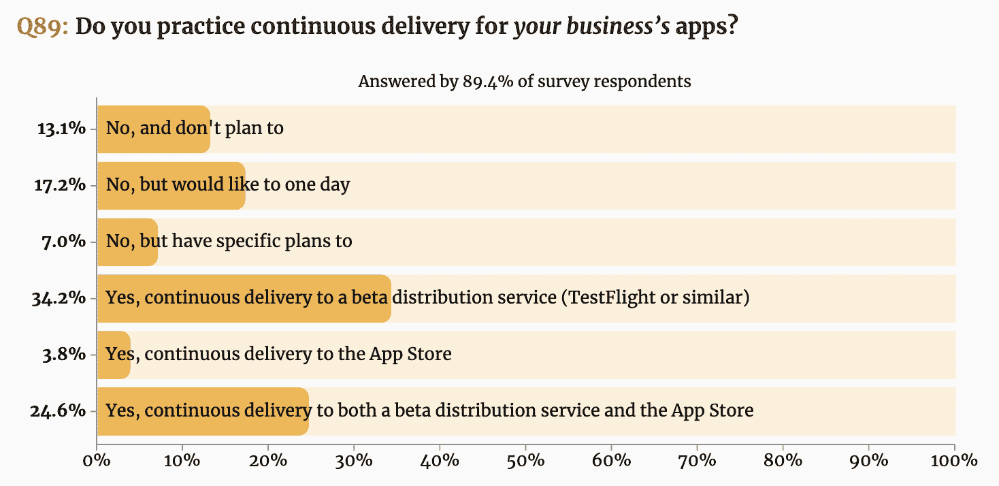
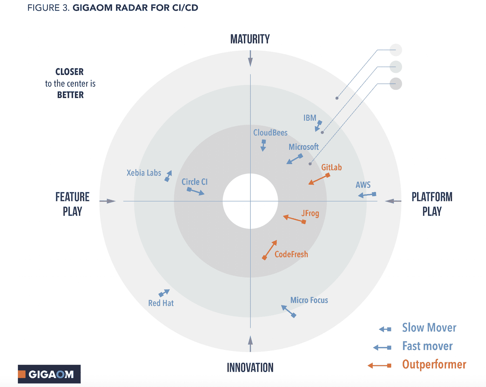

# 云和开发运维:CI/CD 和市场分析

> 原文：<https://devops.com/cloud-and-devops-ci-cd-and-market-analysis/>

如今，公司面临着比竞争对手更快、更高质量地交付软件的巨大压力。只有当公司频繁发布软件更新时，一组好的特性及其对客户的影响才能增加。因此，组织正在采用 DevOps 和 CI/CD 方法来提高其规划、构建、测试和发布应用程序和功能的能力，以便高质量、大规模地快速推向市场。 IDC 预测，到 2022 年，全球 DevOps 软件市场将从 2017 年的 39 亿美元增长到 80 亿美元。

如今，关于持续集成、持续部署和持续交付的讨论比以往任何时候都多，但在实践中，CI/CD 的实际使用似乎更少。这可能是因为 DevOps 中所需的 [技能集的短缺，或者公司仍然在实践传统的软件开发方法。企业不了解他们因缺少 CI/CD 和 DevOps 自动化实践而损失的资金量。](https://thenewstack.io/why-it-is-difficult-to-hire-for-devops/)

对于许多公司来说，开发运维是他们必须尝试的事情，因为他们的竞争对手正在这么做，或者因为这是一种趋势。在不了解后果和对 DevOps 原则的基本理解的情况下，这是一种孤注一掷的尝试。

在很大程度上，这是一套完全不同的工具，客户必须将它们连接在一起才能交付软件，这造成了混乱。另一方面，很难选择正确的工具并理解什么是最佳实践。这就是为什么我们开始看到 DevOps 公司提供统一工具集的趋势，以便客户拥有开箱即用的完整解决方案，⁠—without 不必担心从不同供应商那里找到许多不同的解决方案。

## **什么是 CI/CD？**

每当开发人员提交变更并将其推送到存储库时，CI 系统将重建分支并运行所有相关的测试用例，以验证新的变更不会破坏现有的应用程序和功能。

持续交付是持续集成的一个扩展，帮助您通过点击一个按钮来部署您的应用程序。这意味着每次通过 CI 测试时都要部署变更。有了它，您可以轻松地自动化您的构建和测试阶段，以及您的大部分发布过程。

通过持续部署，开发人员将能够在生产环境中自动发布或部署软件。在这个阶段，没有手动代码签入到应用程序中。通过 CI 流程自动测试代码是否有问题，如果没有发现问题，则部署代码。

## **为什么选择 CI/CD？**

CI/CD 是测试和部署应用程序的最佳实践。出于质量保证的目的，使 CI/CD 成为部署代码的单一渠道是最佳实践。DevOps 团队应该确保一切都通过 CI/CD 管道，以便测试和生产中的代码是相同的。这也将减少人为错误，避免部署其他没有被错误测试的版本。

如今，公司实施 CI/CD 的最大原因之一是更快的软件交付，这导致了对客户更频繁的更新。这让他们感到高兴，频繁的发布带来的持续改进将确保提高客户满意度。这是一个竞争优势，因为它允许公司更频繁地提供新功能。它可以帮助公司领先于竞争对手。

通过 CI/CD 管道传递代码可以确保在进入交付管道的下一阶段之前，所做的任何更改都符合既定的标准。任何失败或差异都会阻止此类更改进入下一步，直到得到纠正。这仅仅意味着 CI/CD 的这种方法确保了坏代码不会进入产品。CI/CD 提倡快速失败、快速学习和快速交付的方法。当您有了自动化的 CI/CD 后，代码会随着开发人员的每次提交而不断地在 CI/CD 过程中运行，这样就可以快速地捕捉到 bug——⁠———隔离 bug 变得更加容易，因为每个小的变化都是单独测试的。

## **什么是 CI/CD 管道？**

CI/CD 管道是与自动化集成的部署管道工作流。当操作良好时，它将最小化手工移交和错误，以增强整个软件交付生命周期的反馈循环，允许开发团队在更短的时间内交付更小的发布块。

CI/CD 管道现在是软件公司的主流，它已经成为现代 DevOps 环境的支柱。DevOps 制定了与文化方面相关的原则和标准，CI/CD 则侧重于自动化、流程、过程和工具。随着容器化和微服务的引入，CI/CD 场景发生了变化。现在，每个云供应商都有 Docker 和 Kubernetes 等工具的支持和集成，帮助 CI/CD 管道扩展。

## 持续交付管道的各个阶段

*   测试自动化和 CI: 这是准备新特性和原型的重要阶段，编码完成，然后代码与基础集成。通过使用 CI 服务器，单元测试和打包就完成了。

*   **构建自动化:**这是开发人员将工件(即依赖项、Docker 映像)推送到注册表(即 Amazon ECR 或 Docker hub 或任何容器注册表)的阶段。

*   **Alpha 部署:**在这个阶段，开发人员签入变更。在这里，开发人员可以仔细查看他们所做的更改，以及这些更改是如何相互作用并影响其他系统的。此外，在这里开发人员可以看到他们是否破坏了主分支中的任何东西。

*   测试部署:这是测试人员执行手工测试的阶段。还是要手工测试才能看到 CI 工具的完善。这为 DevOps 团队提供了应用程序状况良好的保证，并且在部署时肯定会按预期工作。

*   **生产部署:**这是应用上线的最后阶段。

## **市场对 CI/CD 有什么看法？**

*   在谷歌上搜索关键词“CI CD Pipeline”在全球的搜索量逐渐增加。 
*   当测试自动化公司[Mabl 对 500 名软件测试人员](https://www.mabl.com/devtestops-survey-download) 进行调查时，53%的人表示他们的团队使用持续集成，而 38%的人拥护持续交付，只有 29%的人采用了持续部署。
*   Codefresh 的一项 DevOps 相关 [调查显示，三分之一的公司已经自动化了超过一半的工作负载，但只有 1%的公司实现了自动化。几乎没有人实现了整个 CI/CD 流程的自动化。许多工程团队自动化了不到 10%的流程。](https://codefresh.io/continuous-deployment/engineers-struggle-with-ci-cd-automation-to-deploy-more-often/)
*   [iOS 开发者社区调查](https://iosdevsurvey.com/2019/13-testing-and-ci-cd/) 是苹果平台开发者有史以来最大规模的调查，共有 2290 人填写了问卷，CI/CD 问题也是调查的一部分。

下面的结果显示，大多数开发人员在业务应用方面都在实践 CI/CD。

Figure 1: Do you practice continuous delivery for your personal/hobby apps?

Figure 2: Do you practice continuous delivery for your business’s apps?

*   前进的道路:公司将无法充分利用容器和 DevOps，除非他们接受使用适当的部署管道。公司将开始向客户提供预建管道，如 [JFrog 管道](https://jfrog.com/pipelines/) 。需要一个统一的平台，该平台具有支持 CI/CD 系统所需的所有工具⁠—自动化(管道)、二进制库管理(Artifactory)、安全性(Xray)、发布/部署(分发)等。JFrog 提供了一个统一的平台。
*   Codefresh 进行了一项调查，在⁠—kube con+cloudnativecon Europe 2019大会上公布了对 130 位开发者 的 [调查结果，结果有点令人震惊。调查显示，近三分之一(32%)的公司根本没有使用任何持续集成或持续交付(CI/CD)平台。60%的调查受访者表示，他们的组织尚未充分利用自动化来加速软件开发和部署。](https://www.businesswire.com/news/home/20190519005038/en/4-5-Developers-Cite-Lack-Automation-Obstacle)
*   [GigaOm](https://gigaom.com/report/gigaom-radar-for-enterprise-ci-cd/)的《市场雷达报告》是一份关于企业 CI/CD 解决方案的最新研究报告，作者比较了业内领先的 CI/CD 解决方案，并根据不同的评估标准对它们进行评级。根据结果，JFrog、Codefresh 和 GitLab 的表现优于下图。

Figure 3: GigaOm Radar for CI/CD. Source: [GigaOm](https://gigaom.com/report/gigaom-radar-for-enterprise-ci-cd/).

考虑的 CI/CD 解决方案包括 AWS、CircleCI、CloudBees、CodeFresh、GitLab、IBM、JFrog、Micro Focus、Microsoft、Red Hat 和 Xebia Labs。可以在这里下载免费的分析师对比报告:[GigaOm Radar For Enterprise CI/CD](https://jfrog.com/whitepaper/gigaom-radar-for-enterprise-ci-cd-2/)。

CI/CD 是 DevOps 的最佳实践之一，因为它确保了开发人员和运营人员之间的适当协调。虽然它增强了自动化，但开发人员可以更可靠、更频繁地推动代码更改。同时，运营团队可以看到更高的稳定性，因为环境具有标准配置，并且回滚过程是自动化的。为了赢得 CI/CD 游戏，开发和运营团队都需要就有利于长期业务增长的正确工具和方法达成共识。

## **云和 DevOps 齐头并进**

没有云，你就无法进行开发运维。DevOps 没有它不会有太大的价值，云没有 DevOps 也不会有太大的作用。

云计算有许多定义，对云的基本解释可以定义为启用和支持基础设施供应的系统。因此，它允许将其描述为代码或模板，从而促进可重复过程的创建。 这也是 DevOps 的基本原则，最大程度地自动化软件开发生命周期中的过程/任务。

云对 CI/CD 的最大好处之一是云基础设施的动态性。这非常适合 CI/CD 工作负载的短暂性和突发性。云资源可以根据 CI/CD 工作负载自动扩展和缩减。这为企业带来了巨大的管理和成本效益。企业公司不需要有自己的服务器来维护，他们需要随着 CI/CD 工作负载的增加来增加这些服务器，或者在空闲时浪费服务器资源。

无论您的组织如何定义云技术，也无论您通过哪种 DevOps 途径来实现云集成的数字化转型，云技术和服务的美学都可以轻松融入 DevOps 字典，因为它们从根本上补充了 DevOps 的原则和流程。

对于 DevOps 的实施，敏捷原则是一个驱动因素，因为有更短的发布周期和自动化来快速交付和实现最后期限。为了实现持续的实践，云计算是一个很好的推动者，因为资源可以快速地用于开发和应用程序生命周期管理中涉及的所有活动。敏捷原则，加上云计算和 DevOps 实践，可以提高开发人员的工作效率，加快组织的发展。

借助安全的云网关，用户能够从任何地方使用任何设备轻松访问企业资源，而不会影响网络的安全性。让用户从他们的设备访问您的网络有时可能看起来很可怕，但现代云平台可以提供更多，它们带有内置的安全堆栈，可以帮助管理员提供他们管理和支持安全所需的工具。

DevOps 与云技术的结合为采用它们的企业带来了巨大的好处:

1.  提高开发人员的工作效率和协作。
2.  通过快速方便地访问开发环境，加快上市时间。
3.  帮助自动化不同的重复性任务，以便开发人员可以专注于重要的任务。
4.  随着代码的接近，自动化和基础设施可以极大地降低云复杂性和系统维护。
5.  借助现代云平台和消除手动错误的原则提高安全性。
6.  通过基于云的持续业务运营帮助消除停机时间。开发人员可以通过自动化构建无状态应用程序，这将提高可用性和故障转移能力，同时提高业务可靠性和客户满意度。
7.  扩展到新的高度—企业采用云和开发运维的主要原因之一是根据需要扩展其基础架构和应用。

## **云部署模式**

当云提供商完全托管组织的应用和数据时，它就是一个公共云。只要有互联网连接，采用公共云的公司员工就可以访问应用程序。

私有云是指存储、计算和网络资源等组织资源存在于提供商的数据中心。公司更喜欢私有云，主要是因为安全性以及在运行应用程序时存储高度敏感的数据。

一种更现代的方法是混合云；它是私有和公共云服务的结合。根据流量和需求考虑，组织可以进行更改。一些客户可能有本地 CI/CD 系统。其中一些 CI/CD 系统可以通过混合设置将其工作负载扩展到云中。这可以让他们立即认识到云的优势，而不必进行完整的迁移。

主要是，当有高需求时，工作负载可以在公共云中运行，然后当事情恢复正常时，返回到私有云。这种方法减少了花在云资源上的开销成本。此外，关键的一点是，敏感信息、数据和关键应用程序可以保存在私有云中。相比之下，不太敏感的数据和应用程序可以在公共云中存储和运行。

## **选择 DevOps 云解决方案**

如果云像一件乐器，那么 DevOps 就是演奏它的音乐家。

云计算和 DevOps 发挥着至关重要的作用，是 IT 战略中环环相扣的部分。云计算和 DevOps 共同帮助 IT 将重点从“我们在不停机的情况下能走多远、多长时间？”到“我们多久能交付一次新的稳定的功能/特性？”或者“我们部署新服务的速度有多快？”

如今，企业正在寻求借助云计算、开发运维及自动化实践实现数字化转型的方法。考虑到云领域的竞争，看到如此多的供应商，并对选择什么感到困惑，这是势不可挡的。

在这里的[2020 年 DevOps 云解决方案状态](https://jfrog.com/blog/state-of-devops-cloud-solutions-2020/) ***，*** 中，您可以看到当前可用的云 DevOps 平台解决方案的高级概述，以及您在云 DevOps 之旅中对供应商的期望。