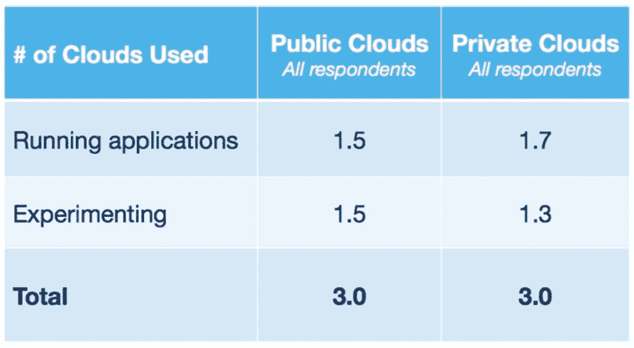
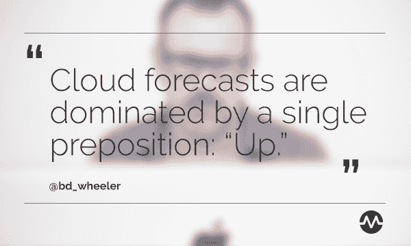

# 2016 年及以后的云计算

> 原文：<https://devops.com/cloud-computing-2016-beyond/>

没有什么活动比预测科技行业的未来更危险了。对于云计算预测来说，这个数字会翻倍。然而，通过深思熟虑和适当的谨慎，您可以相当准确地预测竞争日益激烈的云服务市场将会出现什么。

以下是 2016 年上半年领先云供应商和技术的几个明显趋势，以及下半年和未来十年的展望。

## 谷歌进行了一次重大的云计算行动

作为搜索的代名词，谷歌并不习惯于仰视其市场的领导者，然而根据 Synergy Research Group 汇编的数据，2015 年第四季度谷歌在云服务市场的份额为 4%，落后于亚马逊(31%)、微软(9%)和 IBM(7%)。市场现实主义者的 Puneet Sikka 在 5 月 31 日的文章中报道了这些股票数字。

谷歌 2016 年第一季度财报电话会议强调了该公司最近的三项行动，表明其有意发展云业务:

1.  谷歌通过其内部云操作获得了经验，现在准备与客户分享。
2.  该公司正在将其人工智能(AI)和机器学习专业知识与企业云服务相结合。
3.  VMWare 联合创始人黛安·格林(Diane Greene)于 2015 年末被任命领导谷歌的云业务。

## AWS、微软 Azure 继续提高云服务标准

即使拥有深厚的技术专业知识和看似无穷无尽的资源，谷歌也面临着在飞速发展的云服务市场从亚马逊和微软手中夺走份额的巨大挑战。根据 Sikka 的说法，2015 年 AWS 增加的 722 个新功能中有 Aurora 关系数据库，亚马逊声称这是有史以来最快的。亚马逊 QuickSight (AWS 数据分析和可视化)工具已经帮助 AWS 连续五个时期保持了接近或超过 50%的季度收入增长。

Amazon Web Services racked up five straight quarters of revenue growth at or exceeding 50 percent through first-quarter 2016\. Source: Market Realist

与此同时，微软 2015 年来自 Azure、Office 365 和 Dynamics CRM 的收入同比增长了 140%。微软以及其他云服务提供商的持续优势，部分归因于 RightScale 的 2016 年云状况调查中强调的趋势:使用云的公司平均在 1.5 个公共云上运行应用程序，并正在试验另外 1.5 个公共云。他们还平均使用 1.7 个私有云，并且正在试验 1.3 个私有云。

Companies running apps in the cloud use an average of three different public and private services. Source: RightScale

RightScale 的调查指出，虽然 AWS 在公共云市场的份额在 2015 年持平于 57%，但每个客户的工作负载数量增加了，这有助于解释该服务在 2014 年的收入增长了 69%。Venture Beat 的 Jordan Novet 在 1 月 28 日的文章中探究了 AWS 2015 年的财务状况。

## 供应商呼吁“洗云”

今年及以后云服务的美好前景在 Gartner 的 2016 年[云计算初级读本中得到呼应(需要 Gartner 帐户才能访问)。然而，成本和安全性仍然是采用云的两个主要障碍。Gartner 研究人员发现的另一个成功障碍是云供应商倾向于对他们的产品做出未经证实的声明。Gartner 称之为“洗云”](https://www.gartner.com/doc/3287123/cloud-computing-primer-)

根据 Gartner 的说法，该行业已经成熟到一个地步，采用云的大多数障碍都是非技术障碍:使组织的文化、技能和管理适应云框架；赢得最终用户的心和思想，这些用户通常不愿意克服他们对云模型的天生恐惧和不信任。(是的，你的敏感数据在云服务器上确实比在本地硬盘上更安全。)

Gartner 归入“云清洗”类别的大部分困惑与缺乏云术语的清晰定义有关，如“基础设施即服务”和“平台即服务”——这两个类别的区别将继续模糊。

## 它们都是“混合”云——或者很快就会是

Gartner 表示，公共云和私有云之间的差异也变得越来越不明显，两者都在演变成混合云的版本。事实上，企业并行实施多个云战略并不罕见。这一趋势的一个重要方面是，IT 的基本角色正在从服务提供商转变为服务代理。

Gartner 调查指出，IT 专业人员现在身兼数职，在一天中不断转换角色，从提供商到经纪人再到消费者。根据 Gartner 的说法，混合模式本身正在从“公共/私有”向“快速模式/安全模式”演变。随着移动设备的兴起，围绕云服务术语“混合”的困惑可能会继续存在，其中“混合”指的是基于网络和移动平台本地的应用程序。

确保云客户和供应商说同一种语言的一种方法是关注云的成果，而不是实现这些成果的手段。客户需要定义他们期望从云工作中获得什么结果，例如，财务效益、利用云提供商的专业知识、向企业消费者交付即时结果以及提高整体 IT 运营效率。

## 2017 年及以后有什么计划？

当你浏览云专家的预言时，流行的术语又浮现出来:微服务、容器、开源。然而，客户——尤其是企业中的客户——现在对云计算的担忧与十年前该技术首次出现时一样:安全性、风险管理、治理、合规性和灾难恢复。这些方面取得了多大进展？

也许这些领域将不会由传统的 IT 提供商来解决，而是由以网络为中心的服务和其他非 IT 公司来解决，这些公司为他们的垂直行业开发和营销云解决方案。你不能责怪非云服务提供商垂涎于蓬勃发展的云市场的前景。根据《福布斯》2016 年[市场预测综述](https://www.forbes.com/sites/louiscolumbus/2016/03/13/roundup-of-cloud-computing-forecasts-and-market-estimates-2016/#4aac61ad74b0)，云预测主要由一个介词决定:“上升。”

CLICK TO TWEET

*   公共云 IaaS 硬件和基础架构软件收入从 2015 年的 250 亿美元增长到 2016 年的 380 亿美元，到 2026 年将跃升至 1730 亿美元( [Statista](http://www.statista.com/statistics/507952/worldwide-public-cloud-infrastructure-hardware-and-software-spending-by-segment/) )
*   全球公共云收入从 2015 年的 800 亿美元和 2020 年的 1670 亿美元增加到 2017 年的 1170 亿美元( [TBR](http://www.slideshare.net/TBR_Market_Insight/soaring-toward-113b-tbr-projects-key-trends-in-cloud) )
*   云在年度 IT 预算中所占的份额从 2016 年 1 月的 29.8%上升到 2018 年 1 月的 43%([IDC](https://www.idc.com/getdoc.jsp?containerId=prUS41039416))

无论您的组织目前采用云的情况如何，无论是尝试还是尝试，您都可以依靠独立于供应商的应用管理服务来保证您的云投资经得起未来的考验。没有比这更好的方式来利用云现在提供的优势，同时确保您能够从未来的云增强中受益。