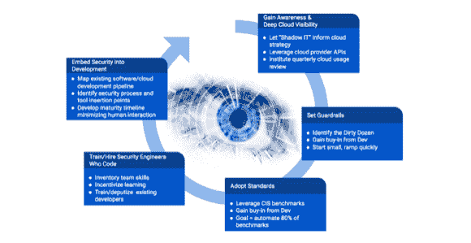

# 云错误配置威胁云迁移

> 原文：<https://devops.com/cloud-misconfigurations-threaten-cloud-migration/>

如果说我们在新冠肺炎疫情中学到了什么，那就是数字原生商业模式对生存至关重要。这意味着云的采用比以往任何时候都更加重要。研究表明，公共云市场预计将在 2021 年增长到 3085 亿美元，比 2020 年增长 16%。

但是，虽然云拥有令人难以置信的潜力，我们有一个突出的安全问题要解决。这个问题就是云配置错误。[到 2025 年，99%的云安全故障](https://www.gartner.com/smarterwithgartner/is-the-cloud-secure/)将是客户的责任，量化了安全专业人员将注意力转向云错误配置等安全卫生问题的需求。

**深入研究云错误配置问题**

为了找到问题的根源，我们必须充分了解云错误配置的风险，以及它们与更传统的漏洞有何不同。虽然传统的漏洞可以被修补，但是云的错误配置会在其他安全的应用程序和基础设施中产生漏洞。想象一下像高速公路系统一样的云基础设施，以及像道路危险一样的云错误配置。它们非常危险，会导致事故。

作为云错误配置的一个具体例子，让我们看看身份和访问管理(IAM)。配置不当的 IAM(例如错误配置的角色或缺乏多因素身份验证(MFA ))会导致管理帐户受损。如果威胁参与者劫持了合法的管理员帐户，他们可能会完全控制整个云环境。由于 IAM 位于云基础架构层之上，所有工作负载和数据都在其中，因此一旦被利用，威胁参与者通常能够绕过您的其他安全屏障，如网络分段，使您毫无防备。

**云错误配置很容易扩展**

错误配置风险急剧增加的地方是通过采用云原生应用程序和实践，如作为开发运维团队使用的代码 (IaC)模板的[基础架构。这些模板为团队构建和管理应用程序提供了更快的速度和更大的规模，但缺点是错误的配置可能会不知不觉地以更快的速度从开发环境复制到生产环境(存储敏感数据的环境)。](https://devops.com/?s=infrastructure%20as%20code)

简而言之，组织目前面临的最大风险是通过云来扩展这些错误配置。随着云的采用和规模的增长，我们看到这些错误配置也随之增长。以前，错误配置可能仅限于孤立的应用程序或环境，而今天，如果没有适当的检查来发现它，同样的错误配置可能会影响整个组织。更糟糕的是，许多[云存储桶禁用了日志记录](https://unit42.paloaltonetworks.com/cloud-threat-report-CSP-findings-IAM/)，这意味着一旦威胁参与者能够识别错误配置并访问内部云存储桶，组织甚至无法看到访问了哪些数据。

**了解共同责任模式**

所有这些都指向一个更高层次的、与卫生相关的问题，在保护云环境时要记住:责任。特别是，组织很难理解共同责任模型，以及它如何在自己的组织中应用。虽然有些人可能无法区分云提供商的责任和他们自己的责任，但最重要的问题是各种内部团队之间的共同责任，在出现安全事件之前，这种责任往往没有得到讨论和记录。

当考虑软件即服务(SaaS)时，消费者承担的责任要小得多。然而，当考虑基础架构和平台即服务(IaaS/PaaS)以及所有移动部分(如网络、用户凭据、资源配置、工作负载、身份配置等)时，云消费者需要负责更多内容。需要注意的一个关键问题是，无论使用哪种云模型，都不能外包责任。更简单地说，如果一个人把数据放在任何一个云提供商那里，他们仍然要对这些数据负责。

**实现全面的云安全战略**

当就如何更好地保护其云环境和应用程序向安全和业务领导提供建议时，我强调了我的团队所称的“大云 5”，这是一组旨在帮助组织采用整体云安全模型的建议，该模型考虑了适当的安全卫生和共同责任。

*   **获得认知和深入的云可见性** 确保云安全的第一步是了解团队如何利用云技术、影子 IT 和云提供商 API。这可以让你了解情况，并在今天和将来做出明智的决定。这不是一次性的事情，而是你需要持续做的事情。
*   **设置护栏以自动防止最严重的云错误配置** 在环境中不应该存在的最令人讨厌(和潜在破坏性)的错误配置周围划出界限是在云中实现自动化保护的关键。这将有助于保持模板和实践的可控性，从而使糟糕的卫生状况不会在无意中生根和蔓延。把这当成你的“肮脏的一打”哪些配置不应该存在于您的云环境中？
*   **标准是自动化的先导** 没有标准化的东西是无法自动化的，尽管还没有被广泛接受的安全标准，但组织中的主要利益相关方必须就如何保护云基础架构达成一致。
*   培训和雇佣编写代码的安全工程师
    为了充分利用 API，安全团队必须拥有懂得如何编写代码和自动化安全流程的工程师。对您的安全团队中存在的技能进行评估(例如，Python 或 Ruby 之类的编码知识)可以指出需要进一步投资的培训和招聘领域。
*   **在开发管道中嵌入安全性** 规划出您的组织将代码推入云中的人员、内容、时间、地点和方式。一旦映射，为安全过程和工具确定最不具破坏性的插入点，以便它们可以存在于尽可能多的开发管道中。

如果您觉得您的组织在适当的云安全卫生方面落后了一步，请知道您并不孤单。2021 年早些时候，网络安全和基础设施安全局(CISA) [发布了一份报告](https://us-cert.cisa.gov/ncas/analysis-reports/ar21-013a)，强调了基于成功云攻击上升的加强安全配置的重要性，这通常归因于卫生条件差和在远程工作环境中混合使用计算设备。虽然这是一个日益严重的问题，但也是一个可以逆转的趋势。最佳实践、网络卫生和共同责任模式可以帮助公司安全可靠地迁移到云。