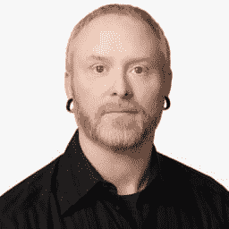

# 云原生:这是一回事

> 原文：<https://devops.com/cloud-native-its-one-thing/>

2022 年 8 月 10 日星期三，美国东部时间上午 9 点开始，Techstrong Group 将举办一场令人敬畏的虚拟会议: [CloudNativeDay](https://www.techstrongevents.com/cloud-native-days-2022) 。我相信你们中的大多数人[已经了解了许多云原生解决方案](https://devops.com/learn-something-new-every-cloud-native-day/)；熟悉云计算原生计算基金会(CNCF)所做的出色工作，以及您的环境中运行的 Kubernetes 集群。但对我来说，起初，人们对云原生的任何事物表现出的兴趣和热情令我难以理解。

在 Techstrong Group，我们大约每月举行一次虚拟会议。这听起来可能很多，但当你将它划分为 [DevOps](https://devops.com) 、[网络安全](https://securityboulevard.com)、[云原生](https://containerjournal.com)和[数字化转型](https://digitalcxo.com)中的主题，然后进一步细分组织中的哪些人是这些事件的目标时，它没有给我们太多的空间来深入研究我们想要的一些主题。我们仔细挑选虚拟活动的主题，并依靠您(我们的观众)的反馈来指导我们。

Tim Hockin, Principal Software Engineer: Kubernetes, GKE, Anthos at Google

这是我们制作云原生虚拟活动的第四年，所以这个话题显然引起了你们许多人的共鸣。但直到去年，我才有了“发现！”瞬间意识到为什么。你看，为了发现原生云如此受欢迎的原因，我查看了常见的地方:软件、应用程序和解决方案。我确信 Kubernetes 的流行是云原生如此受欢迎的原因之一。在过去的 24 个月里，可观察性突然出现。也许这推动了原生云的持续流行。见鬼，CNCF 有超过 40 个项目；也许纯粹的数量是云原生如此受欢迎的原因。但这些感觉都不完全正确——是的，所有这些都推动了云原生的流行。但他们不是主要驱动力。

今年，我又一次有幸录制了与蒂姆·霍金的炉边谈话。如果你不知道他，Tim 是 Google 的首席软件工程师，也是将 Kubernetes 从 Borg 带出来的团队的原始成员(如果你不知道 Borg，那么你需要学习一些云原生历史)。这是我们第四年邀请 Tim 在这个虚拟会议上做主题演讲，对我来说，和他聊天总是这个活动的一个亮点。

蒂姆在我们今年的谈话中说了一些话，最终让我产生了共鸣。突然，我找到了。“一件事”，用电影《都市滑头》中[卷毛的不朽名言来说。](https://youtu.be/xtrQUoRJ_W4)

[https://www.youtube.com/embed/xtrQUoRJ_W4?feature=oembed&enablejsapi=1&origin=https://devops.com](https://www.youtube.com/embed/xtrQUoRJ_W4?feature=oembed&enablejsapi=1&origin=https://devops.com)

你看，云原生的秘密不在于 Kubernetes 有多伟大和强大；它不是可观察性或服务网格或任何那些伟大的云原生或 CNCF 开发的软件工具能为你做什么。云原生是一种心态。虽然它是关于软件的，但它也是一种精神状态。云原生是指利用这种心态所形成的整个生态系统，构建强大的大规模应用。

对你来说听起来有点太禅了？我希望改变这种想法。你不会想错过我和蒂姆·霍金的对话，那是我们今年节目的开始。我们将讨论这种信念，并帮助您理解为什么云原生是一种精神状态。在您收听的同时，Tim 和我还将讨论 fleet 和多集群 Kubernetes 的新功能。

整个[虚拟活动项目](https://www.techstrongevents.com/cloud-native-days-2022)充满了精彩的会议。[前往活动现场](https://www.techstrongevents.com/cloud-native-days-2022)亲眼看看。小组讨论、演讲者、演示。伟大的参展商展位，你可以访问和提问。游戏、奖品、DJ、调酒师等等。我们迫不及待地想在那里见到你！

如果你能从这次事件中想起什么，那就是这件事:原生云是一种精神状态。