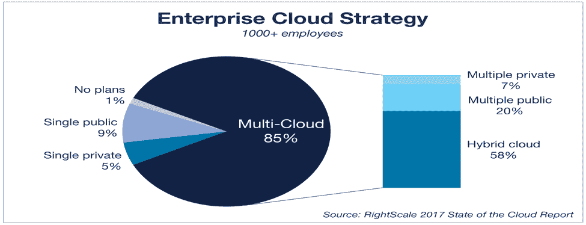

# 云协调器:有益于多云环境

> 原文：<https://devops.com/cloud-orchestrators-beneficial-multi-cloud-environment/>

最近领先的云提供商的中断影响了全球数千家企业，例如 2 月下旬发生的亚马逊网络服务 S3 中断迫使许多首席信息官和首席技术官认真思考他们的云战略，包括多云环境是否有益。

# 投资回报和业务影响

根据模拟网络风险经济影响的初创公司 [Cyence](https://www.cyence.net/) 的分析，在 AWS 的四个小时中断期间，标准普尔 500 公司损失了 1.5 亿至 1.6 亿美元。

观察全球互联网性能问题的网络监测公司 [Apica，](https://www.apicasystem.com/)发现，前 100 家互联网零售商中有 54 家受到影响，性能下降了 20%或更多，三个网站完全瘫痪——Express、Lululemon 和 One Kings Lane——导致业务受到严重影响。

根据 Apica 发言人的说法，在这次中断期间，苹果和其他电子商务网站很可能幸免于难，原因很简单:他们已经将自己的网站设计为跨多个云供应商，因此如果一个云服务出现问题，也不会伤害到他们。这自然是使用云服务的推荐方式。

苹果、沃尔玛、新蛋、百思买、好市多以及令人惊讶的亚马逊/捷步达康都没有受到停电的影响。

此后，组织开始寻找不同的方法来避免数据丢失和停机，并更好地支持不同的应用程序，更不用说弹性应用程序支持、客户管理和数据分析了。这就是多云计算可以帮助解决挑战的地方，它侧重于跨许多云的配置、管理和监控工作负载。

# 多云计算

多云计算是指使用多个相同类型或混合类型的云环境来满足业务需求。根据云供应商提供的服务，企业可以选择将哪些工作负载迁移到不同的云中，以满足业务需求。

本文讨论了采用多云的需求、它在管理多云环境方面的优势和挑战，以及多云协调器如何帮助解决这些挑战。

# **市场趋势**

根据研究公司 IDC 的研究，到 2020 年，超过 85%的企业将适应包含公共云服务、私有云、社区云和托管云的混合云架构，从而推动 IT 组织的变革速度。

据研究公司 MarketsandMarkets 称:

| **云模型** | **2016 年** | **2021 年** |
| **多云管理市场** | 9.393 亿美元 | 34 亿美元(复合年增长率为 29.6%) |
| **混合云市场** | 252.8 亿美元 | 846.7 亿美元 |

# **是什么推动了云计算的采用？**

所有工作负载和业务需求不可能完全相同，这是多云现实的主要驱动因素之一。

独特的需求:您可以以最低的成本在性能最佳的地方运行每个工作负载。

遗留应用:您可以避免将遗留应用迁移到新平台的痛苦。

多样化的愿望:您可以避免供应商锁定和延迟，同时创建冗余。

# 多重云计算的优势

*   **灵活性**:公司可以使用一系列服务部署到公共云、私有云和混合云。
*   **减少支出**:不同云提供商提供的有竞争力的价格和服务使公司能够实现最佳的成本支出。
*   **增强的自主性:**公司避免将其所有 IT 工作负载放在一个云提供商的篮子里。
*   **定制和增强的 IT 性能**:定制利用了多家云供应商的同类最佳功能。
*   **迁移**:容器和基于微服务的应用可以很容易地跨云迁移。
*   **硬件多样性:**依靠多个位置和多个提供商可显著降低影响服务质量的几率。
*   **避免数据丢失和停机:**使用多个云服务有助于组织避免因硬件、软件、存储或网络中的任何单个组件故障而导致的数据丢失和停机。
*   **多地理位置可用性:**公司可以利用云供应商在多个地理位置的数据中心，从而扩展业务。

# 管理多云环境的挑战

虽然有很多关于在云之间移动东西的讨论，但事实是它仍然是相当新的。虽然云已经变得足够智能，可以结束数据锁定，但每个供应商的部署都有自己的一系列挑战，例如公司需要管理的独特门户和流程，可以分为三个不同的类别。

## 技术挑战

*   **API:** 没有一种单一的集成或基础设施自动化模式可以工作，因为每个云提供商将提供不同的 API 来访问不同的云服务。
*   **行为:**对于常见的动作或者在特定的情况下，云的行为有很多不同。例如，一些云在启动服务器或实例时会自动调配存储，而另一些则不会。
*   **资源规模和类型:**每个云提供商将提供不同规模和类型的计算、存储和网络资源；因此，IT 团队必须考虑以工作负载所需的最佳资源规模和类型进行资源调配。
*   **操作系统映像:**每个云提供商都会提供一组唯一的操作系统映像，这使得在其他云中使用相同的映像运行工作负载变得很困难。
*   **虚拟机管理程序:**每个云提供商利用不同的、有时是专有的虚拟机管理程序选项。
*   **应用堆栈:**一些云提供商可能会提供一些通用的预配置应用堆栈(如 LAMP 或 Java 或。网)。
*   **附加服务和功能:**除了基本的计算、网络和存储资源之外，每个云提供商都将提供额外的附加服务和功能。这些可能包括负载平衡、应用服务器、分析工具或数据库。
*   **安全能力:**访问控制能力将因云提供商而异，如果不同的提供商要求不同的密码复杂性或认证措施，访问控制能力将变得更加复杂。
*   **网络能力:**每个云提供不同的方式来定义子网、安全组和网络网关，增加了网络规划的难度。

## 运营挑战

*   **测试:**将应用部署到多个云需要特定于平台的测试，这需要针对多个云平台进行单独的自动化测试。
*   **工具多样性:** DevOps 工具必须跟上平台的快速变化。
*   **维护安全和治理:**公司需要仔细检查每个服务提供商的规章制度，以遵守安全法规。
*   **跨多个云堆栈管理应用和基础架构配置****:**这可能很困难，因为云平台不共享公共 API，这暴露了不同的服务定义和计费模式。
*   **技术支持和专业知识:**需要额外的管理工作和研究，以确定最佳提供商及其服务是否兼容。
*   **地理可用性**:将业务扩展到新市场可能是一项挑战，因为并非所有的云提供商都有全球业务，并且仅在有限的地点提供数据中心。

## 业务挑战

*   **云代理**:使用多个云时，管理云代理是额外的成本。
*   **计费和定价:**每个云提供商都提供独特的定价模式和不同的计费功能，这就需要进行治理和成本优化，提供汇总以及跨云的详细成本跟踪。
*   **技能集和培训:**缺乏组织中不同云的技能集和专业知识会导致工作负载中断并增加成本/工作量。
*   **规划和执行:**选择符合公司业务需求、定价、治理和团队专业知识的服务可能会很困难。

# 多云协调器如何提供帮助

尽管存在这些挑战，但在一定程度上得益于多云协调工具，多云环境正在不断发展，事实证明，多云协调工具非常适合解决上述挑战。

这些编排工具能够让多个云提供商看起来像一个提供商，确保在一个配置模型中配置所有云依赖关系。这些工具使公司能够自动部署和管理多云环境。

这一领域的一些大玩家包括 RightScale、OneOps、Cloudify 和 IBM Cloud orchestrator，它们提供了一套跨多云环境的标准接口和功能。

我们已经确定了当前的云计算管理平台能够很好地处理的一些参数:

*   **应用程序从设计到过渡到部署的规划和执行**。
*   **自动化安装&配置**基础设施包&服务。
*   应用环境的**供应**。
*   **部署**计划和执行。
*   **成本管理:**建议使用经济高效的云服务和单一仪表盘来跟踪与不同云服务相关的成本。
*   **监控整个应用堆栈的**。
*   **安全&治理**关于谁可以查看、创建和执行环境相关活动。
*   **蓝图**模板，可轻松重复使用以创建新环境。
*   **报告:**查看您的组织在多个云中使用的实例的报告。

# 结论

Multi-cloud orchestrator 工具有助于解决上述一些挑战，以配置、供应和部署多个云环境，并从单一自助服务界面集成服务管理。

虽然目前的云计算协调工具为组织提供了一种更省时、更具成本效益的解决方案来管理不同的云提供商，从而专注于更大的业务目标，但实际上这一类别的所有产品都很年轻，可能会出现错误和不一致。此外，对于许多流行的编排工具来说，安全性也是一个问题。默认情况下，提供的许多 API 没有安全加密，需要单独添加 SSL。

我们可以说，多云计算编排工具仍有巨大的改进空间，可以跨不同的云提供商构建更安全、易于设置的标准化工作流，以应对多云计算时代带来的挑战。

## 关于作者/ Rashi Sharma

 Rashi Sharma 是一名建筑师，在 [HCL Technologies](https://www.hcltech.com/) 的技术办公室工作。她拥有 AWS、DevOps consulting &配置管理方法方面的专业知识。她与 DevOps COE 合作，从事 DevOps 解决方案的设计和开发。