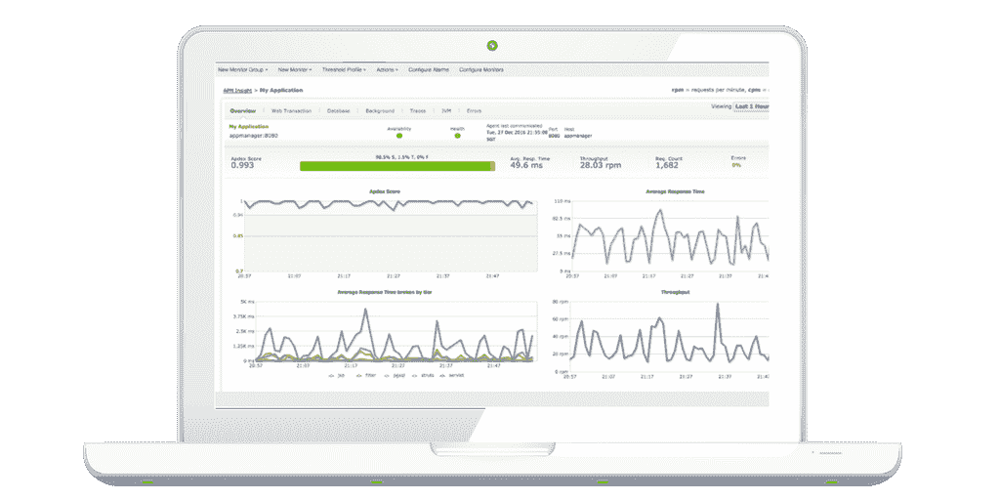

# 在云世界中，云性能管理需要优先于 APM

> 原文：<https://devops.com/cloud-performance-management-needs-precedence-over-apm-in-a-cloud-world/>

当今的大多数企业都遵循云优先战略。这些企业的 DevOps 工程师更喜欢使用基础架构即服务(IaaS)、平台即服务(PaaS)或领先云服务提供商(CSP)的云服务。考虑到现在 IT 发展的速度，从内部到 XaaS，应用程序的开发和运营前景似乎更加光明。

但是，随着 IT 的发展，监控和管理工具也沿着这些路线发展了吗？许多 DevOps 工程师仍然使用古老的应用程序性能监控(APM)工具来测量应用程序的性能和调试问题。

本文讨论了如何将重点从应用性能管理(APM)转移到云性能管理(CPM)上。

## APM 不错，以基础架构为中心的 APM 更好，CPM 是最好的

使用云服务是当今 DevOps 的一种规范。一方面，这些服务充当开发或运行应用程序的构建块，并对该应用程序的性能做出重大贡献。另一方面，它们带来了几层特殊的抽象层。更重要的是，新的云服务或 SaaS 偶尔会引入新的趋势。

监控和管理市场尚未跟上其发展的步伐。市场上只有少数几种云监控工具，它们提供孤立的报告和仪表板。结果:DevOps 的工程师仍然坚持使用老式的 APM 工具。

APM 工具擅长提供洞察力。然而，这些见解仅仅足以理解应用层发生了什么。

如果您观察上面的 APM 仪表板，会发现其中有服务器状态和应用吞吐量、响应时间的摘要，以及更多精美的可视化图表。如果需要，甚至可以获得 CPU 使用、内存使用、磁盘使用等详细信息。

此外，还有以基础设施为中心的 APM 工具，它们位于应用程序层的下一层，提供网络统计信息，如带宽或开放的端口。然而，没有一个工具提供完整的上下文信息。日复一日，DevOps 工程师必须涉猎几个仪表板。

让我们看一个非常简单的场景。假设有一个图像处理 web 应用程序利用 AWS 云服务，如 EC2、用于存储的 S3 存储桶和用于排队的 SQS:

[https://www.youtube.com/embed/8QtSjZTy2Xo?rel=0](https://www.youtube.com/embed/8QtSjZTy2Xo?rel=0)

通过 APM 工具，您可以持续监控应用程序的响应时间，然后监控应用程序服务器的吞吐量(不超过 10 个映像)、CPU 利用率等指标。当管道平稳运行时，顶部的一切看起来都很好。

然后有一天，在特定时间使用该应用程序的用户数量增加，SQS 上的工作开始快速排队，应用程序的响应时间突然变低。然而，在 APM 工具上，所有服务器的性能似乎都很好。

在这种情况下，如果没有监视 AWS SQS 的监视工具，如何调试影响响应时间的根本原因呢？

当然，AWS 提供了自己的控制台来监控其服务。如果 DevOps 工程师意识到了根本原因，那么调试就是小菜一碟。然而，当潜在的问题未知时，就会导致对一些工具的依赖，而这些工具可以为他们挖掘事实。

当企业的一个或多个应用程序依赖于几个还没有监控工具的云服务时，只能提取特定数据的 APM 工具如何帮助提供完整的可见性？

在这个云驱动的世界中，开发人员需要了解他们的应用程序如何与不同的技术堆栈交互，以及这种交互如何推动性能、可用性和成本。

## 统一 CPM 补充了 APM，带来了完整的环境

业界传统上将应用程序和基础设施的性能管理分开，导致每个领域都有多个工具集。APM 或 IPM 都不能单独成功地处理和解决左移监控需求。

APM 只关注应用层，只提供对部分技术堆栈的可见性。如果您是一家企业或中小型企业的 DevOps 工程师，正在研究不同的客户应用程序，您会知道很难理解跨可用性区域的所有资源使用情况，并对每个应用程序的成本/性能权衡、扩展能力、上市时间等进行论证。虽然云服务使开发变得更容易，但每种服务都有自己的学习曲线和抽象。

一个统一的 CPM 工具将上下文推到 APM 的岸边，在一个技术栈中。开发人员需要这样的工具，他们可以从单一控制台监控所有服务并获得端到端的可见性。

## **结论**

在技术堆栈中的其他动态参与者(服务)的上下文中分析每个动态服务的性能，将快速提供正确的上下文，并有助于轻松检测潜在问题——特别是在问题出在云资源而不是应用程序代码本身的情况下。

— [帕拉德普·库马尔](https://devops.com/author/pradeep-kumar/)