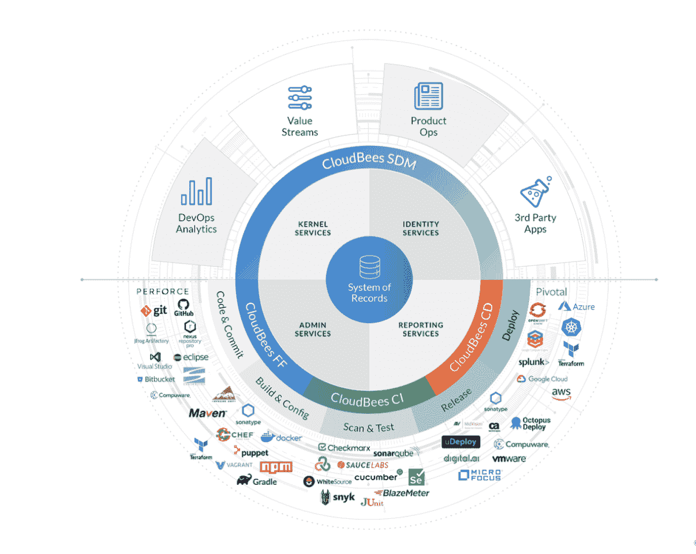

# CloudBees 推进扩展 DevOps 议程

> 原文：<https://devops.com/cloudbees-advances-expanding-devops-agenda/>

CloudBees 今天在其在线 [DevOps World 2020](https://www.cloudbees.com/devops-world) 大会上宣布，它正在[嵌入额外的 DevSecOps 功能](https://www.businesswire.com/news/home/20200922005178/en/CloudBees-Raises-Bar-DevSecOps-Audit-Ready-Software-Delivery)，这些功能跨越基于开源 Jenkins 项目的持续集成/持续交付(CI/CD)平台内的应用程序开发和部署流程。

此外，CloudBees 宣布将在今年年底前为其软件交付管理(SDM)平台提供两个额外的模块。去年推出的 SDM 平台为企业中的所有利益相关者提供了一个集中的机制来跟踪应用程序开发项目。

今天可用的第一个模块在整个应用程序开发项目中统一了特性标志的管理。第二种方法是通过导入和规范化构成 DevOps 平台的工具提供的所有数据，创建一个记录系统来跟踪进展。

与此同时，DevSecOps 产品为 IT 团队提供了一个强化的 CloudBees CI 产品实例，以及强化的审计就绪管道，以确保只使用不可变的、经批准的组件和环境，而没有任何偏差或篡改。CloudBees 还增加了对基于角色的访问控制的支持，这种访问控制基于细粒度的权限以及与 CI/CD 平台的功能标记功能的更紧密集成。如果在生产环境中出现问题，可以通过自动提供的完全可追溯性撤回特定的特性。

最后，CloudBees 将其 CI/CD 平台与 Anchore、Alcide.io、FOSSA、CyberArk、Checkmarx、Contrast Security、Shiftleft.io、Snyk、RunSafe Security、Sonatype、WhiteSource Software、Synopsys 和 Zimperium 的安全自动化应用程序相集成。

CloudBees 首席执行官 Sacha Labourey 在新冠肺炎疫情之后表示，很明显，各组织正在加速开发和部署更敏感的应用程序，以推动数字业务转型计划。事实上，根据加速战略集团 (ASG)代表 CloudBees 对 347 名 IT 专业人员进行的调查的[结果，在近三分之二(63%)的受访者中，数字化转型目标的优先级有所提高或显著提高。](https://devops.com/the-future-of-remote-work-and-software-development-research-addresses-the-impact-of-covid-19-on-software-teams/)

略多于一半的受访者表示，他们的组织也将增加 DevOps 计划放在了更高的优先位置(52%)。许多人现在也在练习每日站立会议(56%)，使用跨职能团队(46%)和自动化任务(43%)。

总的来说，59%的人说他们的软件团队变得更有效率，43%的人说现在及时完成工作任务更容易了。近三分之二(61%)的人表示，他们也发现跨时区工作更容易，在某些情况下，甚至跨洲工作也更容易(39%)。

Labourey 表示，随着数字商业计划的不断发展，越来越多的组织将把 DevOps 原则应用于业务本身。Labourey 表示，SDM 平台将通过提供一个通用框架，使 IT 和业务专业人员能够更紧密地合作，从而在实现这一过渡方面发挥关键作用。目标不应该是将软件开发变成一个工厂，而是以一种有益于业务的方式对项目和计划进行优先级排序。

Labourey 指出，理想情况下，SDM 还提供了一个框架，IT 团队可以通过该框架在许多业务领导者缺乏对往往复杂的 DevOps 流程的可见性的时候进行管理。

与此同时，构成组织内 IT 社区的所有应用程序所有者、IT 团队和安全专业人员之间的鸿沟不断缩小。现在的挑战将是，一旦所有这些选民最终在同一时间看到同样的事情，确定下一步该做什么。