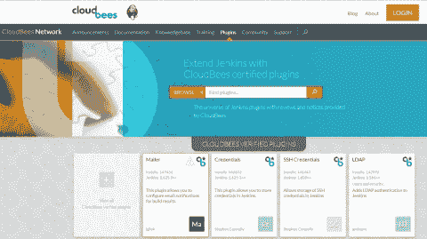

# CloudBees 宣布成立 CloudBees Jenkins 团队，将最新的 Jenkins 创新与企业级可靠性相结合，保持 DevOps 团队快速运行

> 原文：<https://devops.com/cloudbees-announces-cloudbees-jenkins-team-combining-latest-jenkins-innovation-enterprise-class-reliability-keep-devops-teams-running-fast/>

*CloudBees Jenkins 团队提供经过验证的 Jenkins 核心和管理插件，以及专业知识，让 DevOps 团队专注于交付优秀的软件*

借助 CloudBees Jenkins 团队，您可以通过 CloudBees 保证计划随时访问经过验证的插件和核心(图片:Business Wire)

May 03, 2017 09:00 AM Eastern Daylight Time

加利福尼亚州圣何塞([商业资讯](http://www.businesswire.com/))–[cloud bees，Inc.](http://cts.businesswire.com/ct/CT?id=smartlink&url=http%3A%2F%2Fjoin.cloudbees.com%2Fcloudbees-jenkins-team-cloudbees-homepage&esheet=51550822&newsitemid=20170503005234&lan=en-US&anchor=CloudBees%2C+Inc.&index=1&md5=dcb8fe51b35236930720b7ea49c940ae) ，enterprise Jenkins 和 DevOps 的中心，今天宣布推出 CloudBees Jenkins Team，这是一个基于订阅的 Jenkins 发行版，具有经验证的插件和 24×7 CloudBees 支持。CloudBees Jenkins 团队将最好的 Jenkins 与软件交付团队开始持续交付所需的支持和稳定性结合在一起。

> CloudBees Jenkins 团队将 Jenkins 的精华与支持和稳定性团队从#CD 开始所需的东西结合在一起
> 
> [发这条微博](http://www.businesswire.com/news/home/20170503005234/en/CloudBees-Announces-CloudBees-Jenkins-Team-Combining-Latest#)

CloudBees Jenkins 团队利用 Jenkins 的能力来解决现代软件开发和交付的关键任务需求。插件和核心更新都是通过 CloudBees 保证计划交付的；该计划彻底验证最新的 Jenkins 核心和一组精心策划的社区插件的互操作性，确保稳定性和无所畏惧的升级过程。CloudBees Jenkins 团队为需要稳定、可靠的软件交付渠道的团队提供了一个经过测试和完全支持的 Jenkins 发行版。

IT 部门正在采用连续交付来加速和扩展整个组织的软件交付。不确定性和不稳定性会导致停机，这会影响交付软件的能力。CloudBees Jenkins 团队通过对 Jenkins 核心和插件的端到端验证消除了不确定性，确定了相关的更新和安全修复。有了 CloudBees Jenkins 团队，用户可以获得一个健壮的 Jenkins，软件交付过程中的风险更小，CloudBees 的 Jenkins 专家可以保证在整个过程中为他们提供支持。

开源通过频繁的社区驱动的发布提供修复和特性。传统上，需要稳定性的团队无法从开源的快速发展中获益。通过 CloudBees Jenkins 团队，CloudBees 每月提供增量版本，以持续提供新功能、安全补丁和错误修复。团队能够以企业所需的信心和稳定性实现开源创新的速度。此外，该解决方案还包括 CloudBees 的 Jenkins 专家提供的全天候支持。

**cloud bees Jenkins 团队的主要特点:**

*   **CloudBees Jenkins 分发版–**通过交付稳定、经过验证的 Jenkins 核心和精选插件来消除停机时间，从而提供坚如磐石的软件交付环境
*   **24×7 专家技术支持—**联系 Jenkins 专家解决问题并获得最佳实践指导
*   **CloudBees 保证计划—**每月发布最新、最稳定的功能，将开源创新的精华与强大的 Jenkins 核心和插件相结合
*   **升级助手–**集成升级助手提供无忧的插件和 Jenkins 核心的一键升级

*   **自定进度的在线培训—**团队可以通过免费课程发展专业技能，以加快入职并提高对持续集成/持续交付最佳实践的掌握
*   **CloudBees 网络和社区—**用户能够使用知识库文章、诊断工具和充满活力的客户社区找到答案并解决问题

“当今的组织正以创纪录的数量采用开源软件，并从中获得巨大的价值。詹金斯肯定就是这种情况。然而，对于开源软件，你需要依赖其周围的社区来获得支持，这在很多时候对企业来说是不够强大的，”CloudBees 的首席执行官兼联合创始人 Sacha Labourey 说。“现在，通过 CloudBees Jenkins 团队，我们正在提供 Jenkins 用户喜爱的开源创新，以及一种经过验证和测试的方法来轻松获得它。加上正式的技术支持，我们刚刚消除了通常与开源产品相关的潜在问题。公司现在可以专注于为其业务创造创新，而不是维护其软件交付环境。”

CloudBees Jenkins 团队现在可用。所有 CloudBees Jenkins 解决方案都以年度或多年订阅的形式出售，许可基于用户数量。

**附加资源**

*   阅读博客:
    [http://join.cloudbees.com/cloudbees-jenkins-team-blog](http://cts.businesswire.com/ct/CT?id=smartlink&url=https%3A%2F%2Fwww.cloudbees.com%2Fblog%2Fjenkins-with-support-for-continuous-delivery-with-peace-of-mind&esheet=51550822&newsitemid=20170503005234&lan=en-US&anchor=http%3A%2F%2Fjoin.cloudbees.com%2Fcloudbees-jenkins-team-blog&index=2&md5=0df9e4d374067e80797183d12a9bd0d6)
*   了解更多:
    [http://join . cloud bees . com/cloud bees-Jenkins-team-product-page](http://cts.businesswire.com/ct/CT?id=smartlink&url=http%3A%2F%2Fjoin.cloudbees.com%2Fcloudbees-jenkins-team-product-page&esheet=51550822&newsitemid=20170503005234&lan=en-US&anchor=http%3A%2F%2Fjoin.cloudbees.com%2Fcloudbees-jenkins-team-product-page&index=3&md5=baab75848a54b10a7e2220c03f7e0b74)
*   试用 CloudBees 软件:
    [http://join . cloud bees . com/cloud bees-Jenkins-team-get-started](http://cts.businesswire.com/ct/CT?id=smartlink&url=http%3A%2F%2Fjoin.cloudbees.com%2Fcloudbees-jenkins-team-get-started&esheet=51550822&newsitemid=20170503005234&lan=en-US&anchor=http%3A%2F%2Fjoin.cloudbees.com%2Fcloudbees-jenkins-team-get-started&index=4&md5=b4c61d81fc350481893a129b52dab4ff)

**关于 CloudBees**
CloudBees 是 enterprise Jenkins 和 DevOps 的中心，为公司提供自动化软件开发和交付的智能解决方案。CloudBees 从 Jenkins 开始，它是最值得信赖、最广泛采用的持续交付平台，并增加了企业级安全性、可扩展性、可管理性和专家级支持。通过提高软件交付过程的效率、可管理性和便捷性，CloudBees 使公司走上了将伟大的想法转化为伟大的软件并更快地为企业创造价值的最快道路。

CloudBees 由 Matrix Partners、Lightspeed Venture Partners 和威瑞森风险投资公司支持，于 2010 年由 JBoss 前 CTO Sacha Labourey 和一个由持续集成、持续交付和 DevOps 专业人员组成的精英团队创立。在 [Twitter](http://cts.businesswire.com/ct/CT?id=smartlink&url=https%3A%2F%2Ftwitter.com%2FCloudBees&esheet=51550822&newsitemid=20170503005234&lan=en-US&anchor=Twitter&index=5&md5=457e76cdf570f0e6f035a81557c0903b) 、[脸书](http://cts.businesswire.com/ct/CT?id=smartlink&url=http%3A%2F%2Fwww.facebook.com%2FCloudBees&esheet=51550822&newsitemid=20170503005234&lan=en-US&anchor=Facebook&index=6&md5=53a91d3dd0ed5ff4a6d2a0087a5d5902)、 [LinkedIn](http://cts.businesswire.com/ct/CT?id=smartlink&url=https%3A%2F%2Fwww.linkedin.com%2Fcompany%2Fcloudbees&esheet=51550822&newsitemid=20170503005234&lan=en-US&anchor=LinkedIn&index=7&md5=ca5c88ebdfb184e0bc1b99c0b5828306) 和 [Google+](http://cts.businesswire.com/ct/CT?id=smartlink&url=https%3A%2F%2Fplus.google.com%2Fu%2F0%2Fb%2F107928285156726083292%2F%2BCloudbeesHive%2Fposts&esheet=51550822&newsitemid=20170503005234&lan=en-US&anchor=Google%2B&index=8&md5=78e31869bcc5458c84b477fec6c55e21) 上关注 CloudBees。

## 联系人

潘通讯
凯特琳坎贝尔，+1-617-502-4300
[【邮件保护】](/cdn-cgi/l/email-protection#72111e1d0716101717013202131c111d1f1f5c111d1f)

— [帕克·耶茨](https://devops.com/author/parkerdevops-com/)