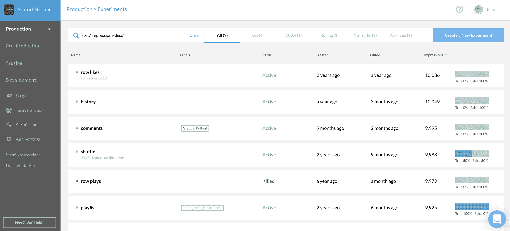

# CloudBees 为内部环境带来了功能标记

> 原文：<https://devops.com/cloudbees-brings-feature-flagging-to-on-prem-environs/>

CloudBees 本周宣布对 CloudBees 功能标志进行更新，现在可以在内部 it 环境中部署这一功能。

CloudBees 高级副总裁兼软件交付管理和软件交付自动化云总经理 Moritz Plassnig 表示，CloudBees Feature Flags 在去年公司收购 Rollout 后，以前只能作为软件即服务(SaaS)应用程序使用。

然而，在高度管制的行业中，仍然有许多组织被禁止在云中开发应用程序。他说，最新版本现在允许这些组织使用 CloudBees 功能标志，以更可控的方式推出新功能。

当然，云计算已经存在了十多年。近年来，云计算的采用大幅增加；但是，大部分应用程序仍然部署在内部 IT 环境中。Plassnig 表示，CloudBees 将其平台的内部版本与云服务一起提供，以满足 IT 团队在应用程序开发领域的需求。

虽然特性标记已经存在了一段时间，但是大多数企业 IT 组织现在才开始使用它。随着组织推出新功能，特性标记使开发运维团队能够将新功能仅提供给一小部分应用用户。假设一切顺利，DevOps 团队就可以更有信心地让所有用户都可以使用该功能。Plassnig 指出，功能标记通过降低固有风险，使部署应用程序更新对所有相关人员来说都不那么可怕。

特性标记主要在应用程序开发的环境中使用。然而，Plassnig 表示，最终这种能力将在生产环境中得到更广泛的部署。例如，组织可能会采用功能标记来为特定类别的用户提供特定的功能。

当然，CloudBees 并不是 DevOps 平台上唯一一个支持特性标记的提供商。然而，作为最广泛使用的持续集成/持续交付(CI/CD)平台之一的企业版的提供商，CloudBees 认为它在任何软件开发生命周期(SDLC)内使特性标记成为标准功能方面处于更有利的位置。Plassnig 表示，DevOps 团队还应该期待看到 CloudBees 加强 CloudBees 功能标志和 CloudBees Flow 之间的集成，cloud bees Flow 是一种用于协调发布和自动化应用程序部署的工具。

随着微服务的兴起，DevOps 团队隔离应用程序中的功能变得更加容易。挑战在于管理所有这些代码模块通常需要 DevOps 团队实现更复杂的工作流程。自动化的进步将简化这些过程；然而，DevOps 团队仍然必须定义将被自动化的工作流程。

同时，DevOps 团队将特性标记视为标准需求只是时间问题。看看有朝一日功能标记会在多大程度上被整合到核心开源 CI/CD 平台本身，这将是一件有趣的事情。