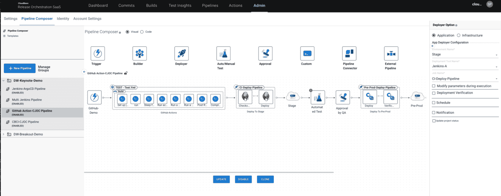

# CloudBees 演示 ReleaseIQ 平台的编排功能

> 原文：<https://devops.com/cloudbees-demos-orchestration-capabilities-of-releaseiq-platform/>

在今天的[在线 DevOps World 2022 活动](https://www.techstrongevents.com/devops-world-2022)上，CloudBees 首次展示了它上个月通过[收购 ReleaseIQ](https://devops.com/cloudbees-acquires-releaseiq-to-advance-devops-orchestration/) 获得的应用发布管理平台的功能。

CloudBees 首席营销官兼临时首席产品官 Shawn Ahmed 告诉与会者，ReleaseIQ 平台将为应用程序开发团队提供准确了解其代码如何进入生产环境的可见性。

他补充说，有了这些见解，就有可能准确理解构建过程中提交的方式，例如，创建工作流瓶颈。

ReleaseIQ 平台旨在使 DevOps 团队能够使用无代码工具创建和维护管道。这使得工作流更加透明，因为仪表盘还能提供优化建议。

CloudBees 已经在其[连续交付](https://devops.com/?s=continuous+delivery)平台中提供了一个流程编排引擎。然而，ReleaseIQ 使用一个更易访问的 SaaS 平台提供了跨多个持续集成/持续交付(CI/CD)平台的类似功能。ReleaseIQ 还可以与多个平台集成，包括 CloudBees CI、Jenkins、CircleCI、GitLab、Bamboo、ArgoCD 等。

自然，开发运维成熟度的当前水平因组织而异。然而，随着越来越多的组织意识到他们在多大程度上依赖软件来驱动[数字业务转型](https://digitalcxo.com)流程，进一步自动化应用程序开发和交付的需求变得更加明显。虽然 CI 在今天被广泛使用，但是持续实施 CD 来自动化应用程序发布管理的组织的数量仍然相当有限。部署软件的底层基础设施通常具有每个 CD 平台需要支持的一组独特的应用编程接口(API)。ReleaseIQ 等平台提供了更高层次的抽象，简化了对交付软件的管道的管理。

CloudBees 本质上将 ReleaseIQ 定位为编排引擎，用于统一管道管理，并最终在日益复杂的应用程序开发环境中实现[价值流管理](https://devops.com/?s=value+stream+management)。可能需要一段时间才能完全实现这一雄心，但随着对 ReleaseIQ 的收购，该公司现在正在寻求一种更加以云为中心的方法，以使 DevOps 团队能够更容易地重用管道。

当然，DevOps 团队多年来已经创建了许多脚本来提供编排功能。问题是，这些脚本往往很脆弱，因为它们不能随着时间的推移很好地扩展。如果脚本编写者离开组织，他们往往也很难记录和维护。对于 DevOps 团队的新成员来说，用自己编写的脚本替换脚本并不罕见，因为他们更熟悉脚本的构造方式。

在 Jenkins CI/CD 平台推出十多年后，仍有大量手动 DevOps 流程应该更加自动化。一个无代码编排平台可能会被证明是自动化一系列耗费过多时间的任务的重要一步。