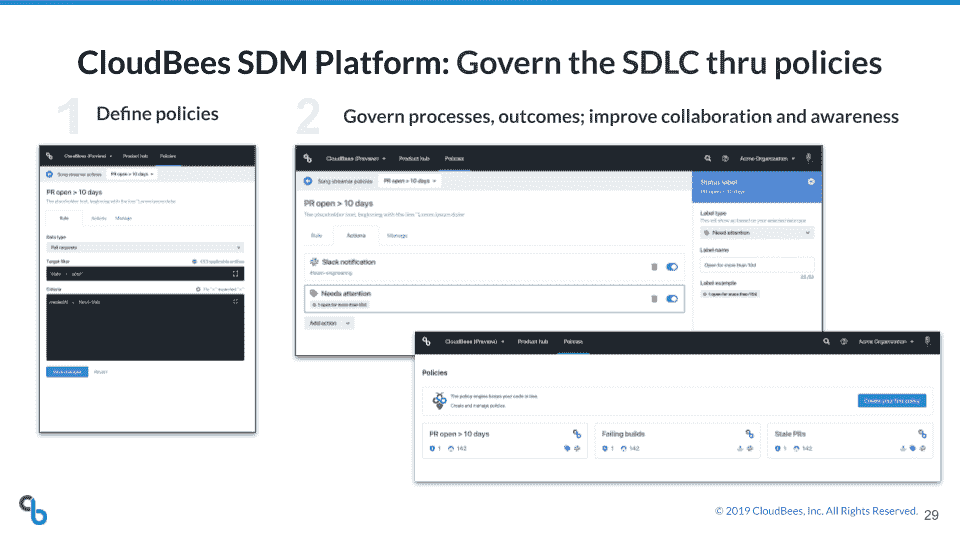

# CloudBees 扩展了 SDM 的服务范围

> 原文：<https://devops.com/cloudbees-extends-sdm-service-reach/>

CloudBees 扩展了嵌入其软件交付管理(SDM)平台的集成，以[增加对谷歌](https://www.previous.cloudbees.com/press/cloudbees-integrates-software-delivery-management-platform-google-cloud-build-and-tekton-break)提供的额外服务的支持。

CloudBees 的高级副总裁兼 SDM 总经理 Moritz Plassnig 表示，与 Google Cloud Build 和 Tekton pipelines 的这些集成是两家公司长期联盟的一部分，旨在推动最佳 DevOps 实践的采用。CloudBees SDM 服务运行在谷歌云平台(GCP)上。

作为这项工作的一部分，CloudBees 一直在投资一个 SDM 平台，该平台使 DevOps 团队能够从任何工具或平台获取指标。这些数据随后被输入到分析云服务中，CloudBees 通过云服务提供洞察，例如，确定项目延迟可能如何影响整体收入目标。

Plassnig 表示，在新冠肺炎疫情之后，随着组织加速构建和部署数字业务应用程序，对软件交付分析的兴趣已经上升。他指出，随着员工和客户在家中工作以对抗疫情，组织正在加大投资，以创建能够为最终用户提供数字化替代方案的应用程序。他补充说，与短短几个月前相比，任何这些项目的延迟都可能对业务连续性战略产生更大的影响。

CloudBees SDM 服务为 DevOps 团队和业务经理等提供了整个组织内所有产品和功能开发的实时视图，以及触发操作以更好地优化软件交付流程的策略引擎。组织还可以在度量整体 DevOps 性能的同时，对软件交付过程进行建模和可视化。

Plassnig 表示，CloudBees 没有要求组织在单一平台上实现标准化，而是利用应用程序编程接口(API)来集成各种 DevOps 工具的指标。他说，这种方法可以满足任何组织在 DevOps 成熟度方面的需求。

Plassnig 指出，对 Tekton 管道的支持非常重要，因为预计未来大多数持续集成/持续交付(CI/CD)平台将使用 Tekton 管道构建，tek ton 管道为构建旨在部署在 Kubernetes 集群上的平台提供了一个开源框架。 [Jenkins X](http://Originally developed by Google,) ，最初由 CloudBees 开发，是最早支持 Tekton 管道的 CI/CD 平台之一，tek ton 管道最初由 Google 开发。Jenkins X 和 Tekton 管道现在在持续交付基金会(Linux 基金会的一个分支)的赞助下[向前推进。](https://devops.com/continuous-delivery-foundation-picks-up-momentum/)

Plassnig 指出，随着越来越多的 CI/CD 平台采用 Tekton，从分析的角度来看，平台本身将不再是一个黑匣子。

他说，与此同时，CloudBees 还预计谷歌将继续成为云服务提供商。虽然谷歌在整体市场份额方面远远落后于亚马逊网络服务(AWS)和微软，但普拉斯尼格指出，随着能够部署在多种云和内部 IT 环境中的云操作系统 Anthos 的到来，谷歌云构建等服务得到更广泛的应用只是时间问题。

无论使用什么平台，有一件事是肯定的，那就是软件在各种平台上生成和部署的速度将受到更密切的关注。