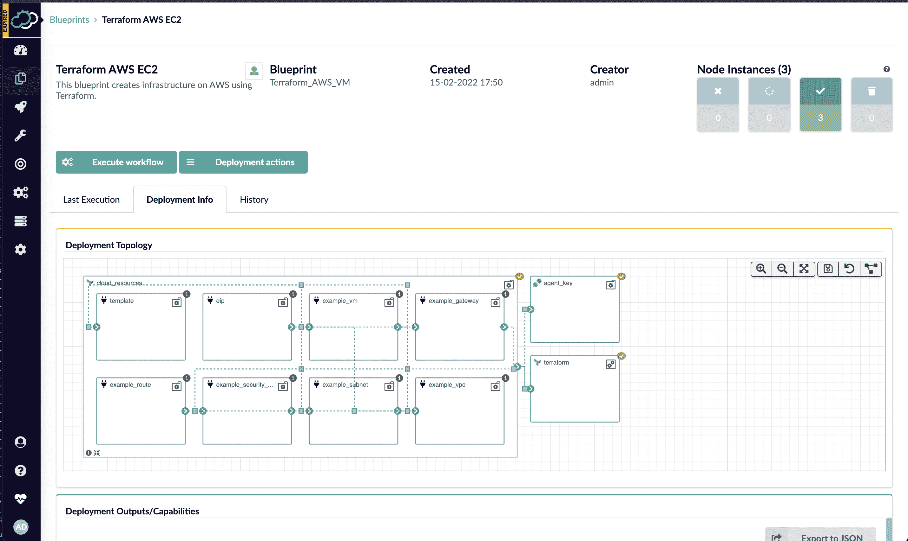

# Cloudify 将 DevOps 自动化平台与 Terraform 集成在一起

> 原文：<https://devops.com/cloudify-integrates-devops-automation-platform-with-terraform/>

Cloudify 本周宣布了一个免费的用户界面(UI)模块，该模块扩展了其基础设施供应平台，使 DevOps 专业人员能够集成无限的 Terraform 模块。

Cloudify 首席技术官 Nati Shalom 表示 [Terraform UI](https://www.prweb.com/releases/cloudify_launches_free_terraform_ui_experience_for_devops_engineers_enabling_seamless_automated_import_and_management_of_unlimited_terraform_modules/prweb18498248.htm) 为使用开源 DevOps 自动化平台来提供基础设施即代码(IaC)的 DevOps 团队提供了一个熟悉的构造。他说，该模块使 DevOps 专业人员能够无缝地将 Terraform 模块导入 Cloudify，而无需编写蓝图或任何额外的胶水代码。

Cloudify 现在自动生成每个 [Terraform](https://devops.com/?s=Terraform) 模板所需的包装器，使 DevOps 团队能够通过任何 Git 存储库协作管理机密、执行并发部署、远程存储状态以及监控部署、用户和版本。然后，这些 Terraform 模块可以根据开发运维团队的要求，与应用编程接口(API)和持续集成/持续交付(CI/CD)平台集成。

DevOps 团队还可以将现有的自动化模块和脚本导入 Cloudify。这些模块和脚本可以自动转换到可以通过 Cloudify 控制台集中管理的环境中，或者通过导出到 ServiceNow 的 IT 服务管理(ITSM)平台作为软件即服务(SaaS)应用程序。

他补充说，这种方法提供了额外的好处，使 DevOps 团队能够通过单一控制台集中管理所有 Terraform 模块和版本，作为减少导致安全漏洞的错误配置的努力的一部分。

Cloudify 使 DevOps 团队能够创建自助服务目录和门户，通过该目录和门户可以管理基础架构。许多 DevOps 团队已经建立了他们自己的门户来管理这个过程。然而，Shalom 指出，这些 DevOps 团队需要投入资源来维护该门户，而这些资源可以分配给其他关键任务。

Shalom 补充说，DevOps 团队不仅可以使用 Cloudify 来应用补丁，改变拓扑结构，添加安全功能，进行配置更改或提供额外的资源，他们现在还可以将 Terraform 工具与 Kubernetes 等平台或 Ansible 等其他自动化框架集成。Cloudify 还通过这些集成提供了该平台的企业级版本。

尚不清楚 It 组织在构建和维护 DevOps 环境方面投入了多少时间和精力。然而，在许多情况下，组织可能应该重新考虑关于构建当时不存在的能力的决策。这并不一定意味着替换定制的 DevOps 工具是有意义的，但很可能在这几年中，通过 DevOps 平台提供的工具范围已经大大扩展了。与此同时，DevOps 的相对新来者正在享受他们不必自己构建的平台带来的好处。

事实上，Shalom 指出，就 DevOps 的采用而言，随着越来越多的组织启动数字业务转型计划，要求应用程序的构建和部署速度比以往任何时候都快，拐点已经到来。当然，挑战在于既要安全又要以合理的成本做到这一点。