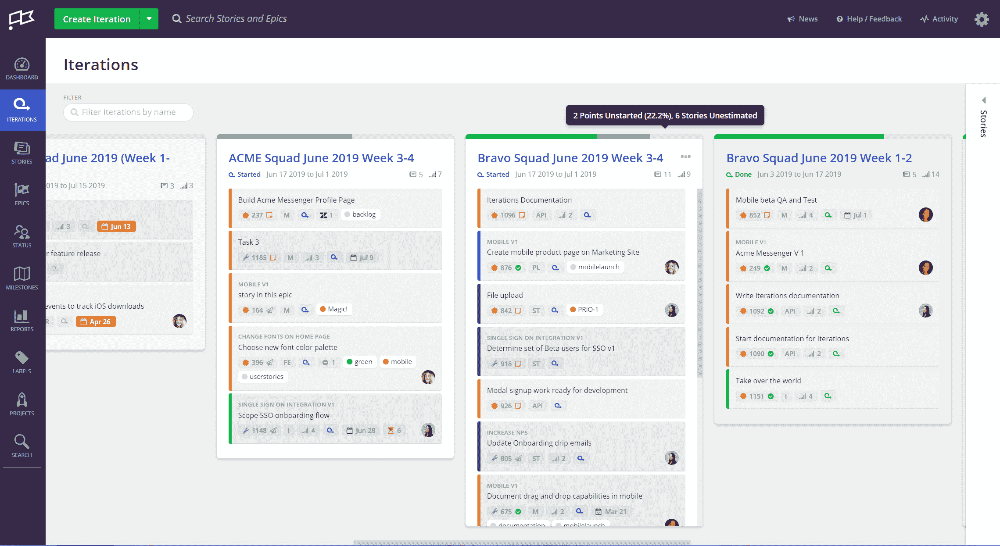

# Clubhouse 旨在简化软件项目管理

> 原文：<https://devops.com/clubhouse-aims-to-simplify-software-project-management/>

Clubhouse Software 今天宣布，它将在其项目管理应用程序中添加一个 Clubhouse 迭代模块，以便更容易地规划涉及产品和软件工程团队的冲刺。

Clubhouse Software 的首席营销官 Mitch Wainer 表示，迭代将作为其项目管理应用程序服务的一部分，旨在弥合软件开发团队和他们为之构建应用程序的业务线之间经常存在的鸿沟。

Wainer 说，该公司的同名项目管理软件使非技术专业人员更容易作为开发团队参与相同的项目管理工作流程，而不是要求他们熟悉为软件工程师设计的项目管理应用程序，如吉拉。他说，Clubhouse 的方法消除了当同一组织内的两个团队依赖不同的项目管理应用程序时产生的孤岛。

Wainer 补充说，Clubhouse Iterations 更进一步，当特定项目中的优先级和时间表改变时，团队需要关注什么。

他补充说，Clubhouse Iterations 允许用户使用开始和结束日期来定义 sprints，然后该工具会发送提醒，以便团队可以预留时间专注于特定的项目。

已经成功采用 DevOps 的组织几乎总是寻求将那些过程扩展到软件开发团队之外。至少在理论上，整个企业应该渴望变得更加敏捷。然而，今天许多 DevOps 团队使用的项目管理软件对于一般的业务主管来说太复杂和吓人了。与其强迫业务用户学习如何掌握这些应用程序，不如为软件开发团队和他们最终服务的产品经理提供一套更直观的项目管理工具。Wainer 说，已经有 2000 个组织在使用 Clubhouse 来解决这个问题。

Wainer 还指出，就持续集成/持续交付(CI/CD)平台而言，Clubhouse 软件也没有偏见。Clubhouse 旨在通过应用编程接口(API)与多个 CI/CD 平台集成，以支持定制工作流的开发，例如，包括与通过 Slack 服务进行的实时对话的集成。

接下来，Wainer 说 Clubhouse 打算改进它在平台上提供的搜索功能，并提供更复杂的报告工具。

与此同时，如果没有项目管理应用程序支持的功能，DevOps 的崛起是不可能的。但是 DevOps 过程的敏捷本质迫使项目管理软件的提供商使他们的应用程序更加动态和易于访问。反过来，这些进步使得[将新成员加入](https://devops.com/citizen-developers-drive-productivity-and-innovation/)devo PS 团队变得更加容易。

项目管理软件可能并不总是被视为大多数软件开发过程的关键。然而，如果没有某种形式的项目管理应用程序，大多数 DevOps 过程很久以前就会陷入完全的混乱。

— [迈克·维扎德](https://devops.com/author/mike-vizard/)