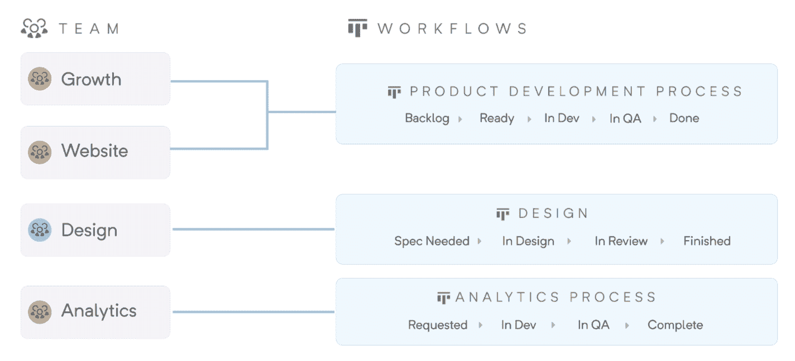

# 会所成为软件项目管理变革的捷径

> 原文：<https://devops.com/clubhouse-becomes-shortcut-to-transform-software-project-management/>

Shortcut，原名为 [Clubhouse Software](https://domaininvesting.com/clubhouse-announces-rebrand-to-shortcut/) ，今天宣布其面向软件开发团队的项目管理软件已经扩展到包括额外的工作流功能。

首席执行官库尔特·施拉德表示，团队到工作流的功能正在被添加到软件即服务(SaaS)平台，并将以更标准化的方式更容易地在软件开发团队之间共享工作流。

组织可以跨多个团队标准化工作流，同时仍然让每个团队能够为自己独特的流程定制工作流。随着工作的创建和分配，它会自动进入工作流，而无需手动更新流程。

施拉德说,“捷径”的设计是为了让开发团队以一种保持透明度的方式与参与同一个更大计划的其他团队合作变得更简单。他补充说，随着组织规模的不断扩大，它允许产品经理、工程师和设计师无摩擦地计划、跟踪和衡量他们的工作。

例如，除了允许用户使用开始和结束日期来定义冲刺之外，Shortcut 将显示团队需要关注特定项目中的优先级和时间表的变化，然后该工具会发送提醒，以便团队可以保留时间来关注特定项目。

Shortcut 还将通过应用程序编程接口(API)与持续集成/持续交付(CI/CD)平台集成，以支持定制工作流的开发，例如，包括与通过 Slack 协作服务进行的实时对话的集成。

大多数[项目管理](https://devops.com/?s=project+management)软件开发团队现在使用的软件对于一般的业务主管来说过于复杂和令人生畏。与其强迫业务用户学习如何掌握这些应用程序，不如为软件开发团队和他们最终服务的产品经理提供一套更直观的项目管理工具。

随着越来越多的组织意识到他们是如何依赖软件来驱动业务流程的，他们中的许多人正在审查他们目前依赖的管理软件开发的工具。目标不仅是减少团队间的摩擦并实现更大的透明度，而且是为开发团队之外的涉众提供任何给定项目状态的更多可见性。

与此同时，组织同时启动更多的软件开发项目，这些项目有许多依赖关系。这些计划中的许多都是基于微服务的，这些微服务在被聚集起来创建一个应用程序之前都是彼此独立构建的。这些微服务之间的依赖性要求组织确保它们的开发和部署方式不会让一个软件开发团队在完成工作之前等待另一个团队完成项目。

施拉德说，人类作为一个物种，不善于组织。项目管理应用程序应该使公司更容易理解项目是如何组织的，以及项目之间存在的所有依赖关系。

不管软件开发项目是如何管理的，对更大可见性的需求是显而易见的。鉴于所有可用的沟通渠道，不太清楚的是实现这一目标的最佳方式。