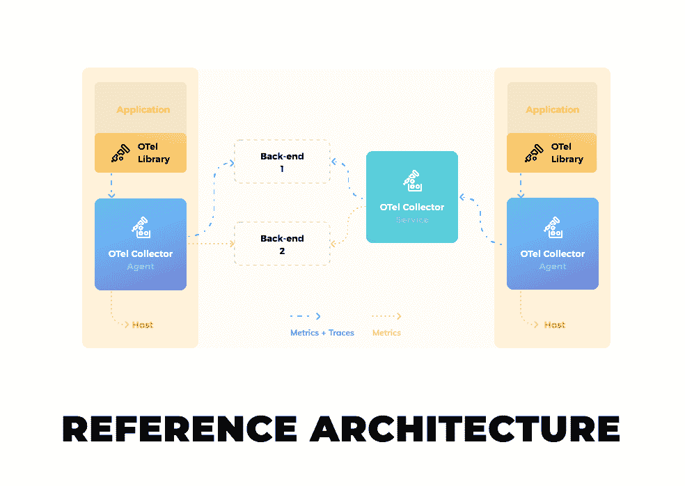

# CNCF 推进开放式遥测倡议

> 原文：<https://devops.com/cncf-advances-opentelemetry-initiative/>

云计算原生计算基金会(CNCF)的技术监督委员会(TOC)已经投票同意将 OpenTelemetry 作为一个孵化项目的一部分，作为正在进行的使用开源代理软件简化软件工具的努力的一部分。

OpenTelemetry 是工具、应用程序编程接口(API)和软件开发工具包(SDK)的集合，可用于收集[指标](https://devops.com/?s=metrics)、日志和跟踪，从而简化确定应用程序问题的根本原因。

OpenTelemetry 的核心是基于 OpenTelemetry 协议(OTLP)规范，该规范描述了从源、中间节点和后端平台收集的遥测数据的编码、传输和交付机制。OpenTelemetry Collector 为接收、处理和导出遥测数据提供了独立于供应商的实现。API 和 SDK 可以为 11 种不同的编程语言提供工具应用。

之前，OpenTelemetry 是 CNCF 的一个沙盒级项目，下一步将成为一个分级项目，与其他开源产品一起，如 Kubernetes 和 Prometheus，一个用于监控 IT 环境的平台。

OpenTelemetry 项目是在 2019 年 5 月通过合并 OpenCensus 和 OpenTracing 项目创建的。从那时起，来自 220 家公司的 500 多名开发人员为该项目做出了贡献，包括亚马逊、Dynatrace、谷歌、Honeycomb、Lightstep、微软、Splunk 和优步。

大多数可观测性平台的提供商至少已经表明了他们支持 OpenTelemetry 的意图，作为他们以前创建的收集指标、日志和跟踪的专有代理软件的替代。

OpenTracing 和 OpenTelemetry 的联合创始人之一、Lightstep 的首席执行官 Ben Sigelman 表示，OpenTelemetry 项目的不同元素处于不同的成熟阶段。因此，根据供应商对 OpenTelemetry agent 软件收集日志的能力的信任程度，正在向平台添加对项目元素的支持。

Honeycomb.io 是一个可观测性平台的提供商，其主要开发者 Liz Fong-Jones 表示，随着时间的推移，大多数可观测性平台将支持 OpenTelemetry 倡议的所有元素，以降低他们自己的工程和支持成本。她指出，随着时间的推移，这些节省将会传递给那些能够以更经济的方式装备应用程序的组织。

OpenTelemetry 的广泛应用可能还需要一段时间，但组织越快过渡到基于微服务的应用程序，对开源遥测软件的需求就越迫切。如果没有某种形式的遥测，组成多个应用程序的所有微服务之间存在的依赖关系将无法管理。组织面临的挑战是找到一种负担得起的方法来装备所有这些微服务。

当然，几十年来，组织一直在利用应用程序。然而，与仪器相关的时间、精力和成本往往限制了其仅用于组织的最关键任务应用。现在的问题是，不仅基于微服务的应用需要仪器来管理，而且在数字化转型时代，被视为任务关键型应用的比例也在稳步上升。