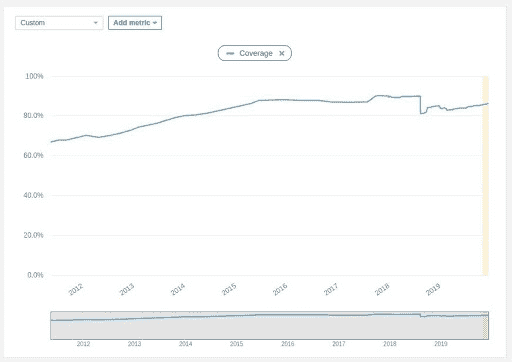

# 代码质量不一定要像天气一样

> 原文：<https://devops.com/code-quality-doesnt-have-to-be-like-the-weather/>

有时候代码质量就像天气一样:每个人都在谈论它，但是没有人做任何事情。当然，这并不是因为缺乏善意；大多数人都喜欢留出一两周的时间来清理东西。不幸的是，世界不是这样运转的。最好的做法是偷偷摸摸地在这里打扫一下，在那里打扫一下，作为正常工作的一部分。幸运的是，这实际上是最好的方法。在 SonarSource，我们称之为 Clean as You Code 方法论，我们发现这种代码质量的行为方法与开发人员用来跟踪它的工具一样重要。

Clean as You Code 背后的思想是忽略旧代码的质量，只关注新代码的质量。这听起来可能有些激进，但是请原谅我。为什么只关注今天的变化？因为仅仅为了解决代码质量问题而挖掘遗留代码可能需要层层审批，或许还需要业务测试，这可能很难实现。但是开发人员对他们现在编写的代码的质量有绝对的控制权，并且他们会为制定和执行这些代码的高标准而自豪。专注于遗留和新建项目中新代码工作的质量，以及所有质量轴。

让我们以测试覆盖率为例。许多开发人员从事的项目测试覆盖率比他们希望的要低。但是到处偷一个小时来添加随机方法的测试通常是令人沮丧的，最终是徒劳的。而是从今天的变化说起。确保他们被完全覆盖，直到他们被释放。就这样，这就是所需要的。涵盖这一两种方法——甚至一两行——可能感觉像是杯水车薪，但随着时间的推移，它会产生真正的影响。事实上，这正是我们的经历。

从我公司旗舰产品的早期开始，我们就有了 80%单元测试覆盖率的内部标准。然而在早期，我们通常在 60 年代发布报道。总是有编写单元测试的意图，但是不可避免的是在发布之前。然后，寻找最大的未被覆盖的文件并费力地通过他们不熟悉的代码来编写测试变成了一场争夺。这种方法的问题之一是，编写代码的开发人员通常不是编写测试的人，因此永远无法确定测试的行为是否正确。当然，没有人喜欢为别人收拾残局。

最后，这是一个痛苦而最终无效的套路；直到 2014 年 7 月，覆盖率才突破 80%——大约在项目开始 7 年后，大约在我们第一次制定和采用 Clean as You code 后的一年半。你可以在这个项目覆盖率的图表中看到 2012 年 10 月的拐点(是的，前几年的数据缺失；早期结构重构的受害者):

On November 9, 2011 test coverage was at 66.9%. After rising to 70.3% on July 23, 2012 it fell to 69.3% by that October. From that October 2012 inflection point, it climbed steadily for more than three years, crossing the 80% threshold in July 2014\. Coverage today is at 86.2%, comfortably above the 80% goal.

今天，我们的覆盖率达到了 86%,并且还在上升。实现这个目标的公式很简单:

*   设定新代码的质量标准。这里的“新”是指在新代码周期中添加或更新的任何内容。
*   定义新的代码周期。这就是关注的范围，也就是说，为了应用新的代码标准，要回溯到多远。我们将它设置为自上次发布以来。
*   除非你的标准得到满足，否则不要发布。

当然，前两步要比最后一步容易得多，尤其是在发布之前达到标准的时候。每个开发人员都可能感受到压力，要尽快将业务变更投入生产。这就是为什么这个策略在尽可能精细地应用时最有效。在发布之前满足标准是最起码的，但也应该不是一个事件。

我们发现“如你所愿”代码在应用时最为有效:

*   从个人层面来看——优秀的开发人员希望写出优秀的代码。当开发人员对他们今天编写的代码承担个人责任时，从长远来看可以节省时间，并且没有人必须在其他人之后清理。
*   在拉式请求时——如果每个单独的请购单都符合您的标准，则不符合标准的代码将永远不会被合并。这意味着没有人会受到管理层的压力而发布次标准代码，因为它不会存在于主代码库中。

但是存在于每个项目中的糟糕的旧代码呢？你可能在想它不会神奇地消失。但是实际上——逐渐地——它会。上图是项目的整体代码覆盖率图。通过关注新代码的覆盖率，我们有机地、自动地提高了所有代码的覆盖率。这不是一次性的；你的结果会是一样的。在几年的过程中，正常的变更请求将引导您通过代码库。请确保您为这些更改编写的代码是干净的，其余的会自动完成。