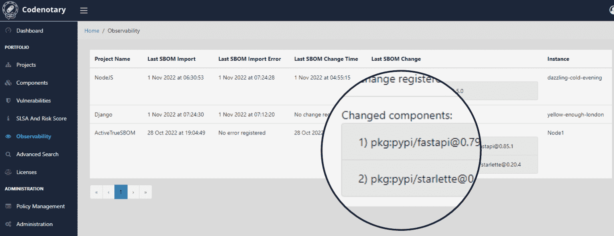

# code 公证人将动态 SBOM 扩展到无服务器计算平台

> 原文：<https://devops.com/codenotary-extends-dynamic-sbom-reach-to-serverless-computing-platforms/>

code 公证人已经将其用于自动生成软件材料清单的平台扩展到运行使用函数构建的软件的无服务器计算平台。

code 公证人首席技术官 Dennis Zimmer 表示，由于无服务器应用是动态创建的，因此不可能使用传统方法生成 SBOMs。通过在任何应用程序的源代码中添加一行代码，TrueSBOM 平台就可以实时创建 SBOM。该平台的 [TrueSBOM for Serverless](https://www.businesswire.com/news/home/20221129005933/en/Codenotary-Introduces-Automated-Software-Bill-of-Materials-for-Serverless-Applications) 版本现在将这种能力扩展到亚马逊网络服务(AWS)、微软和谷歌在云中提供的无服务器计算框架。

他指出，这种方法使 SBOM 成为应用程序本身的一部分，而不是单独存储的文本文件。Zimmer 补充说，每次应用程序更新或扫描器发现新的漏洞时，都会自动生成新的 SBOM。

自从拜登政府发布的行政命令明确表示联邦机构将从明年开始要求软件提供商提供 SBOMs 以来，对 SBOMs 需求的认识急剧上升。在一系列高调的网络安全违规事件发生后，许多企业 IT 组织可能会效仿，作为更大规模努力的一部分，以更好地保护软件供应链。

大多数内部 DevOps 团队已经很好地处理了他们部署的应用程序中使用的软件组件。Zimmer 指出，问题是使用该软件的组织无法轻松验证正在使用的组件。这是有问题的，因为组织可能会因为一个已知的漏洞而禁止部署特定的软件组件。Zimmer 补充说，TrueSBOM 允许使用应用程序的组织保持对其软件环境的控制，而不管使用什么软件构件来构建封闭或开放源代码组件。

现在还不清楚大多数组织将如何操作 SBOMs，因为更多的 SBOMs 正在创建中。理想情况下，组织应该能够只批准其组件已经被验证为安全的软件。

随着 SBOM 法规变得越来越严格，越来越多的应用程序提供商渴望遵守保护软件供应链的规则。现在的问题是为软件的开发者和消费者找到一种简化验证过程的方法，在目前的形式下，验证过程过于繁琐，难以有效管理。Zimmer 说，因此，许多组织现在正在组建由网络安全专业人员和软件开发人员组成的专门团队来管理 SBOM 进程。

当然，有大量已经部署的代码今天不会出现在 SBOM 中。虽然许多新兴应用程序(使用诸如函数和容器之类的构件创建)可能会越来越多地被检测以动态生成 SBOM，但是可能需要类似检测的遗留应用程序的数量要大几个数量级。因此，为使用中的每个应用程序生成 SBOMs 所需的工作量可能比团队最初预期的要多。