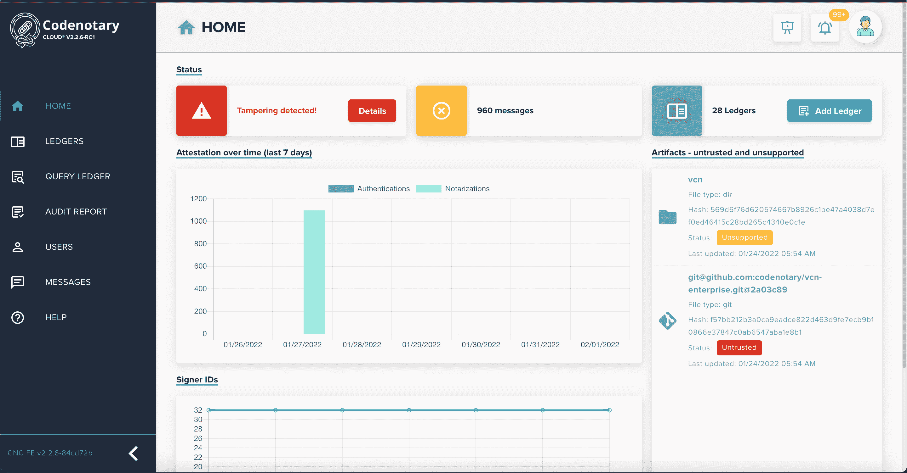

# code 公证人推出云服务生成 SBOMs

> 原文：<https://devops.com/codenotary-launches-cloud-service-to-generate-sboms/>

code 公证人推出了一个[code 公证人云](https://www.businesswire.com/news/home/20220201005235/en/Immutability-Specialist-Codenotary-Now-Offers-Trusted-Software-Supply-Chain-Assurance-in-a-Fast-Easy-Inexpensive-Cloud)平台，该平台可以自动生成软件材料清单(SBOM ),并更容易发现应用程序中包含了哪些组件。

role 公证人首席执行官 Moshe Bar 表示，这种能力也可以在识别应用程序中的哪些组件可能包含漏洞方面发挥关键作用，例如，最近在 Java 应用程序中发现的 Log4jShell 漏洞。

Bar 补充说，这种能力可以将删除不安全构件所需的时间减少 80%，因为组织不依赖扫描工具来搜索易受攻击的组件。

code 公证人云基于[一个不可变的开源 immudb 数据库，该数据库以加密方式为每个软件工件附加一个身份](https://devops.com/codenotary-uses-immutable-database-to-verify-software-artifacts/)。在一系列高调的违规事件之后，现在[更加关注软件供应链的完整性](https://devops.com/linux-foundation-survey-sees-rise-in-sbom-use/)。事实上，拜登政府最近发布了一项行政命令，要求所有联邦机构，除其他外，确保他们使用的所有软件都可以使用 SBOM。

code 公证人声称，code 公证人云可以跨源代码、构建、存储库、Docker 容器映像和 Kubernetes 部署扩展到每秒数百万次完整性验证，而不需要 DevOps 团队将数据上传到一个集中的平台，注意到 Bar。他补充道,[使得公证和验证所有代码的出处成为可能。](https://digitalanarchist.com/videos/featured-guests/immutable-repository-codenotary)

code 公证人云还可以通过托管服务与大多数漏洞扫描器和流行的云本地持续集成/持续交付(CI/CD)系统完全集成，这些系统运行在任何云或本地主机上。由 10 名开发人员组成的工作组的起价为 5500 美元。

尚不清楚拜登政府的行政命令将在多大程度上提高整体软件安全性。过去几年中出现了多个漏洞问题，但这些问题并未导致组织管理其应用程序开发流程的方式发生任何实质性变化。然而，拜登政府发布的行政命令，加上最近关于开源软件安全状况的峰会，意味着更多的高级商业和 it 主管至少意识到了日益增长的担忧。

可以肯定的是，将会发现更多的零日漏洞。今天的开发人员经常重用由少数志愿程序员维护的开源软件和免费组件。像任何其他开发人员一样，这些人拥有的安全专业知识是有限的。许多组织重用这些代码，而不对项目做出任何有意义的贡献——无论是在融资方面，还是在漏洞识别和补救支持方面。这些项目的贡献者免费贡献他们的时间和专业知识来构建这些组件。许多贡献者认为保护他们创建的软件的责任在于决定部署该软件的组织。

不管谁负责安全，很明显网络安全团队将审查应用程序开发过程。从理论上讲，这将使所有相关人员受益，并导致 DevSecOps 最佳实践被更广泛地采用。