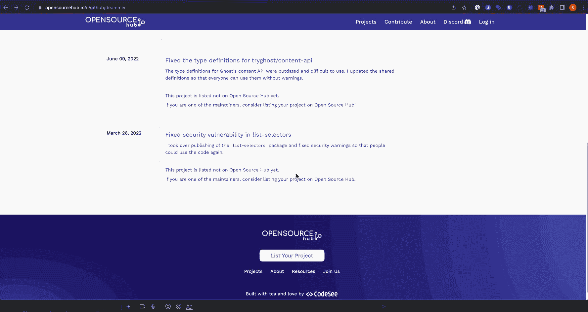

# CodeSee 推出开源中心

> 原文：<https://devops.com/codesee-unveils-open-source-development-hub/>

CodeSee 今天推出了一个免费的[开源中心](https://opensourcehub.io/) (OSH)社区，开发者可以通过它更容易地分析构成开源软件项目的代码库。

CodeSee 首席执行官 Shanea Leven 表示，这种能力至关重要，因为让探索[开源](https://devops.com/?s=open+source)代码库变得更加容易，减少了开发人员理解在哪里做出贡献所需的工作量。

OSH 基于 CodeSee 创建的同名可视化工具。CodeSee 工具使开发人员能够看到如何使用图形技术构建代码库，图形技术可以扫描软件存储库并识别组件及其相互关系。开发人员还可以使用 CodeSee 来更好地了解对代码库的更改会产生什么影响。

除了使开发者更容易发现开源软件项目，OSH 还使维护者和贡献者能够创建个人资料，开源社区的其他成员可以通过这些资料看到他们的努力如何影响了各种项目。

作为 OSH 的一部分，CodeSee 还提供与 Discord 的集成，Discord 是一种在线语音、视频和文本协作服务，使开源软件项目的维护者和贡献者更容易进行协作。

Leven 说，对于大多数开发人员来说，今天花太多时间钻研代码库来理解他们可能做出的贡献。她指出，代码库变得越大，开发者就越不愿意花时间开始做出有意义的贡献。

OSH 的到来正值开源项目的维护者特别寻求保护开源软件的时候。核心问题是，许多项目是由少数程序员维护的，这些程序员自愿贡献他们的时间和精力来构建其他人可以免费使用的组件。像任何其他开发人员一样，这些人拥有的安全专业知识是有限的。当发现零日漏洞时，他们中的许多人根本没有时间立即为应用程序提供补丁。

不幸的是，许多 IT 供应商和大型企业 IT 组织从开源代码中受益，却没有为项目做出任何有意义的贡献——无论是在融资还是帮助开源维护者发现和修复漏洞方面。也不是所有的贡献都必须是代码的形式。许多开源项目只是需要文档方面的帮助，一旦提供了文档，其他贡献者就可以将更多的时间和精力放在应用程序安全性上。

目前还不清楚商业和 It 领导意识到他们的组织实际上是多么依赖开源软件。即使他们这样做了，也不容易让开发人员参与任何软件开发项目。开发人员可能需要几个月的时间才能真正对项目做出有意义的贡献。

根据定义，应用程序开发现在是一项团队工作。一个单独的开发人员负责整个应用程序的日子已经一去不复返了。问题是要找到一种方法，让开发团队在大多数人从未见过面的情况下更容易地协作。