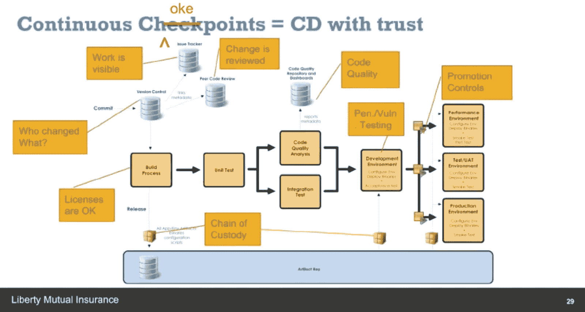

# 来自房利美、自由互助和第一资本的自白

> 原文：<https://devops.com/confessions-fannie-mae-liberty-mutual-capital-one/>

### *在全天 DevOps 会议上，从演讲者那里学习真实世界的故事…*

## 真实故事

在过去的几年里，房利美改变了它交付软件的方式。部署人数从每月 1 200 人增加到每月 15 000 人。同时，生产率提高了 28 %,而成本降低了 30%。

但是，房利美是怎么做到的呢？

在[全天 DevOps 会议](https://www.sonatype.com/all-day-devops-on-demand)期间，来自世界各地的 13，500 多名从业者齐聚一堂，向业内同行学习。房利美 DevOps 高级经理巴里·斯奈德(Barry Snyder)是 57 名分享其企业转型真实经历的从业者之一。

## 咽喉要道还是检查站？

Liberty Mutual 的软件交付平台总监 Eddie Webb 也分享了他的组织进入 DevOps 的历程。Eddie 描述了 Liberty Mutual 如何发展其组织、工具链和流程，在过去的 18 个月中，从 20%的构建部署到 60%。他描述了该公司如何记录其价值交付链，并确定了连续交付过程中需要自动化以实现其新的速度和质量目标的所有瓶颈。

## 受严厉批评

全天的 DevOps 会议记录了超过 57 次由从业者主导的会议(每次 30 分钟)，包括来自 Barry 和 Eddie 的会议。现在每个环节都在网上发布，可以免费观看。会议本身有三个轨道:CI/CD、自动化安全和现代基础设施，包括:

*   **KMS 的应用秘密管理**–Capital One 的安德烈·乌蒂斯
*   **与詹金斯一起走出职场丛林**——clear 2 pay 的达米安·科拉波夫
*   **服务器计算——为团队贡献一份力量**—蓝箱集团的 Paul Czarkowski

了解 DevOps 的最佳方式之一是听取其他人的经历。今天早上、午餐时或晚上在家花 30 分钟观看你与[全天 DevOps 点播](https://www.sonatype.com/all-day-devops-on-demand)的第一次在线会话。

— [德里克·威克斯](https://devops.com/author/derek-e-weeks/)