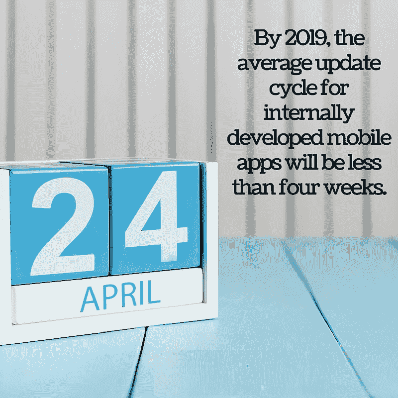

# 如何为您的移动测试征服测试自动化

> 原文：<https://devops.com/conquer-test-automation-mobile-testing/>

开发你的移动应用只是为市场做准备的第一步。它首先需要在数千种不同的设备上完美地工作，每种设备都运行在不同的移动操作系统上，有自己的版本，并且在数百个独特的本地网络中运行。最重要的是，每个功能都必须经过测试，以获得快速性能。

那是很大的工作量！

除此之外，今天的 DevOps 标准要求您在几周内完成所有工作，而不是几个月。最终，这将是几天而不是几周。

这需要测试自动化。除了检查下一版本应用程序的新代码之外，手动测试不再被接受。移动应用竞争异常激烈；如果一个应用没有在几天内上升到一定的排名，它就被认为是失败的。移动测试自动化保证了快速的发布周期，这是向公众提供最新最好的移动产品所必需的。

## 实现移动测试自动化的四个障碍

### 找到正确的测试自动化工具

自动化测试脚本的能力只是皮毛，但是合适的移动测试工具应该有更多。为了支持更大的开发运维战略，it 应该能够连接到云，并无缝集成到 Jenkins 等持续集成服务器，以尽可能多地自动化开发运维流程。

此外，它必须在本地和对象 web 属性上运行，尽可能精确地识别应用程序的组件。它应该能够执行不仅仅是功能测试，自动化工具还必须允许通过网络虚拟化和负载测试选项进行良好的性能测试。

### 集成到现有的测试环境中

当您的测试脚本是完美的，但是工具不接受编写脚本的语言时会发生什么？为了解决这个挑战，你需要一个能够处理所有大型测试环境的工具:Selenium、QTP、微软 Visual Studio、IBM RFT、Smartbear Testcomplete、Java、Pearl、Python 和 Ruby。您应该能够用这些语言中的一种编写测试脚本，并且能够立即将它转换成任何其他语言。

### 并行执行和对新技术的适应性

自动化移动测试的优点是脚本在你熟睡的时候运行，使你的测试效率加倍。如果您可以同时在一个以上的设备上运行相同的测试，那么您将成倍地提高移动测试的生产率。正确的测试自动化解决方案允许并行执行，要么通过在连接到本地计算机的设备上运行多个测试，要么通过在通过云连接的数十甚至数百个设备上运行单个脚本来真正扩展。这可以通过建立专门的移动设备实验室来实现。

随着设备、操作系统、版本和本地网络矩阵的快速扩展，并行执行是使您能够以测试覆盖范围本身倍增的速度增加测试覆盖范围的必要条件。

测试覆盖范围增加的最大原因是无数新技术的新移动设备进入市场。最好的测试自动化工具是那些在新平台对公众可用的时候，甚至是在测试阶段，就能预测并准备好测试的工具。

### 支持和学习:尽可能无痛

即使有最好的东西，您仍然需要学习测试工具。您还需要能够对移动测试中的每个技术问题做出快速反应。合适的移动测试提供商为您提供实用的培训计划，甚至认证流程，并为您提供全天候支持。您正在投入大量的资金来减少您的发布时间，每周期几天，甚至几个小时。因为第三方无法及时回复您的需求而失去这一优势是可笑的。合适的移动测试提供商知道您的风险所在，并相应地优先考虑他们的响应时间。

正确的测试自动化策略的投资回报是无价的。但要实现这一点，你必须确保清除最大的障碍。