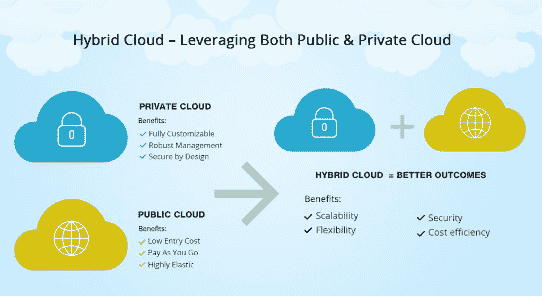

# 考虑混合云？关注为什么

> 原文：<https://devops.com/considering-hybrid-cloud-focus-on-the-why/>

如此多的商业——以及一般的生活——都可以归结为语义。我们用各种术语来阐述目标和衡量成功。有些有助于澄清；其他人困惑。考虑术语“混合云”——一个[谷歌搜索](https://www.google.com/search?source=hp&ei=e5ctX-u7L9ugytMP05aqQA&q=hybrid+cloud&oq=hybrid+cloud&gs_lcp=CgZwc3ktYWIQAzIFCAAQsQMyAggAMgIIADICCAAyAggAMgIIADICCAAyBQgAELEDMgIIADICCAA6DgguELEDEMcBEKMCEJMCOggIABCxAxCDAToICC4QxwEQowI6CwguELEDEMcBEKMCOgUILhCxAzoCCC46CAguEMcBEK8BUNAPWP4bYKkkaABwAHgAgAF2iAHKBpIBBDExLjGYAQCgAQGqAQdnd3Mtd2l6&sclient=psy-ab&ved=0ahUKEwir5dHl1onrAhVbkHIEHVOLCggQ4dUDCAg&uact=5)产生 596 万个结果。所以，是的，混合云是一个热门话题，但我们到底指的是什么呢？

混合云的(当前)公认定义是使用第三方和私有(内部)云资源组合的任何计算/存储环境。然而，这个定义有些误导。您的公司很可能已经使用第三方平台和服务(混合云模式)多年了。

混合云更多的是“为什么”，而不是“是什么”问题不是“我应该迁移到混合云吗？”(你已经有了。)更好的问题是，“我是否在最大限度地利用这个模型？”

## 内部部署与公共云容量—战略与非战略应用

IT 必须支持的各种应用程序、系统和业务需求的数量呈指数级增长。作为回应，越来越多的工具可以提供帮助。公共云、私有云、边缘计算和 PaaS/SaaS 模式都为首席信息官和 IT 经理提供了处理更复杂的新需求的选择。各有利弊。IT 面临的挑战是开发可用工具的最佳组合，以确保以最有效的方式实现业务目标。

Source: Veritas Inc., global IT consulting

制定混合云战略的第一步是了解哪些功能、应用程序和要求对业务具有战略意义。更具体地说，由于安全、法规或其他治理问题，哪些运营是组织的核心目标或必须保留在内部(即私有云)？这些是高优先级操作，因此有必要准备高效的内部资源和员工来[支持您的云计划](https://devops.com/cloud-adoption-companys-horizon/)。

在决定一个应用程序或功能是否具有战略意义时，将 it 输出与产生它的硬件/软件分开是至关重要的。例如，您可能会投入大量资金购买一台旧式大型机，该大型机配有运行任务关键型应用程序的软件和分析工具。但真正的问题是:产出在战略上有多重要？如果它是战略性的，那么，无论如何，把它留在内部。如果不是，将应用程序迁移到公共云对等设备，并将腾出的空间用于更具战略意义的事情，可能更有意义。

另一方面，非战略性职能是提高运营效率和节约成本的机会。例如，使用 SaaS 或 PaaS 提供商在公共数据中心托管您的 CRM 平台，可以提供更多的空间、人员和资源来支持更高优先级的业务。

## 最大的生产力和价值，最小的空间

虽然混合云战略的功能目的是确定哪些应用程序留在现场，哪些可以离开，但总体目标是提高战略和非战略功能的价值和交付。通常，直到您必须解决对额外数据中心空间的需求时，您的决策的全部重要性才被意识到。

规划、设计、建造和维护新设施所需的成本、时间和人力是一家公司可以做出的最大投资。通过战略性地优化您的内部云容量，并将非战略性功能卸载到云中，您可以增加可用的空白空间。这为您赢得了更多的时间来确定何时需要更多的空间，以及您当前优化的设施与其他选择相比是否具有竞争力。此外，您的内部设备(由于其战略重要性)变得更有价值和更高效。

在某些情况下，组织会发现，一旦他们将非战略性的运营转移到云中，在现场运行关键应用程序的成本就不足以维持他们现有的数据中心。此时，出售数据中心并租回所需空间或与多租户数据中心合作可能更有意义。

## 潜在的陷阱

当然，将应用程序和业务功能转移到异地也有不利的一面。选择井。将核心功能重新定位到云会损害控制，并可能削弱您的竞争优势。此外，虽然公共云似乎是小型组织的一个特别好的选择，但随着规模的扩大，它很快就会变得成本高昂。如果您决定从公共云迁移，将数据重新定位到新环境通常既复杂又昂贵，限制了未来的选择。这并不是说公共云选项本质上是高风险的；他们不是。但是，它强调了在权衡公共云选项所带来的成本和灵活性的同时，需要在您的长期战略背景下看待每个决策。

## 商业第一

底线是开发混合云战略首先是一项业务决策。如果做得好，它将基于公司的愿景和发展轨迹，并使用所有可用选项的最佳组合来实施，这些选项包括 XaaS 合作伙伴、私有云、公共云、托管提供商、专属资源和边缘计算。

在你开始尝试解决诸如架构和安全之类的细节之前，你必须确定策略。对于更常见的非战略性应用程序，基于云的部署提供了数据中心无法比拟的灵活性和成本效益。另一方面，在支持任务关键型应用程序方面，没有什么能比得上数据中心的现场控制和专用资源。

在决定什么留下什么离开的时候，肯定是有利有弊的。你的挑战是找出哪个是哪个，以及为什么。好好选择。