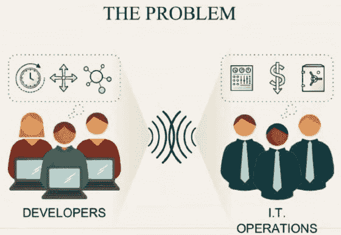
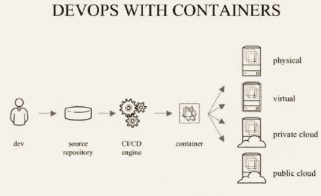
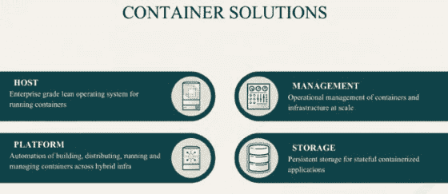

# DevOps 之旅中的容器注意事项

> 原文：<https://devops.com/container-considerations-devops-journey/>

容器是用来装你的东西的。在开发领域也是如此——容器是你的软件的东西，就像容器是你的东西一样，软件容器可以帮助你变得有条理、高效和安全。

([@ cmorgan _ cloud](https://twitter.com/cmorgan_cloud))红帽 OpenShift 合作伙伴生态系统技术总监，在 [2016 全天 DevOps 大会](http://www.alldaydevops.com/) 发表主题演讲。 Chris 与集装箱息息相关，最近讨论了他们如何改造 DevOps 管道。

Chris 从一个令人鼓舞的数字开始:DevOps 在企业层面的采用率为 74 %(至少在全面采用的道路上)。原因是 DevOps 有助于解决以下问题:

*   服务交付缓慢
*   服务质量差
*   频繁停机时间

然而，开发的需求和 IT 的愿望经常会阻碍 DevOps 的全面采用，这正是容器可以帮助的地方。容器允许应用程序轻松共享和部署:

*   一致的环境和工具
*   可预测的构建工具
*   更快的部署

简言之，容器可以充当开发和 IT 运营之间的通用语言。如果配置得当，运营团队可以利用容器来组装环境，而不会影响安全性。

调查显示企业中 DevOps 的采用率为 74 %,还显示企业中容器的采用率为 18%。为什么不同？容器有时很难跨多个主机实现。

如果您准备考虑在您的 IT 环境中使用容器，Chris 提供了一些需要考虑的事情:

*   您将容器图像存储在哪里？
*   哪个主机上的哪个容器？哪个有足够的容量？
*   您如何监控集装箱的健康状况？
*   如果集装箱崩溃，你会怎么做？
*   如何解决规模问题？

当您有跨越多个容器的大型应用程序时？

*   哪些容器可以访问其他容器？
*   哪些容器应该一起部署？
*   如何限制某些容器？
*   他们是如何找到彼此的？
*   任何容器上都有恶意软件吗？
*   如何处理持久存储？

底线是你需要的不仅仅是容器。你需要一个主机，一个平台，管理和持久存储。

您的组织是否准备好至少考虑 DevOps 的容器？Chris 提醒我们，“技术不应该决定过程。首先确定理想的流程，然后确保技术足够灵活。”首先，找到一些唾手可得的果实，评估你团队的技能和能力，并参与发现会议。

Chris 的主题演讲更加详细，特别是一些在企业中实现容器的解决方案。Y ou 可以全天观看 Chris 的[devo PS 大会会议](https://youtu.be/wa3iRS4iOaU) (仅 40 分钟)或者您可以在线观看 2016 年大会的其他 56 个演示文稿，并在此免费观看。本博客系列回顾了 2016 年全天 DevOps 的会议，该会议接待了超过 13，500 名注册与会者。下周，寻找戴蒙·爱德华兹主演的《Ops Happens:devo PS Beyond Deployment》。

最后，请务必在这里 为您和您团队的其他成员注册 2017 年全天 DevOps 大会 [。今年的活动将提供 96 场由从业者主导的会议(不允许供应商推介)。这一切都是免费的，10 月 24 日在线。](http://www.alldaydevops.com/)

— [德里克·威克斯](https://devops.com/author/derek-e-weeks/)