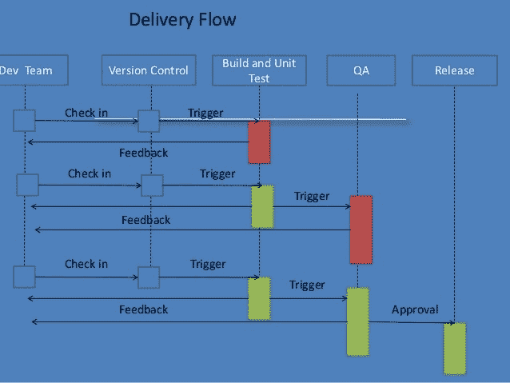
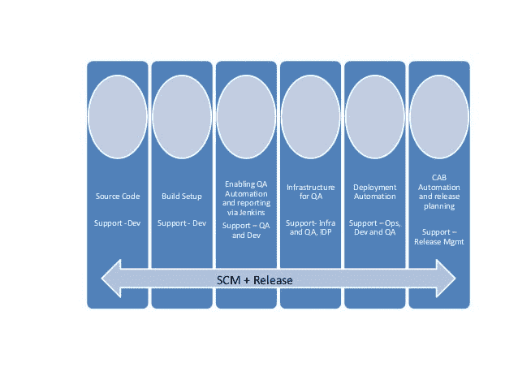

# 持续交付和持续部署

> 原文：<https://devops.com/continuous-delivery-continuous-deployment/>

一个问题浮现在脑海中，我们到底需要做什么来推进持续交付和持续部署，我们应该如何开始，或者更确切地说，我们应该从哪里开始。 很多时候团队可能没有适当地实现持续集成，可能是由于缺乏适当的工具、工作流或历史过程。

**甚至在想到 CI/CD 之前我们需要做什么，我们的先决条件是什么:**

*   源代码
*   构建系统
*   部署
*   质量保证自动化

我们需要了解**发布！**=部署

让我们假设在正确的源代码控制工具、构建系统和 QA 的帮助下，自动化团队已经实现了持续集成，这意味着开发人员每天数次将代码集成到共享存储库中，并且每次签入都可以通过自动化构建来验证，从而允许团队及早发现问题。

**下一步:**从 CI 到持续交付部署

到底什么是连续交付，它对软件安全和快速的态度
让我们从基础开始，在生产中部署一个生产线变更或一个小错误修复需要多少时间？没错，我们的目标应该是尽快实现这一目标。

**为什么我们需要连续交货？**

*   是的，它的速度是当今快节奏的软件行业所需要的。
*   不要再互相等待了，去开门吧。
*   质量——它提高了你的应用程序的整体质量——毫无疑问。
*   容量和清晰度——让每个团队使用一种工具——消除手动错误

## 我们将如何做到这一点……..

### **重点地区:-**

*   速度至关重要，因为不交付软件会带来机会和成本
*   频繁发布，频繁到什么程度才算频繁？为什么开发者写完代码还需要等待？
*   每个构建都可能是潜在的发布候选。

### **底线**

*清除手工工作/步骤。*
*走向完全自动化*

## 交货流程

**这里是发货流程。**

### **配料:-**

配置管理
持续集成/自动化构建
自动化部署
自动化测试

显然，没有任何一个团队可以在没有其他团队帮助的情况下独自实现 CD。它需要协作和团队工作来实现，让我们看看我们需要来自不同团队的什么

### **开发团队**

*   协作——整合不再是一件大事
*   定期签到
*   因为大变化而频繁小规模发布- >大风险->大努力小变化->小风险->小努力

### **QA 团队**

*   应具有完全自动化或任何可能的最大化。更多的手动测试导致更多的延迟。
*   缩短构建和测试流程
*   将 QA 自动化分解成小块，这样它们就可以同时运行并频繁地执行 QA。
*   发布报告

### **环境**

*   应该有完整的环境来测试一切。
*   灵活且可扩展，因此可以随时生成多个 env 并进行扩展。
*   作为产品或至少类似于产品进行管理

这增加了对构建生产就绪性的信心，降低了发布风险。

## 实现 CD 的主阻断器

1.  手工作业
2.  漫长的过程
3.  票务系统
4.  批准

**现在，我们如何对付拦截者**

*不添加闸门，只添加支票。添加门来防止问题蔓延到 prod 并不明智。还有更多的问题隐藏着，只是你不知道罢了*

***批准！！！为什么我们需要出租车？***

开发签收
QA 签收
运营和依赖签收
基础设施签收

**开发人员签字- >** 使用适当的项目管理工具，通过适当的工作流程跟踪软件中的所有内容。一开始就把每个人召集起来，这样就不会在最后一刻出现意外。在整个开发过程中保持团队会议。 这样你就不需要任何批准，因为你已经在整个开发过程中考虑了所有必要的因素。

**>**发布每个版本的综合质量保证报告，每个人都可以看到。你应该对“继续”有一个正确的定义，而不仅仅是随机的检查，没有人必须要求 QA 对继续进行竖起大拇指。必须设定 Q 的最低标准。

**Ops，Dependency 和 Infra Sign off - >** 在项目开始时包含它们。在需求收集期间进行容量和变更规划，这为运营和基础架构提供了足够的时间为发布做准备。

**供应链/发布管理的角色**

SCM/ Release Mgmt 提供工作流程、工具和必要的填充工具，使所有团队能够互动和自动化他们的部分。
下图是 SCM 和发布管理是如何帮助各个团队的。

通过定义分支策略为开发提供源代码支持，为开发团队提供构建设置支持，以提供具有预定义配置的持续构建，并在托管环境中提供静态代码分析，如单元测试、代码覆盖、检查样式等..

通过构建工具(如 Jenkins)实现 QA 自动化和报告，以支持 QA 和开发人员在中央位置运行自动化和汇总报告。其中包括 QA 自动化/回归、功能代码覆盖等..
QA 支持基础设施，如管理集成环境、部署自动化等。

运营、开发和 QA CAB 自动化和发布计划支持。

很明显，CI 和 CD 不是一个人的表演。规划、协作和团队合作是执行的重要组成部分。

组织/团队可以选择任何适合他们的工具，但主要部分是工具的自动化和相互集成，以使流程顺畅和自由。