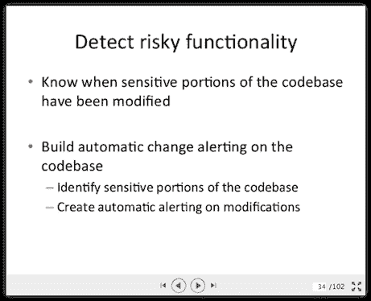

# 持续集成提高安全性

> 原文：<https://devops.com/continuous-integration-better-security/>

小规模部署和持续集成的一大优势是，它可以更容易地提供更主动的安全性。简而言之，持续集成(及其支持的相关自动化测试)使您的安全团队更容易专注于分析安全风险较高的领域。

如果快速开发、快速部署和持续集成的概念让您的安全团队感到紧张，那么您可以通过分享那些在现实世界中使这种方法运行良好的公司的成熟想法来让他们参与进来。例如，我最近在 SlideShare 上浏览了 Etsy 的一个演示，发现了持续集成如何实现更好的安全性的清晰解释。

 在右边，你看到这张幻灯片(很长但清晰)上的第 34 张幻灯片。这是一系列幻灯片中的第一张，讨论如何识别高风险的代码区域，然后使用这些标识来驱动对这些代码区域的变更的自动检查。当您自动提醒安全团队有人刚刚签入了更改高风险区域之一的代码时，这种力量就来了。

这似乎是一种将高度注意力集中在高风险上的常识性方式。

这种方法的另一个积极的好处是，它迫使关于什么是高风险区号的对话提前进行。这是一个让安全部门、运营部门和业务部门就风险可能发生的地方达成一致的机会。当您将这种方法与对现状的定期回顾相结合时，它允许您基于您的经验来改进您的自动化分析方法。换句话说，在事后审查期间，如果您发现了“哎呀，我希望我知道我有时间”这种情况，您可以在自动化库中添加一个检查，以便在将来查找这些情况。这种持续改进模式对每个人都有好处。

哦，顺便说一下，这种方法可以检查的场景之一是引入新的第三方库。在当今对第三方风险日益担忧(以及对开源组件中安全缺陷的担忧)的环境下，拥有这种能力可能是一件非常好的事情。

你呢？您如何将持续安全检查集成到您的持续集成中？