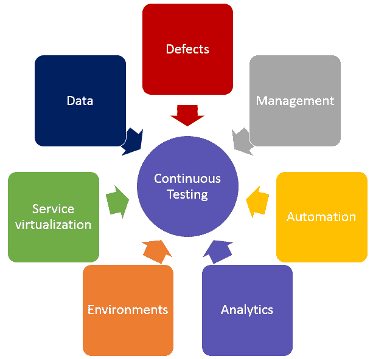

# 连续测试:左移并找到正确的平衡

> 原文：<https://devops.com/continuous-testing-shift-left-find-right-balance/>

您可能听说过术语“持续测试”，但是正在努力理解它是什么以及如何实现它。项目团队需要提高他们的测试能力，并在需要时执行测试自动化，而不仅仅是在可能的时候。服务虚拟化允许团队通过模拟不可用的系统，在生命周期中更早、更频繁地进行测试，或者“左移”。将测试自动化与服务虚拟化相结合，使团队能够提供关于质量的即时反馈——因此问题可以更快、更便宜地得到解决。鼓励和接受这种对解决方案质量的即时反馈，使企业能够快速向市场交付高质量的创新解决方案。

除了通过使用服务虚拟化左移之外，在所有测试实践中找到正确的平衡对于实现连续测试也是至关重要的。下面的图表显示了支持连续测试的关键测试实践，团队在每一个实践上都花费了精力，不管他们是否愿意。下面的问题可以帮助你的团队了解他们在哪里花费时间，也许他们的时间用在哪里会更好。

*   **缺陷**——团队是否花费太多时间记录、分类或分析缺陷？花在不是“真正的”缺陷上的时间呢——在测试和代码之间有误解的地方？或者，如果他们能从一开始就阻止整个缺陷学校的产生，又会怎样呢？
*   测试管理——团队是否花费时间手工制作状态报告，并收集测试执行结果？或者，他们是否有一种工具可以实时提供这些信息，并允许利益相关者根据需要进行深入研究？团队如何知道他们的测试工作是按计划进行的，是落后于计划还是超前于计划？
*   测试自动化–团队重新执行现有测试的效率如何？他们是手动运行大部分甚至全部吗？如果他们进行了自动化测试，他们是只关注用户界面层的功能测试，还是运行功能 API 层测试、性能测试甚至安全测试？他们有健壮且可维护的测试自动化框架吗？
*   **分析**——团队如何知道他们应该运行哪些测试，何时运行，甚至为什么在那些时间运行这些测试？他们的测试有效性有多好——也就是说，他们是否运行了最少数量的测试，发现了最多数量的问题？每当他们得到一个新的构建时，影响分析对于选择正确的测试集来执行是至关重要的。
*   **测试环境**–团队是否一直在等待测试环境被适当地供应和配置？他们是否运行测试，并在测试环境不“正确”的事实后发现，因此他们必须修复环境，然后再次重新运行所有测试？他们会从开发人员那里听到“它能在我的机器上工作吗！”但是在测试环境下不行？
*   **服务虚拟化**–团队是否在“真正”测试之前等待相关系统变得可用？他们是否使用“大爆炸”方法进行端到端系统测试，将所有组件放在一起，并希望它们能够正常工作和交互？团队可以在投入生产之前测试异常和错误场景吗？他们首先测试最简单的部分仅仅是因为它们是可用的，并延迟高风险区域以结束测试工作吗？
*   **测试数据**–团队是否拥有所需的类似生产的测试数据集，以确保他们覆盖正确的测试场景？有没有因为没有正确的测试数据集而无法执行的异常和错误场景？

如果这些问题或想法中的任何一个引起了您的共鸣，这里是关于如何开始实现持续测试之旅的指导。

首先，确定您的瓶颈:

*   你的**测试效率**有多高——你能够运行所需的测试并快速提供反馈吗？
*   你的**测试效果**有多好——你运行的测试数量最少，却发现了最多的问题吗？
*   瓶颈也可能来自实际测试执行工作的上游或下游——您是在等待依赖的系统，还是测试环境供应？

然后，查看测试工作的所有方面，首先关注最大的瓶颈。

*   您在测试环境调配方面的延迟有多长，环境调配时是否准确？如果延迟时间过长且环境不正确，请自动化您的测试环境供应和配置，以消除手动错误并获得准确性和可靠性。
*   您是否在等待相关系统开始测试？如果是这样，使用服务虚拟化来模拟那些不可用的系统，这样您就可以更快地开始测试。
*   您是否无法在下一个构建可用之前运行所有需要的测试？如果是这种情况，自动化您的高风险回归测试以提高测试效率。
*   您是否在生命周期后期，甚至在生产中发现了性能问题？停机可能会对业务造成长期损害，因此应在生命周期的早期进行负载、性能和压力测试。
*   当所有系统都集成在一起时，您是否发现了重大问题？确定并同意系统接口和数据定义，并为高风险集成点创建自动化集成级别测试。

提高他们的测试效率和有效性的团队显著地减少了他们的花费和为用户获得高质量的、创新的解决方案所花费的时间。你不能测试所有的东西，也不能自动化你所有的测试，所以找到正确的平衡是很关键的。同样重要的是服务虚拟化，它允许通过模拟缺失的依赖项，在构建完成后立即开始测试。通过结合测试自动化和服务虚拟化，团队可以更早地进行测试，或者“左移”，因此他们比以往更快地收集反馈。

在我们即将发布的网络广播中，了解更多有关使用服务虚拟化左移并避免测试环境停机的信息:[Maersk 如何使用服务虚拟化左移并避免测试停机](http://webinars.devops.com/service-virtualization-ibm-maersk)。

## 关于作者/玛丽安·霍利尔

Marianne Hollier 是 IBM 和 Open Group 认证的应用程序开发领域的 IT 专家。她在可测量地改进软件开发生命周期和推动必要的文化变革以使其工作方面具有强大的、实际的专业知识。她在设计、裁剪和部署 IBM DevOps 最佳实践以及多种类型项目(从大型到小型、从长期到快速跟踪、从敏捷到传统)的适当软件开发工具方面发挥了重要作用。Marianne 尤其热衷于所有的测试——过程、工具、文化和自动化。她的经验非常广泛，既包括定制项目，也包括适用于许多行业的标准软件包，包括炼油、制药、电信、医疗保健、金融、汽车、政府和零售。在 [LinkedIn](https://www.linkedin.com/in/marianne-hollier-bb55941) 或 [Twitter](https://twitter.com/mariannehollier) 上与玛丽安联系。