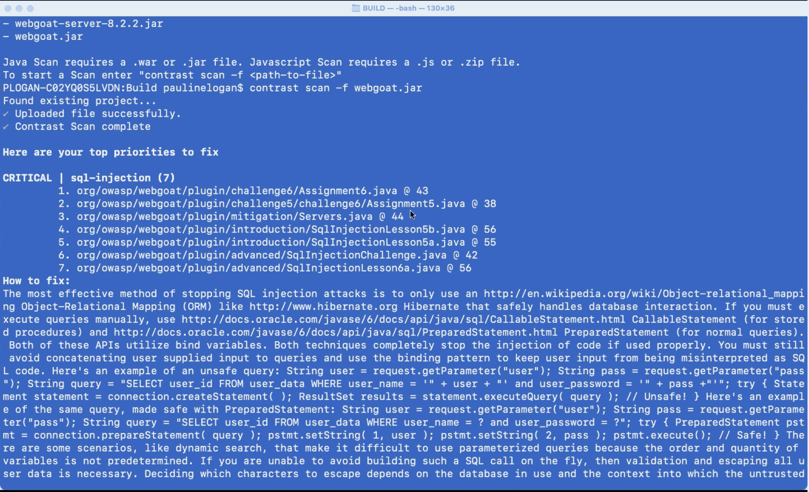

# 对比安全添加免费代码扫描工具

> 原文：<https://devops.com/contrast-security-adds-free-code-scanning-tool/>

Contrast Security 本周推出了一款免费的安全工具，使开发人员能够使用他们组织内网络安全团队使用的相同核心引擎来扫描他们的代码。

对比安全产品营销副总裁史蒂文·菲利普斯说，虽然现在不缺少免费的扫码工具，但大多数工具都不太准确。菲利普斯说，相比之下,CodeSec 中的扫描引擎要精确 10 倍以上，因为它经过优化，可以识别真正的阳性而不是产生大量的假阴性。他补充说，CodeSec 不仅仅是另一个为开发者提供的免费增值服务，它是一个商业服务的蹩脚版本。

CodeSec 也不同于 Contrast Security 现有的应用程序安全工具，因为它提供了对命令行界面(CLI)的访问，使其更容易集成到 DevOps 工作流的上下文中。Phillips 指出，这种方法使组织更容易将更多的应用程序安全责任转移给开发人员。

然而，菲利普斯说，将责任转移给开发者并不是万灵药。他指出，对比安全方法使开发和网络安全团队能够通过软件即服务(SaaS)平台使用相同的扫描引擎来发现漏洞。

很难确定网络安全可能会向左移动多远，但应用程序开发团队发现的每个漏洞都会减少网络安全团队要求开发人员在生产环境中修复的漏洞。挑战在于让开发人员尽可能简单地发现这些漏洞。

在披露了一系列备受瞩目的违规事件后，最近几个月，应用程序安全所花费的时间和精力都在以某种方式急剧增加。网络犯罪分子现在将目标锁定在[软件供应链](https://devops.com/?s=software+supply+chain)上，这是他们试图危害大量下游应用程序的努力的一部分。开发人员经常重复使用的许多模块正在被偷偷插入的恶意软件所破坏。组织试图解决的基本挑战是如何构建和部署更安全的应用程序，同时又不降低构建速度。

自然，培训开发人员认识到安全问题是等式的一个重要部分。然而，没有哪两个开发人员拥有同等水平的网络安全专业知识。以开发人员可以采取行动的方式识别漏洞的工具对于推进 DevSecOps 最佳实践的采用是至关重要的。这些工具需要开发人员一定程度的接受，因为他们倾向于使用 CLI 工具。

与此同时，组织很可能需要扫描大量已经部署的应用程序，寻找漏洞。运行在云内部和外部的应用程序通常被部署为最低级别的扫描。事实是，许多开发人员倾向于将网络安全政策视为构建和部署应用程序的障碍。不幸的是，网络犯罪分子现在欣赏并充分利用机会进行破坏。