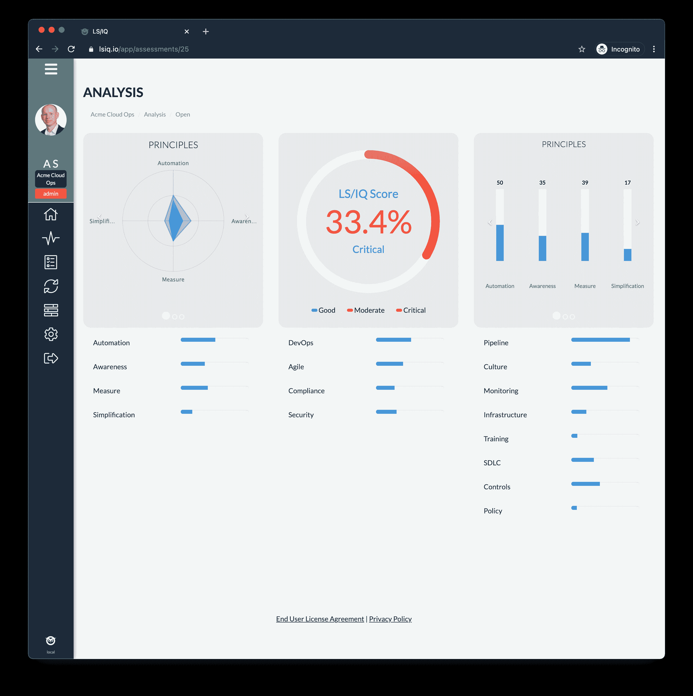

# 科帕多获得新的环境来推动 DevSecOps 的采用

> 原文：<https://devops.com/copado-acquires-new-context-to-drive-devsecops-adoption/>

科帕多是用于构建部署在 Salesforce 云平台上的应用程序的 DevOps 平台的提供商，今天宣布其已经[收购了新的上下文](https://copado.uberflip.com/blog/copado-acquires-leading-devsecops-company)，作为将其产品组合范围扩展到 DevSecOps 最佳实践领域的努力的一部分。

科帕多首席营销官 Andrew Leigh 表示，此次收购带来了科帕多的工具和专业服务专业知识，将用于帮助组织在他们已经用来访问一系列软件即服务(SaaS)应用程序的相同云平台上构建和部署安全的定制应用程序。

Leigh 解释说，新的上下文精益安全智能平台使开发人员能够通过分析代码来实现这一目标，然后提出开发人员何时应该应用特定安全控制的建议。现有的新客户包括加州蓝盾公司、通用电气公司、凯撒永久公司和荷兰皇家壳牌公司。

像大多数已经采用 DevOps 最佳实践的组织一样，就采用 DevSecOps 而言，它仍然处于早期阶段。然而，很明显，科帕多已经做好了充分的准备来推进一个互补的精益安全情报平台的采用，Leigh 说。科帕多声称拥有 1000 多名客户，最近又筹集了 9600 万美元的资金来帮助推动这些努力。该公司还声称其年度经常性收入(ARR)增长了 120%。

在新冠肺炎疫情之后，越来越多的组织开始采用 SaaS 应用来推动数字业务转型计划。例如，扩展 Salesforce 客户关系管理(CRM)应用程序通常更简单，而不是从头开始构建每个应用程序。

一旦组织达到一定的规模水平，他们就开始将 DevOps 最佳实践应用到那些构建中。然而，这些努力往往是不平衡的。最近代表科帕多进行的一项调查发现，虽然 82%的公司增加或保持了销售队伍发展团队的规模，但与一年前进行的类似调查相比，变革失败率从去年的 23%跃升至 2020 年的 33%。该调查还指出，恢复时间从 2019 年的 110 小时增加到 2020 年的近 196 小时。

采用 DevOps 的组织面临的下一个主要挑战当然是 DevSecOps。挑战在于，由于 Salesforce 环境是独特的，应用程序是使用一组特定于该平台的对象和表构建的。因此，Salesforce 环境通常需要从头开始设计的 DevOps 平台来处理对象和表。

Salesforce 在最近的第四季度报告营收为 58.2 亿美元，同比增长 20%，尽管新冠肺炎疫情的经济影响挥之不去。因此，基于 Salesforce 开发的定制应用程序的数量应该会稳步增长，尤其是随着低代码工具被更广泛地采用。现在，越来越多的组织迟早会达到应用程序开发计划的临界质量，从而保证投资开发运维平台来管理它们。