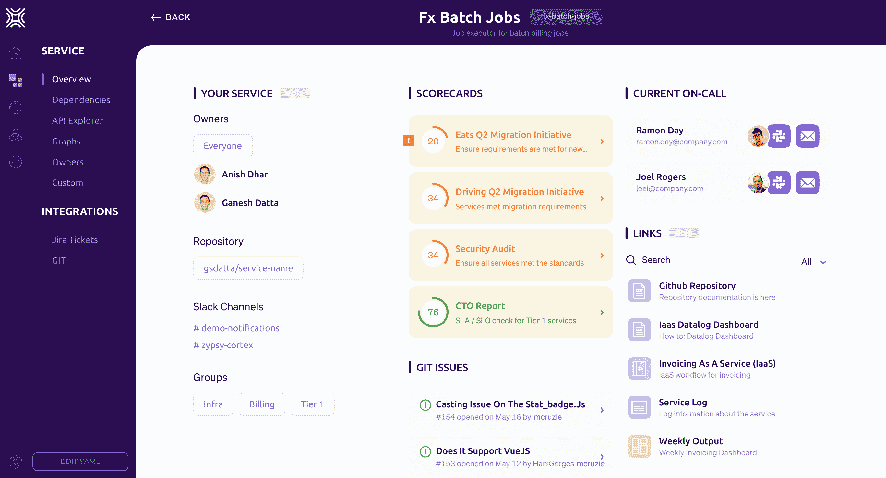

# Cortex 利用 GitLab 帮助 DevOps 团队管理微服务

> 原文：<https://devops.com/cortex-taps-gitlab-to-help-devops-teams-manage-microservices/>

追踪微服务所有权的平台提供商 Cortex 本周宣布，其平台现在可以[从 GitLab 持续集成/持续交付(](https://www.businesswire.com/news/home/20210609005313/en/Cortex-Joins-the-GitLab-Technology-Partner-Program-to-Accelerate-SRE-Control-of-Microservices) [CI/CD](https://devops.com/?s=CI%2FCD) )平台导入服务。

Cortex 首席执行官 Anish Dhar 表示，该公司的平台现在集成了 DevOps 团队经常使用的 30 多种工具，包括 GitLab、Datadog、Sonarqube、Snyk 和 PagerDuty 的产品，以及 Kubernetes 容器编排引擎和 Istio 服务网格等开源平台。

Cortex 平台专为现场可靠性工程师(sre)和其他 DevOps 专业人员设计，无需依赖电子表格来手动跟踪微服务的所有权。相反，Cortex 导入驻留在开发人员使用的工具中的数据，以显示组织中谁负责维护哪些微服务。

此外，Cortex 仪表板使 DevOps 团队能够看到哪些开发人员在发生意外事件时随叫随到，微服务正在经历的延迟率以及哪些漏洞尚未修复。

还可以基于与特定微服务相关联的指标将等级分配给特定微服务。Dhar 指出，这种方法允许 DevOps 团队使用记分卡来应用游戏化技术，以鼓励开发人员不断改进他们的微服务。Dhar 补充说，这种方法也将使其他开发人员清楚地知道，在生产环境中运行的微服务最可靠。

该平台的核心是 Cortex Query Language (CQL)，这是一种特定于领域的语言，允许 DevOps 团队定义粒度规则，这些规则可应用于例如随叫随到的轮换、安全漏洞、包版本、服务级别目标(SLO)和微服务的整体健康状况。工程师可以使用 YAML 文件形式的代码，通过与各种工具的直接集成，跨团队和服务类型设置可靠性标准。Dhar 说，实际上，Cortex 提供了一个代码可靠性平台。

随着应用程序的责任进一步左移，每个开发团队都要对他们创建的任何微服务或应用程序的生命周期负责。企业开发运维团队面临的挑战是，当有数百甚至数千个微服务时，很难确定开发团队中谁负责特定的微服务。Cortex 没有试图使用电子表格来跟踪开发团队和微服务之间的关系，而是提出了一个工具来自动化发现和跟踪过程。

如今，大多数组织都在采用微服务来以不同的速度构建和部署更灵活的应用。然而，他们迟早会发现自己正试图在无法使用电子表格管理的微服务之间的相互依赖网络中导航。当然，DevOps 团队可能倾向于使用他们的技能来创建他们自己的工具来跟踪微服务。然而，考虑到手头的所有任务，维护一个用于发现和跟踪微服务所有权的定制平台可能是愿意维护和支持专用工具的供应商更好的工作。