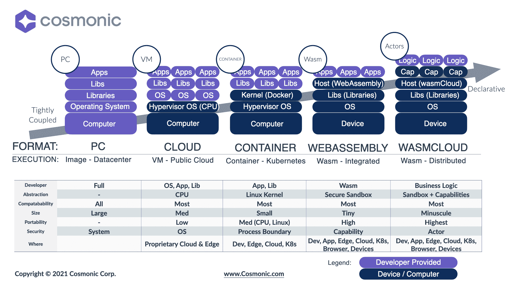

# Cosmonic 为 CNCF 贡献 WebAssembly 运行时

> 原文：<https://devops.com/cosmonic-contributes-webassembly-runtime-to-cncf/>

Cosmonic [今天透露，它已经向云原生计算基金会(](https://www.prnewswire.com/news-releases/wasmcloud-joins-cloud-native-computing-foundation-as-sandbox-project-301362358.html) [CNCF](https://cncf.io) )捐赠了其通用应用运行时，用于使用 WebAssembly (Wasm)开发框架构建云原生应用。

Cosmonic wasmCloud 运行时使得在任何平台上运行使用 WebAssembly 构建的应用程序成为可能。相比之下，使用容器构建的应用程序不太容易移植，因为 IT 团队无法将为 Linux 开发的容器应用程序运行在 Windows 上。每个操作系统的容器技术实现方式不同。

CNCF 将使 wasmCloud 成为一个沙盒项目，并将邀请其他组织开始做出贡献，作为最终使 wasmCloud 与 Kubernetes 等其他项目平起平坐的努力的一部分。去年 11 月推出的 wasmCloud 运行时已经有近 80 个贡献者。

CNCF 正试图推进其他 WebAssembly 技术，包括 Krustlet，这是一个用于 Kubernetes 环境的工具，它侦听来自新 pods 的事件流，以便调度程序可以分配工作负载。

然而，CNCF 现在并不是唯一一个寻求推广 WebAssembly 技术的组织。字节码联盟已经启动了 WebAssembly (Wasm)和 web assembly System Interface(WASI)计划，作为促进标准的努力的一部分，这些标准将使在任何地方运行 Wasm 应用程序变得更加容易。字节码联盟最初由 Fastly、英特尔、Mozilla 和微软创建，现在还包括 Arm、DFINITY Foundation、Embark Studios、谷歌、Shopify 和加州大学圣地亚哥分校。

Wasm 的核心是一种可移植的二进制指令格式，用于构建描述内存安全的沙盒执行环境的软件。有一天，这种方法可能会取代当前主要的软件构建方法，这种方法依赖于软件组件的集合，而这些组件之间往往缺乏明确的安全界限。因此，恶意软件感染应用程序的所有组件变得相对容易。

Cosmonic 的首席执行官 Liam Randall 表示，尽管 Wasm 实际上为应用程序提供了另一种类型的虚拟化，但 IT 团队不应将其视为有朝一日将不再需要容器的一系列技术。他说，使用 Wasm 开发的应用程序将基于各种容器平台。

例如，已经有一个 Wasm 项目创建了一个服务器端 Wasm 运行时，使应用程序能够部署在比 Docker 容器更有效的安全容器架构上。

万维网联盟(W3C)推动了 Wasm 的开发，这是为执行 JavaScript 代码的浏览器创建通用格式的努力的一部分。Wasm 现在正被扩展到浏览器和 JavaScript 之外，以使开发人员最终能够创建一组通用二进制文件，无需修改即可在任何平台上工作。

这些努力的成果可能需要一段时间才能实现。然而，很明显，将一个 it 平台与另一个平台分隔开来的墙开始倒塌。一旦应用程序变得更加可移植，一个组织选择一个平台而不是另一个平台的原因将与开发人员的偏好没有太大关系。